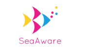
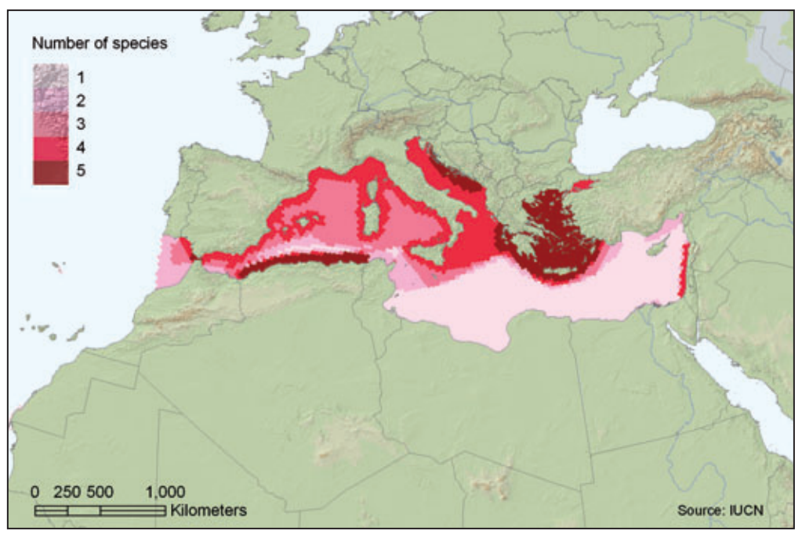
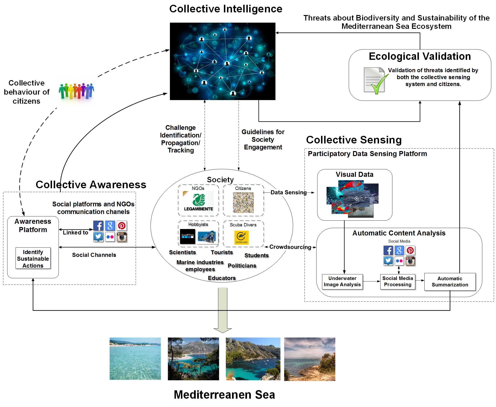
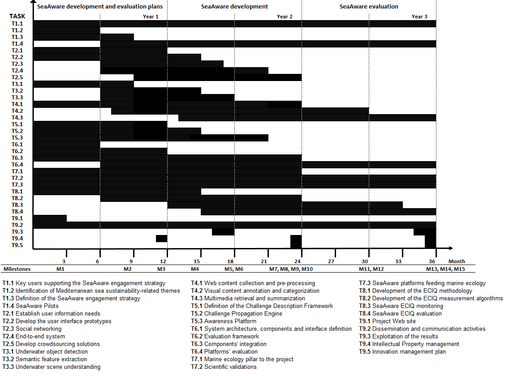
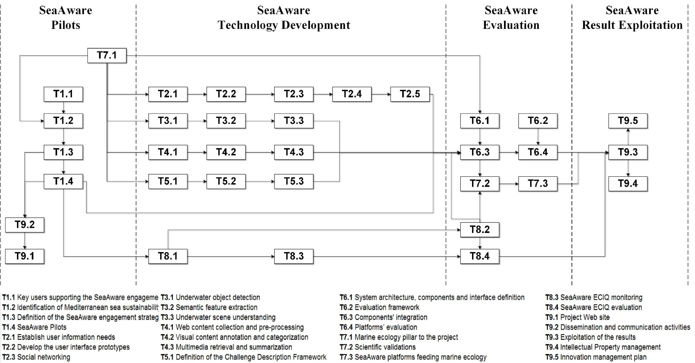

**SeaAware: Collective Awareness Platform for Biodiversity and Sustainability of the Mediterranean Sea Ecosystem**

**List of participants**

<table>
  <tr>
    <td>Participant No *</td>
    <td>Participant organisation name</td>
    <td>Country</td>
  </tr>
  <tr>
    <td>1 (Coordinator)</td>
    <td>Vrije Universiteit Brussel, Global Brain Institute (GBI)</td>
    <td>Belgium</td>
  </tr>
  <tr>
    <td>2</td>
    <td>Centre for Research and Technology Hellas – Information Technologies Institute. (CERTH) </td>
    <td>Greece</td>
  </tr>
  <tr>
    <td>3</td>
    <td>Centre National de la Recherche Scientifique (CNRS)</td>
    <td>France</td>
  </tr>
  <tr>
    <td>4</td>
    <td>DIVEBOARD SARL (DIVE)</td>
    <td>France</td>
  </tr>
  <tr>
    <td>5</td>
    <td>Legambiente Associazione Onlus (LAMB)</td>
    <td>Italy</td>
  </tr>
  <tr>
    <td>6</td>
    <td>Università degli Studi di Catania (UNICT)</td>
    <td>Italy</td>
  </tr>
</table>

**Table of Contents**

[[TOC]]

# 1.	Excellence

## 1.1. 	Objectives

**Marine ecosystems provide valuable ecosystem services** (NOTE:  http://cmsdata.iucn.org/downloads/the_mediterranean_a_biodiversity_hotspot_under_threat.pdf)** but are widely recognised, both within the EU and worldwide, to be among the most fragile ones, facing significant sustainability challenges.** The Mediterranean Sea, in particular, holds a special position among such ecosystems, possessing a number of unique characteristics both at the purely environmental level as well as at social and political levels. 

At the environmental level, it is a closed sea and consequently a relatively closed ecosystem, whose biodiversity has been significantly affected in the last decades by human activities and their various consequences at both local and global level (particularly by overexploitation). Recently (2015) the European Environment Agency accurately quantified the problem of sustainability of the marine species in the Mediterranean Sea stating that *"only 7% of marine species assessments indicate favourable conservation status"** * (NOTE:  http://www.eea.europa.eu/soer-2015/europe/marine-and-coastal)*. *

**Fig. 1***: *Example of biodiversity decline: Species richness of threatened marine mammals in the Mediterranean (source: International Union for Conservation of Nature1)

At the social and political level, it is an ecosystem that borders with 23 countries (9 EU and 14 non EU) with altogether about 500 million population (190 million of EU people representing ~38% of the whole EU population). It is also the world’s leading tourism destination in terms of both international and domestic tourism with more than 300 million international tourist arrivals per year. The Mediterranean Sea ecosystem supports either directly or indirectly a significant portion of the GDP (e.g. via fishing, tourism, sea transports) of the 23 neighbouring countries (including countries with the world highest migration rates, such as Lebanon, Libya), whose policies control its fate to a significant degree. Ensuring the sustainability of the Mediterranean marine ecosystem, and specifically preventing the further decline of the biodiversity of this ecosystem, represents a major sustainability challenge and at the same time a financial, social and moral imperative for the EU. 

While the magnitude and significance of this challenge has been well-recognised by worldwide policy makers, and various measures to address it have already been taken at the EU level (including, for instance, the reformed Common Fisheries Policy, the Marine Strategy Framework Directive etc.), the active involvement of the citizens in the effort of addressing this challenge has been surprisingly limited. This is clearly sub-optimal, as citizens are both part of the problem (e.g. acting as a direct polluter of the coastal area and the sublittoral zone; and, as a consumer, controlling the demand for different fish species whose population stability and sustainability varies significantly [Coll et al 2010]) and potentially part of the solution.

We argue that the latter can be achieved by **mobilisation of collective awareness of European citizens and** by **transformation of that awareness into a powerful, socio-technologically distributed intelligence, able to collectively identify and tackle the most pressing threats to the sustainability of the Mediterranean Sea**. Such intelligence can emerge from harnessing observations, experiences, capacities, and actions of the hundreds of millions of citizens that interact with the Mediterranean Sea and its ecosystem every year with novel technologies and social media.

The main goal of SeaAware is to bootstrap the active involvement of European citizens into three aspects of sustainability assurance for the Mediterranean Sea:

1. ongoing observation of the entire ecosystem by **collecting and interpreting big data** 

2. identification of emerging threats to the Mediterranean Sea biodiversity and reformulation of the identified threats into **challenges that can be collectively tackled**

3. **mobilisation of actions and attitudes** aimed at tackling the identified challenges.

We propose an interdisciplinary **research project on generating collective awareness of Mediterranean Sea sustainability-related threats in order to improve decision-making and to drive sustainable collective behaviours**. As a practical framework for focusing and integrating research into issues of the "Collective Awareness Platforms for Sustainability and Social Innovation", we will investigate: 

1. **methods to support collective sensing**, i.e. how to engage people to contribute visual data to the system

2. **automated data analysis methods** to process massive user-contributed data

3. **social participatory platforms **both to inform people about events related to the Mediterranean Sea and to involve people again in proactively providing feedback for making the automated data analysis methods more robust

4. **methods to identify sustainability-related threats and propose challenges** by investigating the collective behaviour of stakeholders and to "propagate" the identified challenges 

5. **methods to mobilise and guide collective behaviours** so as to meet the detected Mediterranean Sea sustainability challenges. 

The scientific and technological questions that will be investigated in this project are:

* What** dissemination and communication methods** are the most effective for engaging people in contributing data related to the ecosystem of the Mediterranean Sea? What interfaces can be deployed to support and enhance this process?

* What **computer hardware and software architectures as well as storage methods **allow for massive visual data collection and analysis? How to organise the collected content in order to make the underlying information relevant to and appealing for users?

* What **computer vision methods **allow for the detection and recognition of marine animals and the visual understanding of the underwater scenes? What **machine learning techniques** can be devised to make the underwater computer vision methods operate under different scenarios without the need to retrain classifiers?

* What **multimedia and multimodal analysis techniques **allow for mining open social media data with the goal to put the underwater visual data in context and to possibly identify events of interest and event-related information? 

* Which **multimedia and machine learning techniques** allow for distilling the bulk of collected underwater and non-underwater data and present them in a coherent and concise way to marine ecologists for further investigation?

* How to **communicate the automatic analysis results back to citizens in a non-obtrusive way**, and how to enable multitudes of people to proactively provide feedback with minimum effort in order to improve the automated analysis? 

* How to **turn acknowledgement into engagement, engagement into action, and action into societal change **in collective, distributed, non-hierarchical communities? 

* How to measure the resulting **collective intelligence mobilised to solve sustainability-related problems **in the Mediterranean Sea ecosystem?

Finding good answers to these questions and proving that they work in our project will impact marine ecology research, marine biodiversity and resources management practices, provided that the following complementary aspects are investigated:

* What is the range of **marine research questions** that can be answered by using user-contributed data? How to drive the collective behaviour of citizens so as to acquire the answers to specific research questions?

* How can the proposed system support **marine stakeholders in decision-making** related to biodiversity and sustainability of the Mediterranean Sea ecosystem? 

To answer the above questions, the consortium will undertake research into: 1) distributed social sensor networks and human computer interfaces for enabling large scale collective sensing; 2) computer vision and machine learning methods for automated underwater scene understanding; 3) multimedia content analysis for event detection and summarization; 4) data sensing methodologies to allow for the collection of massive data; 5) methods for stimulating social self-organisation and for measuring the emergence of the resulting collective intelligence; 6) marine science and marine resource management for making sense of the automatically identified threats and transform them to challenges to be propagated to the community in order to drive sustainable behaviours. 

Overall, the measurable objectives of the project, directly addressing the issues raised in the "Collective Awareness Platforms for Sustainability and Social Innovation" call, are:

1. Develop an open-data social participatory sensing platform (enabling the creation of a distributed marine social sensor network), in which a large number of persons interested in the Mediterranean Sea provide sea-related data (mainly images and videos) via their end user devices (e.g. smartphones);

2. Develop novel methods for maximizing the system-wide performance of social sensing platform;

3. Devise alternative incentive methods to stimulate the wide public to participate in the distributed sensing and in supporting automated analysis methods;

4. Develop methods for storing and real-time accessing massive amounts of visual and non-visual data contributed by crowds of users;

5. Develop computer vision methods for characterizing underwater scenes, identifying fish species, seabed types etc. in any user-contributed underwater visual data independently from the employed cameras;

6. Develop multimedia and multimodal analysis methods allowing for complementing the underwater visual data and its analysis with Mediterranean Sea sustainability-related information and present the integrated information in a coherent and concise way that is easily understood by marine scientists and stakeholders;

7. Develop a strategy to engage the society not only to contribute (visual) data but also to support the automatic data content analysis;

8. Develop a social 'mobilisation system' and supporting technological solutions to involve users in making sense of data gathered in a way that leads to identification and tackling of the most pressing threats to the Mediterranean Sea sustainability;

9. Develop methods to turn threats into challenges and propagate them to the wide public as well as to support ecological validation by marine scientists;

10. Develop a methodology for quantitative measurement of the overall collective intelligence unleashed by the project;

11. Integrate the research outcomes in the form of two publically usable web tools: 1) a participatory data sensing platform of the Mediterranean Sea and 2) a challenge propagation platform, increasing collective awareness, mobilising collective action, and supporting marine science;

12. Publish the massive collected data and connect it to the Linked Open Data.

While the focus of the project is based on very specific marine eco-system visual data and environmental study tasks, this has been selected as a particular use case to demonstrate the more general techniques being developed within the project. The strength of the project is not only in going beyond the state of the art in the specific areas of expertise of the different partners, but in combining their strengths to form an end-to-end solution – a narrow bridge over the semantic gap between domains. Some of the expected research results will also be applicable to other visual-based monitoring initiatives run collectively by distributed contributors, such as video-based monitoring of the behaviour of wild land-based animals or secure area surveillance. Furthermore, several of the core technologies being investigated and developed here should have a much wider applicability. These include the social sensing platform, adaptive object recognition, multimedia data analysis for event detection, challenge propagation engine, and algorithms to measure distributed collective intelligence resulting from human-technology interconnections. While we do not expect that the project results will generalise directly, it is clear that the technologies listed above address research issues encountered in many other domains.

## 1.2. 	Relation to the work programme 

<table>
  <tr>
    <td>Work Programme Topic</td>
    <td>SeaAware relevance</td>
  </tr>
  <tr>
    <td>Develop and test pilot solutions to clearly defined sustainability challenges by harnessing 'network effects', leveraging on innovative combinations of distributed social networks, sensor networks and knowledge co-creation networks.</td>
    <td>SeaAware addresses a clearly-defined environmental sustainability challenge: ensuring the sustainability of the Mediterranean marine ecosystem, and specifically preventing its further decline. SeaAware addresses this challenge by bringing together thousands of the most engaged observers of the Mediterranean Sea (divers, local managers, marine industry employees, activists, hobbyists, etc.) in a social networking platform, and co-opting their cameras as a virtual ad-hoc sensor network for collecting underwater data. Combining the collected data with data available in other social networks and open data repositories, and bringing together engaged citizens and marine scientists, SeaAware enables collective sensing, elicits collective awareness, and eventually empowers collective intelligence. </td>
  </tr>
  <tr>
    <td>Gain evidence and better understanding on the processes about collective awareness.</td>
    <td>Part of the SeaAware project is to study patterns of socio-technological interactions enabled by the platform in order to better understand collective awareness processes and find best ways to transform them into collective intelligence. The SeaAware empirical studies will be performed within a coherent framework developed in the project, based on the concepts of ‘mobilisation system’, ‘challenge propagation’, and ‘emergent collective intelligence’.</td>
  </tr>
  <tr>
    <td>Pilots should be grounded on recent developments in open data, open source, distributed social networking and open hardware; must seize the full potential of existing mobile communications, integration of networks and online collaboration and can make use of innovative integrated mobile sensing devices to create collective awareness of risks and opportunities. </td>
    <td>SeaAware builds on the idea of combining the Diveboard on-line platform (www.diveboard.com), other popular social networks, virtual ad-hoc sensor networks comprising the users’ cameras, open Web data sources, and crowdsourcing for building collective awareness and collective intelligence on marine ecosystem sustainability. This allows us to exploit the full potential of modern communication infrastructure (mobile and broadband networks) and EU citizens’ ubiquitous access to the Web and Social Web for i) collecting data, and ii) engaging the EU citizens and making them part of the envisaged platforms.</td>
  </tr>
  <tr>
    <td>Pilots can pioneer crowdsourcing/crowdfunding solutions and new mechanisms for social innovation whose expected return goes beyond GDP measures and traditional success indicators.</td>
    <td>Crowdsourcing will be used in SeaAware for certain data analysis tasks, but contrary to the usual solution of providing monetary compensation to the contributors, we will adopt a gamification strategy that will allow us to virally involve people in a sustainable manner. Also, the challenge propagation implemented on the platform, which stimulates citizens to become involved in identification and solving of the sustainability-related problems of the Mediterranean Sea, can be seen as a novel mechanism of crowdsourcing. Even more important than the study of such mechanisms in their own right is that in SeaAware such mechanisms will be applied specifically towards ensuring the sustainability and diversity of the Mediterranean marine ecosystem, which is a result that only in part can be measured by means of GDP and similar success measures.</td>
  </tr>
  <tr>
    <td>Pilots should be user-driven, involving existing communities of people. </td>
    <td>The SeaAware pilot is built around three existing communities of people: diving enthusiasts, as represented by the current users of the Diveboard online platform, marine ecology experts, as represented by the CNRS experts and the community of their peers with whom the CNRS experts closely collaborate under various settings, and nature- and environmental sustainability-conscious individuals, as represented by the LAMB members and volunteers (over 100,000 people). With these existing communities serving as a seed, the SeaAware pilot will of course also reach beyond them in order to engage a large number of additional individuals and communities.</td>
  </tr>
  <tr>
    <td>Participants should include not only industry and academia but also local communities, grassroots activists, hackers, social entrepreneurs, students, citizens, creative industries and civil society organisations. Consortia are expected to be multidisciplinary in nature.</td>
    <td>The SeaAware consortium has an excellent balance between academia in the ICT sector (UNICT, CERTH), experts in social sciences (GBI), marine biology experts (CNRS), a company and corresponding user community of diving enthusiasts (DIVEBOARD), and an internationally renowned organization and community devoted to environmental sustainability (LAMB). This consortium is diverse and highly multidisciplinary, in perfect agreement with the multidisciplinarity of the challenge that SeaAware addresses.</td>
  </tr>
</table>

## 1.3 	Concept and approach 

**1.3.1 SeaAware Concept**

Our concept for making European citizens 'SeaAware' of threats to sustainability of the Mediterranean Sea ecosystem is built on a three-level vision. We will:

**enable collective sensing, elicit collective awareness, **and **empower collective intelligence**.

These three "layers" of the project will be forged out of several complementary streams of **research, technology development and social action**, carried out by specialised partners.

**[A. Collective Sensing]**. First, we will build a **novel socio-technological interconnection** between thousands of the most engaged observers of the Mediterranean Sea (scuba-divers, local managers, marine industry employees, activists, hobbyists, etc.). The interconnection will start to operate as a distributed an intelligent ad-hoc distributed sensor network, registering, interrelating, and interpreting all kinds of ongoing changes within the ecosystem; 

**[B. Collective Awareness]**. Second, we will make hundreds of thousands of **European citizens constructively aware** of the most pressing threats to the Mediterranean Sea ecosystem, not by merely informing them, but by virally involving them into collaborative thinking and action: identification of threats to the biodiversity, transformation of threats into addressable challenges, and mobilisation of behaviours and attitudes needed for the challenges to be resolved; 

**[C. Collective intelligence]**. Third, we will investigate and guide resulting patterns of **socio-technological interactions as instances of an emergent, self-organising, distributed, collective intelligence**, which - if understood and supported properly - can become forceful enough to be able to shift interrelations between humans and the rest of the Mediterranean Sea ecosystem, making them sustainable and mutually beneficial.

**A. Collective Sensing**

An important contribution to marine ecosystem sustainability is the creation of monitoring systems to investigate the situation more deeply and systematically. For years, such monitoring has been accomplished by marine biologists and activists through visual observation. Driven by the advances in imaging systems, the employment of video cameras for marine ecosystem analysis has gained more attention for the current and prospective development of marine science and marine resource management. Nevertheless, marine ecosystem monitoring system cannot be delivered at a truly large scale because of the high cost of infrastructure, which includes not just underwater cameras, but also network data transmission (usually carried out wirelessly with expensive buoy-antenna systems), storage and maintenance. This strongly limits the use of underwater visual data for marine ecosystem surveys, resulting in problems of restricted data coverage.

In this project we will introduce a new player to the scene: citizens will be involved in (1) collecting underwater and sea-related visual data through a dedicated participatory platform, so as to create a self-evolving distributed camera sensor network able to collect massive visual data and (2) supporting the development of each technological part of the entire project. The collected data will be analysed by means of computer vision and multimedia analysis methods to automatically provide quantitative measured on the Mediterranean Sea ecosystem, which can then be ecologically validated by marine scientists. The expected outcomes of the collective sensing part are validated Mediterranean Sea sustainability threats. These need to be effectively propagated to the larger society so as to increase awareness about them and consequently drive collective behaviours to solve them.

In detail, to enable the ongoing collective observation of Mediterranean Sea ecosystem we will:

* **Engage **thousands of divers, local managers, marine industry employees, activists, hobbyists, etc. **to contribute and tag** a multitude of diverse visual data, thus making a snapshot of the Mediterranean ecosystem at a particular time;

* **Establish and maintain a "participatory social sensing platform"**, connecting “ad-hoc networks” of individual user cameras (including mobile device cameras) used to take and upload underwater pictures and multimedia files;

* **Process automatically the massive amount of visual data** **collected **by contributors with the resulting technology, thus reducing the time and efforts needed to manually interpret it and extract meaningful information from it;

* **Crowdsource annotations** for the hundreds of thousands of uploaded pictures, using Diveboard platform ([www.diveboard.com](http://www.diveboard.com)) and other channels (identified when engaging people), upgraded to **support crowdsourcing through gamification and self-moderation techniques** in order to support the automated analysis methods;

* **Assess the reliability and benefits of the resulting technology** when compared to the existing methodologies for data sampling in marine ecology, as for example, to obtain species occurrence data over very large (global) spatial scales at minimal cost in order to assess correlates of biodiversity globally;

* **Monitor, continuously improve, and scientifically validate** the accuracy of the automatically inferred information.

**B. Collective Awareness**

Having a validated Mediterranean Sea threat, the next step in the project’s pipeline is to ensure that it receives as much attention and has as big an impact as possible. Environmental issues are usually very complex and multifaceted approaches are needed to deal with them. This implies that many different parties should collaborate in order to resolve the threat. 

The collective awareness 'layer' of the project aims exactly at attracting attention and mobilising action of as many as possible of the most appropriate stakeholders that could participate in the problem’s resolution. There are many examples of such applications, such as notifying a politician about a problem that could be resolved by enforcing a new law or regulation, involving students and educators in academic/community programs that regard environmental protection, or informing local managers of protected areas, fishermen associations, hobbyists, activists, divers and tourists about new protected species. 

In order to achieve that, the target groups of the identified threat should receive the required information in a personalised manner. This will be achieved by providing an awareness platform, able to identify the correct target group depending on the information acquired by the sensing mechanisms of the project. To maximise the efficacy of the propagation, major collaborators to this task will be not only environmental institutions and associations, but also existing social media (e.g. Facebook, Twitter etc…) which can achieve a great impact in terms of diffusion. End users, and especially volunteers, dislike complicated systems with prolonged submission procedures. Therefore, such collaboration must be implemented through a seamless integration between the project’s awareness platform and the other means of dissemination so as to offer a transparent solution. In this way, the integrated digital ecosystem will become an efficient mobilisation platform that motivates and coordinates the actions of people, so as to maximize their commitment and productivity.

To make European citizens aware of the most pressing threats to the Mediterranean Sea ecosystem, and to make this awareness constructive and actionable, we will:

* **Make the information, data, and multimedia gathered in the project accessible and useful to a large variety of audiences**, including but not limited to: educators, students, scientists, local managers of marine protected areas, marine industry employees, tourists, divers, hobbyists, politicians, and activists.

* **Build lasting, automated interconnections** between our Platform, several social media platforms, internet communication channels of all partners in the consortium, and dozens of Mediterranean-related portals, allowing for (1.) putting underwater visual data in context by enrichment of the collected raw visual data with other relevant information (2.) viral propagation of the collective awareness across social media.

* **Involve hundreds of thousands of citizens in substantiating and tackling arising threats** to the Mediterranean Sea biodiversity by mobilising them to (1.) create or follow online wiki-like 'threads' about the threats, (2.) investigate the threats and contribute related data, information, and multimedia, (3.) establish or join 'challenges', turning the identified threads into implementable action plans, (4.) constructively act upon the challenges, and (5.) virally spread the news in one's own social media channels.

* **Involve marine scientists **in the scientific validation and estimation of the biodiversity threats identified by citizens.

**C. Collective Intelligence**

The key concept behind our collective awareness platform is that of self-organization. Self-organization is defined as the spontaneous, bottom-up emergence of order, without an external agent directing the process [Heylighen 2001]. This is typical of complex adaptive systems, such as markets, ecosystems, communities, or swarms of animals. Such systems are too complex to be controlled in a top-down manner, yet they are surprisingly efficient in adapting to a broad variety of challenges. Self-organization arises from local interactions between the individual agents or components of the system and results in a global, coordinated pattern of activity. This coordination can be understood as a form of collective intelligence that from now on directs the activity of the system. 

More efficient interaction channels between the agents facilitate such self-organizing coordination. New communication media and socio-technological interconnections therefore create a niche for novel instances of coordination and collective challenge-solving capacity to emerge, in particular capacities that did not exist before. These processes inform the project’s vision on its third 'layer', within the conceptual framework of complex adaptive systems and self-organisation: we aim to create a communication environment that facilitates and stimulates the self-organisation of an efficient form of coordination, so that complex, Mediterranean Sea sustainability-related challenges get identified, propagated to the appropriate agents, and adequately tackled, without the need for a central supervisor or controller to decide who should tackle which challenge.

Once an efficient interconnection of people (citizens, researchers, divers, educators, etc.) and technological systems (communication platforms, cameras, visual data analysis tools, etc.) is created, this should enable the spontaneous coordination of interactions between these individual agents. Having previously studied and modelled the emergence of such collective processes, we know the basic mechanisms that are needed to produce such a dynamics. The existing mathematical and simulation models developed by the Global Brain Institute - and in particular the concept of self-organization of collective intelligence by the means of Challenge Propagation [Heylighen 2014] - will be used for the design of a novel communication-enhancing software agent. Its function will be to elicit and promote the types of interactions between agents that are most needed to produce collective awareness of the identified challenges.

To enable the collective intelligence resulting from the project, we will:

* **Implement a consistent framework of guidelines for engaging the society** (organizing project-related events, communicating with various audiences and stakeholders, broadcasting project news, etc.) in a way that supports and amplifies the self-organization of emergent collective actions.

* **Develop an automated software agent, called 'the Challenge Propagation Engine', devised to guide the self-organisation of distributed, collective intelligence** by: (1.) automated user guidance, (2.) automated dissemination of challenges, (3.) monitoring of the degree of 'relaxation' of challenges over time, (4.) identification and reinforcement of the most effective challenge propagation routes.

* **Devise a measurement methodology for evaluation of the quality and capacity of an emergent collective intelligence** with all its key aspects.

We will integrate the individual research components into two publically usable platforms: 

1. A participatory **social sensing platform**, extending the already existing DIVEBOARD.COM platform, for people interested in the Mediterranean Sea and, more in general, in the undersea domain; 

2. An **awareness platform**, where the challenges, identified by analysing collective behaviour of citizens, are propagated to large communities of people.

Fig. 2 shows a schematic architecture for the integrated project.

**Fig. 2 **– SeaAware integrated project and system 

An overview of the SeaAware concepts translated into expected project outcomes and ways to achieve and evaluate outcomes is given below.

<table>
  <tr>
    <td>THEME</td>
    <td>OUTCOME</td>
    <td>AGENCY</td>
    <td>EVALUATION</td>
  </tr>
  <tr>
    <td>Collective sensing</td>
    <td>Better informed science with data collected by citizens</td>
    <td>Participatory Data Sensing Platform
Automated data analysis tools
Data and crowdsourcing contributors (marine biologists, divers, marine managers, etc.)</td>
    <td>Technology
Participatory Sensing Platform Usability
Quality and usefulness of data from the scientific point of view
Statistics about contributors and contributions </td>
  </tr>
  <tr>
    <td>Collective awareness</td>
    <td>Better informed and mobilised Europe: citizens, institutions, stakeholders</td>
    <td>An awareness platform integrating existing and commonly employed platforms, e.g. the LAMB one.
Various groups of stakeholders (activists, educators, politics, marine industry…) use the platform, making sense of the new data available
Other data (like from LAMB, IUCN, etc.) linked to the platform </td>
    <td>What key players have been involved? 
Qualitative survey - what are people becoming aware of? What do they get mobilised to do?
Usage stats</td>
  </tr>
  <tr>
    <td>Collective Intelligence</td>
    <td>Self-organising collective intelligence meeting sustainability-related challenges</td>
    <td>Challenge propagation engine
Social networks
Guided self-organisation</td>
    <td>Challenge propagation - how threats are identified, how they can be transformed into challenges, how they are spreading, and how they are tackled
Emergent collective intelligence quotient
</td>
  </tr>
</table>

To better understand the potential SeaAware contribution and impact, let us consider the case of marine invasive species in the Mediterranean Sea. Marine invasive species are plants and animals that have been intentionally or unintentionally introduced in new habitats and spread into the wild in the new host region, threatening native equilibrium of biodiversity and ecosystem services. Species invasion is now considered by marine scientists as one of the main threats to Mediterranean Sea biodiversity. Moreover, with the doubling of the Suez Canal that is very likely to be done soon, this threat will be even stronger. There are strong interactions between invasive species and humans, with humans being at the same time vectors of the spread, threatened themselves by the impacts of invasion, and potential actors for management actions.

In the Mediterranean Sea, the spread of the poisonous pufferfish, *Lagocephalus sceleratus* in Israel, for example, have a large impact on the local fisheries. Their high abundance increase fishermen´s effort for cleaning the fishing gears and the strong toxin of the fish poses health hazards reducing their interest of consumers for other species. Similarly, the effects of other species, such as the invasion of cornetfish *Fistularia commersonii*, are believed to reduce the commercial captures of other commercial species in some localities. The spreading of new herbivorous fish species such as *Siganus* spp. may impact on macro-algae forests (*Cystoseira* spp.), the habitat for settlement of numerous coastal species (fish and invertebrates) or create different top-down control by top predators. This species, being eatable, is now managed through targeted fishing efforts. Blooms of jellyfish, like the comb jelly *Mnemiopsis leidyi* or the nomadic jellyfish *Rhopilema nomadia* have adversely effects on beach tourism in some areas, block water intake pipes of ports and other coastal developments as well as clog fishing nets reducing fishing catches.

As detailed in the IUCN-MedPAN-WWF draft strategy on marine invasive species (2013) (NOTE:  http://cmsdata.iucn.org/downloads/guide_on_monitoring_invasive_species_in_amp.pdf) and summarized here, actions to reduce or prevent the spread of invasive species are numerous and SeaAware can be really useful, supporting, on the one hand, the automation of some actions and, on the other hand, the identification and development of ad-hoc strategies.

<table>
  <tr>
    <td>IUCN-MedPAN-WWF strategy on marine invasive species</td>
    <td>How SeaAware addresses the IUCN-MedPAN-WWF strategy actions</td>
  </tr>
  <tr>
    <td>1. Prevention
Goal 1: Highlight the risk of invasive entering and establishing into the Mediterranean environment.
Key action 1.1: Identify the highest and most potentially impacting species that are easy to identify and should be subjected to more attentive monitoring and surveillance.
Key action 1.2: Promote better access to information about invasive alien species, especially for interested groups such as diving clubs or recreational boats using new social media and new technologies.

Goal 2: Building awareness as well as support to prevent introductions and spreading of invasive among decision makers, relevant stakeholders and the general public through public awareness campaigns.
Key action 2.1: Preparation of awareness and educational materials for general public and key selective groups as well as implement communication campaigns to increase their participation and minimize the introduction and spreading of invasive. </td>
    <td>
The SeaAware collective sensing would enable users to upload underwater images taken during their dives in the Mediterranean Sea.
Automated methods, processing user-contributed images, would generate some quantitative measurements about the presence of a given invasive species and providing information on the most threatened fish species and link it with media discussing the causes of fish invasion. (Key action 1.1). In addition SeaAware multimedia content analysis modules will allow for creation of multimedia summaries easing the access to heterogeneous and distributed information about invasive alien species (Key action 1.2). 

The SeaAware Collective Awareness strategy relying on theory of mobilisation systems, through the challenge propagation engine, will enable identifying key aspects of spreading awareness and transforming it into actions, in order to formulate action scenarios to be followed in citizen-targeted communications and developments (Key action 2.1). Any person suspecting a certain species overrepresentation (a diver, a scientist, a local marine industry employee, etc.) would be in a position to initiate a challenge, drawing other users' attention to the topic and inviting them to investigate it further.</td>
  </tr>
  <tr>
    <td>2. Detection
Goal 3: Improve information on the status and distribution of marine invasive alien species in the Mediterranean.
Key action 3.1: Develop guidelines for the identification of the highest potentially impacting invasive species, their monitoring, evaluation and reporting.
Key action 3.2: Initiate and instigate continuous monitoring programmes on invasive species in the coastal areas of the Mediterranean by developing network of scientists, managers or volunteer groups such as recreational divers. 
Key action 3.3: Coordinate with partners a centralised long term database for mapping and reporting invasive that includes distribution maps as well as information through other sources on invasive distribution.
Goal 4: Standardize data collection for effective sharing and response actions
Key action 4.1: Consolidate a reporting, verification and ‘early warning system’ for the identification, evaluation and management of invasive species.
Goal 5: Develop regional partnerships, coordination and cooperation to implement management plans for priority invasive species.
Key action 5.1: Increase partnerships with other organizations at regional and local level to deliver knowledge as well as practical and cost-effective management actions for priority invasive species.</td>
    <td>
The SeaAware Collective Intelligence methods will provide measures on the on-going self-organization of the whole system, able to identify the factors of the invasive species problem with the biggest impact. Precise guidelines will be formulated accordingly (Key action 3.1) and SeaAware citizens engagement strategy and pilots will follow such guidelines organising specific monitoring campaigns and camps (Key Action 3.2 and Key Action 4.1).

The SeaAware platforms will enable storing distributed data and organise the collected content according to users’ needs, also by using specific maps to provide a more intuitive view of the analysed problem and findings (Key action 3.3)

The SeaAware awareness platform and dissemination activities would invite various stakeholders (in this case MPA managers) through the challenge propagation engine to get involved in its further elaboration, to launch and join actions (behavioural changes) targeted at the challenge resolution (Key Action 5.1).</td>
  </tr>
  <tr>
    <td>The strategy goals 6 and 7 are tailored to involve and engage several types of stakeholders, e.g. international and nation authorities, in mitigation strategies. </td>
    <td>Best solutions, obtained on how to meet the challenges, would be collectively identified (using SeaAware engaged users) and tailored to different types of stakeholders (e.g., a solution would be to invite fishermen not to fish local species that can predate on the invading ones). These solutions will be spread through our challenge propagation engine to raise awareness.
</td>
  </tr>
  <tr>
    <td>Goal 8: Improve the decision making process and information flow to control priority invasive species
Key action 8.1: Identify possible management approaches to effectively manage and control priority invasive species and implement actions to minimize their impact in the MPA´s marine environment. 
</td>
    <td>Challenge propagation paths (such as links between certain users and/or types of actions) that have proven to be most successful (leading to the challenge resolution in the smallest number of steps) would be identified and memorized by the SeaAware as examples of bottom-up decision making processes to be used again in the future.
</td>
  </tr>
</table>

**1.3.2 Position of the project according to Technology Readiness Levels **

Given the Technology Readiness Levels defined in General Annex G, this project fits best TRL 5 "technology validated in relevant environment". 

In fact, the SeaAware ICT solutions will be developed and tested on "real-life" sea-related visual data provided by citizens. For example, the methods for underwater and sea-related image analysis will aim to provide quantitative measures on the underwater scenes and other aspects related to the Mediterranean Sea (e.g. marine pollution, hence detecting automatically polluting materials) by using only citizen-contributed data taken in real-life settings. 

The involvement of marine scientists within the consortium will aim at ecological validation of the ICT outputs. Therefore, the proof of concept specifically refers to the validation of the technology for dealing with Mediterranean Sea sustainability issues to determine the effectiveness of the devised solutions.	

**1.3.3 Relevant research projects and innovation activities. **

SeaAware will be linked to several on-going/completed research and innovation activities to meet the objectives indicated in. 

<table>
  <tr>
    <td>Project / Activity description</td>
    <td>Relation to SeaAware</td>
  </tr>
  <tr>
    <td>DIVEBOARD Platform http://www.diveboard.com/</td>
    <td>DIVEBOARD is a platform enabling scuba divers to log their scuba experiences and aggregate data created during a dive. Data can be currently input either from a web interface or a native mobile application running on iOS or Android.
DIVEBOARD is the largest online logbook with over 100.000 contributors	 worldwide sharing their dive experiences through data collection.</td>
  </tr>
  <tr>
    <td>Fish4Knowledge (FP7 ICT IP, 2010-2013)
www.fish4knowledge.eu </td>
    <td>The expertise and the software developed for automatic underwater video analysis methods. In fact, the UNICT team was involved in the F4K project and is the pioneer of automatic underwater video analysis. The F4K project recorded 524K unique videos (taken with stationary single cameras), each 10 minutes long, resulting in 87K hours of video (91 Tb). These videos were fully analysed and resulted in about 1.5 billion detected fish. We will exploit the F4K results to build the adaptive underwater visual analysis tools and also to compare them to previous developed methods, which will serve as benchmark.</td>
  </tr>
  <tr>
    <td>AQUACAM 
http://c-fish.org/what-we-do/aquacam-research-programme/ </td>
    <td>SeaAware will be also linked to the AQUACAM research programme which is a 3-year collaboration (2012-2015) between the Fish4Knowledge Research Consortium (F4K) (led by University of Catania, Italy, in collaboration with the University of Edinburgh), the Department of Life Sciences and the Centre for Marine Sciences at the University of the West Indies (UWI-Mona) and The CARIBSAVE Partnership (CARIBSAVE) through the C-FISH Initiative. Several benefits will come from this collaboration for the SeaAware project. In particular, UWI and CARIBSAVE have collected several thousands of videos. Although the project will mainly deal with the Mediterranean Sea, we intend to develop an approach that can be generalised to other scenarios. To prove the generalization capabilities of the developed solutions, we will test them in Marine Protected Areas in the Caribbean area through the AQUACAM research programme, whose primary objective is to improve the management of marine resources and promote sustainable livelihoods by enhancing the effectiveness of fish sanctuaries and increasing their resilience to climate change. </td>
  </tr>
  <tr>
    <td>LinkedTV (FP7 ICT IP, 2011-2015): Television Linked To The Web. 
www.linkedtv.eu</td>
    <td>LinkedTV promoted the convergence of TV and Web content into a single, integrated experience. As part of this effort, CERTH developed in LinkedTV technologies and tools to analyse and annotate visual content (temporal video segmentation; concept-based image and video annotation). SeaAware will adapt and reuse these technologies developed in LinkedTV by CERTH.</td>
  </tr>
  <tr>
    <td>ForgetIT (FP7 ICT IP, 2013-2016): Concise Preservation by combining Managed Forgetting and Contextualized Remembering.
https://www.forgetit-project.eu/ </td>
    <td>ForgetIT addresses current challenges in the area of multimedia preservation, in the personal and organizational context, by introducing the concepts of Managed Forgetting, Synergetic Preservation, and Contextualised Remembering. For realizing them, CERTH developed in ForgetIT techniques for the summarization and contextualization of image/video content. SeaAware will adapt these technologies to content related to sea activities and reuse them.</td>
  </tr>
  <tr>
    <td>ChallProp
http://bitbucket.org/gbi/challprop/</td>
    <td>Sponsored by the Yuri Milner foundation for 5 years (2012-2017), the GBI research project investigates and develops a challenge propagation simulation, called ChallProp. The project aims at mathematical modelling of the emergence of the collective, distributed, intelligent socio-technological system, called 'the planetary nervous system' or 'the Global Brain'. People, machines and software systems are seen as agents that communicate via a complex network of communication links.</td>
  </tr>
  <tr>
    <td>Educational Mobilisation system</td>
    <td>Inspired by Massive Open Online Courses (MOOC), a set of experiments has been done for project-oriented education, as a collaboration between the MOSI department of the Vrije Universiteit Brussel and GBI between 2006 and 2012. This resulted in the development of a mobilisation system that stimulates the active engagement of students in projects. The software developed is a model for the mobilisation system required for SeaAware's WP1. </td>
  </tr>
  <tr>
    <td>Evolution, Complexity and Cognition (ECCO)
http://ecco.vub.ac.be/
</td>
    <td>The research program Evolution, Complexity and Cognition (ECCO), associated with GBI, has built a conceptual framework for modelling self-organization based on an ontology of action. Within the ECCO research, concepts of collective and distributed intelligence have been investigated in depth. This is directly applicable to the SeaAware issue of measuring the Collective Intelligence Quotient of a socio-technological system. </td>
  </tr>
</table>

SeaAware will also exploit services and outputs publicly available from other EU-level initiatives. 

<table>
  <tr>
    <td>MyOcean, MyOcean2 and MyOcean Follow-On http://www.myocean.eu/
</td>
    <td>MyOcean, MyOcean2 and MyOcean Follow-On are three EU funded projects that aim to provide to the world the marine services of Copernicus: a monitoring service that provides regular and systematic reference information about the oceans and regional areas (e.g. temperature, salinity, sea level, currents, wind and sea ice). The service should start its public availability from April 2015 and possibly, some of the provided data will be valuable for the SeaAware project.</td>
  </tr>
  <tr>
    <td>EMODnet http://www.emodnet.eu/</td>
    <td>The European Marine Observation and Data Network (EMODnet) is a long term marine data initiative from the European Commission Directorate-General for Maritime Affairs and Fisheries (DG MARE) underpinning its Marine Knowledge 2020 strategy. The EMODnet aims at finding and packaging hidden marine and to offer these to individuals and organisations (both public and private) in a uniform way. Such data normalization and integration could be important for the SeaAware project and in particular to kick-start the project’s big data efficient processing.</td>
  </tr>
  <tr>
    <td>Argomarine http://www.argomarine.eu/</td>
    <td>The Argomarine project, instead, is a European Commission funded project that monitors the pollution in the Mediterranean Sea due to carriers/commercial ships as well as recreational boats. The project employs electronic, geopositional and tools for transmitting ship navigation data but also environmental data acquired from different sensors (radars, hyperspectral sensors, thermal sensors, electronic noses, and acoustic sensors) on satellites, aircraft, vessels, in situ anchored buoys and AUVs. Such data will be available by means of a common interface and could be used in the SeaAware project for studying the effects of ship traffic to the Mediterranean biomasses.</td>
  </tr>
  <tr>
    <td>Atlantos https://www.atlantos-h2020.eu/</td>
    <td>In an attempt to unify these two services, Copernicus and EMODnet, the EU commission funded the Atlantos project, which is the biggest project heretofore, with 63 partners and around 32 million of euro funds. The project aims at improving the relevance of the aforementioned networks for societal benefit by creating an interface between stakeholders including universities and research institutes, marine monitoring institutes and local authorities.</td>
  </tr>
  <tr>
    <td>CommonSense, Nexos and MariaBox http://www.commonsenseproject.eu/ http://www.nexosproject.eu/ http://www.mariabox.net/MARIABOX/Home.html
</td>
    <td>The CommonSense, Nexos and MariaBox projects support the implementation of EU marine policies, such as the Marine Strategy Framework Directive (MSFD) and the Common Fisheries Policy (CFP), aiming at creating innovative sensors with the scope to understand how the marine environment works. During the project’s course the results of both CommonSense and Nexos projects will be closely monitored and studied for eventual critical information that will boost SeaAware’s research. </td>
  </tr>
</table>

**1.3.4 Approach and Methodology**

The aim of our research strategy is to generate collective awareness solutions by integrating interdisciplinary research streams to identify events threatening the Mediterranean Sea, expand the knowledge of such events at the European level (and beyond), and drive sustainable citizen behaviours.

The approach and methodology work plan associated for the realisation of the science and technological innovation described in the previous section consists of: a) one workpackage (WP1) aiming at effectively engaging the citizens; b) three complementary technical workpackages (WP2 – WP5) aiming at implementing the participatory data sensing platform and the awareness platform; c) three evaluation workpackages (WP6-WP8), assessing the outcomes of the pilot project from three complementary perspectives: technological (WP6), ecological (WP7), and that of collective intelligence (WP8), d) one dissemination workpackage (WP9) which identifies the strategies for work and results dissemination.

WP10 ‘Project Management’ deals with efficient and effective project management and timely submission of deliverables and reports. Milestone reviews will be held at key phases of the project and are held to coincide with risk management reviews, thereby acting to reduce the likelihood of risk, ethical and dual use difficulties emerging late into the project. 

**WP1 – Engaging the Society**

*Engaging citizens in contributing to the identification and resolution of sea-sustainability themes and accordingly carry out pilots related to such themes.*

The bottom-up paradigm of collective awareness platforms assumes that it are citizens, not the project consortium, who should be the main actor on the scene. The aim of WP1 is to make sure that this collective actor is indeed present, interested, and mobilised. This involves, first, reaching out to hundreds of thousands of people in Europe (including local managers of marine protected areas, marine industry employees, marine biologists, marine conservation specialists, tourists, divers, hobbyists, educators, students, scientists, politicians, and activists) and effectively inviting them to engage with the technology developed in other WPs by:

* **Contributing visual data** collected while interacting with the Mediterranean Sea ecosystem [Target groups: scuba divers, managers of marine protected areas, marine industry employees, environmental NGO volunteers; Responsible partners: DIVE + LAMB];

* **Participating in gamification-based crowdsourcing** of annotations for visual data [Target groups: scuba divers, managers of marine protected areas, marine industry employees, hobbyists, educators, students, environmental NGO volunteers; Responsible partners: DIVE + LAMB];

* **Identifying sea sustainability-related themes and formulating challenges** at the challenge propagation platform [Target groups: marine biologists, marine conservation specialists; Responsible partner: CNRS + LAMB];

* **Refining of challenge formulation** by other users [Target groups: scientists, educators, hobbyists, activists; Responsible partner: DIVE + LAMB];

* **Participating in identification of new scientific problems **in online discussions organised around the identified challenges [Target groups: scientists, educators, hobbyists, activists; Responsible partner: CNRS + LAMB];

* **Substantiating and documenting** the derived challenges [Target groups: local managers of marine protected areas, marine industry employees, marine biologists, marine conservation specialists, tourists, divers, hobbyists, scientists, politicians, and activists; Responsible partner: CNRS + LAMB];

* **Spreading information** about the challenges by citizens using their own social networks via all popular social media [Target groups: hobbyists, educators, politicians, and activists; Responsible partner: DIVE + LAMB];

* **Brainstorming about possible solutions** to the identified challenges [Target groups: local managers of marine protected areas, marine industry employees, marine biologists, marine conservation specialists, hobbyists, educators, students, scientists, politicians, and activists; Responsible partner: GBI + LAMB];

* **Leading and joining initiatives** aimed at solving the identified challenges [Target groups: local managers of marine protected areas, marine industry employees, marine biologists, marine conservation specialists, hobbyists, educators, students, scientists, politicians, and activists; Responsible partner: GBI + LAMB];

* **Actively participating in resulting initiatives** until the challenge is solved or at least sufficiently 'relaxed' [Target groups: local managers of marine protected areas, marine industry employees, marine biologists, marine conservation specialists, hobbyists, educators, students, scientists, politicians, and activists; Responsible partner: GBI + LAMB].

To ensure that the SeaAware platform successfully attracts and retains contributors, several complementary communication channels will be exploited. 

Initially, DIVEBOARD will engage the current users of the DIVEBOARD.COM platform (112.234 users around the world of which 8%, i.e. nearly 9.000 has already dived in the Mediterranean Sea), inviting them to share the SeaAware communications across social media, aiming at potentially exponential growth of involvement (e.g. 10.000 Mediterranean divers spreading the news among, on average, 100 Facebook friends can result in 1.000.000 citizens being directly and immediately addressed). In addition to this, DIVEBOARD will also leverage its database of 15.000 local diving shops, 800 of which are located in the Mediterranean. Each shop has on average some 1.000 customers per year, which means a potential reach of 800.000 users in the Mediterranean and 15.000.000 in the entire world.

LAMB will involve its volunteers, especially the ones dealing with its marine programs, in using the DIVEBOARD platform first and then the SeaAware platforms as soon as they are ready. 

LAMB and CNRS will also liaise with other environmental organisations operating at the Mediterranean Sea level, in order to progressively increase the number of citizens/users involved in the "loop". CNRS will exploit its already existing collaborations with the Network of Marine Protected Area Managers in the Mediterranean (MEDPAN) asking them to distribute the SeaAware communications across their social media (A support letter from MedPAN is already included in the proposal, see Sect 4). LAMB will further promote the SeaAware objectives and technology with the “European Environmental Bureau” and International Union for Conservation of Nature, in particular with the Centre for Mediterranean cooperation IUCN-Med and will meet European marine protected areas (MPA) managers and the major European (at the Mediterranean level) diving centre/clubs. This action will be repeated every 4 months.

To model ways in which SeaAware technologies may be used, CNRS will participate in collective processes of identification, reformulation, and documentation of the Mediterranean Sea-sustainability themes. Members of CNRS will provide a scientific perspective on the issues discussed, motivate users to increase their involvement, and identify the most frequently appearing themes to transform them into leading themes of the project (e.g., fish biodiversity, marine pollution caused by citizen waste, marine protected areas, etc.).

To guide actions taken in this WP, GBI will further operationalise its theory of mobilisation systems [Heylighen et al. 2013], identifying key aspects of spreading awareness and transforming it into actions, in order to formulate action scenarios to be followed in citizen-targeted communications and developments. Based on its extensive studies of collective intelligence GBI will also formulate and implement a strategy of engaging the society in a way that supports self-organisation and emergence.

The last task of WP1 is to run pilots intended as complete strings of all challenge propagation steps - leading from an initial challenge identification to a clearly identified corresponding ‘behavioural change’ required from citizens. Such strings will be then broadcasted as project 'featured themes’ functioning as highly visible examples of what the SeaAware platform can achieve. 

This task will require extensive citizen involvement. LAMB will perform several activities according to the engagement strategy previously defined. LAMB runs, every year, several awareness campaigns aiming at i) informing people about the protection of the marine ecosystem, ii) increasing the public’s awareness about the impact of marine litter on the environment and biodiversity, and iii) fostering "proper" behaviour. Clean Up Beaches ad Green Schooner are awareness campaigns involving each year many cities all over Italy. In 2014, Green Schooner has visited 32 coastal cities and involved millions of people among policy and decision makers, the Coast Guard, Protected Areas, waste disposal companies, recycling consortia, environmental organisations, research institutes, professional fishermen cooperatives, beach operators, tourism operators, diving centres, marinas, yacht and fishing clubs, and any other stakeholder holding knowledge and experience in the marine environment and marine litter on a local scale. 

LAMB will leverage on these campaigns and will organise, in specific cities in the Mediterranean Sea, a call to action for the collection of underwater images and videos to be uploaded into the SeaAware platforms (WP2 and WP5). An important target of these promotion activities will be beach tourists. The engagement of beach tourists and beach operators is important because the Mediterranean (especially the Italian one) coastline attracts millions of visitors each summer. We aim to involve beach operators and tourists in actions to raise awareness on sea-sustainability threats, foster proper behaviour and to promote sustainable tourism and good waste management practices.

LAMB will also exploit work camps for spreading awareness on the SeaAware technology. Indeed, LAMB organises every summer, work camps where thousands of volunteers and children spend 'ecological' holidays committing themselves to safeguard and improve the environment. During the implementation of 40 diving, snorkelling, swim trekking work camps (almost 1200 volunteers), specific SeaAware sessions will be organised where volunteers, informed about project activities and will upload images, captured during specific activities, in the SeaAware data sensing platform. 

Finally, LAMB foresees also to involve schools in awareness activities. The engagement of youngsters is important as they are one of LAMB main groups for awareness raising actions - and because this is the generation inheriting the problem of sea-sustainability threats. Future generation will be informed, motivated and empowered and will act as multipliers of the messages, influencing directly the habits of their close family members and their peers. LAMB will specifically involve school classes of coastal cities in specific activities aiming at identifying sustainability-related threats and formulating challenges to marine ecosystems and will be invited to use the platform and the crowdsourcing games (as young people are usually more interested and active in such games). 

LAMB will be primarily responsible for the whole WP, with CNRS identifying and documenting Mediterranean Sea sustainability-related themes, GBI developing the engagement strategy, while all the other remaining partners will support the implementation of the defined engagement strategy.

**WP2 – Participatory Social Sensing Platform**

*Develop a participatory social sensing platform, extending the existing DIVEBOARD one, where citizens can upload marine-related multimedia content (mainly images and videos) and socially interact with others discussing the Mediterranean Sea threats related to the sustainability themes defined in WP1*

The aim of WP2 is to develop the participatory social sensing platform enabling people interested in the Mediterranean Sea to provide visual data and contextual metadata about the Mediterranean Sea. The platform will function as a large-scale long term observing distributed sensor network, where sensors are users’ devices, capable of measuring sea-related socio-environmental variables at unprecedented temporal and spatial granularities.

This platform will extend the DIVEBOARD one ([http://www.diveboard.com](http://www.diveboard.com)), which is the first online logbook for scuba divers and since 2012 has allowed more than 110.000 divers to track and share their dives. This platform will build on the existing DIVEBOARD one (which already contains over 10.000 dive spots and about 150.000 pictures taken in the Mediterranean) but will be enriched with different interfaces addressing the different types of stakeholders, from divers to activists to marine scientists to students etc., and their role in supporting the understanding of the scenarios defined in WP1. 

The platform development is divided into different phases: user task identification, prototype interface development and evaluation, and application development and evaluation. 

Initially interviews, tailored to the different types of users and stakeholders, will be carried out to establish the information needs and this work will be carried out in close cooperation with WP1. Users’ high-level needs, these will be incorporated in a suite of application interfaces/views.

Rapid incremental prototyping of a series of application interfaces that support the functionality developed in the other technical work packages (WP3, WP4) will be carried out. Every prototype will be made available online ("release soon, release often") and exposed to users for informal testing and fast feedback loops. Results from user experiences with the prototypes will be fed back as requests for improvements in functionality of the application. The final user interface will be evaluated with users before integrating it into the end-to-end system. 

The sensing platform will keep the social nature of DIVEBOARD (where divers can share and comment diving experiences) and will be linked to other social web platforms (e.g. Facebook, Twitter, etc.) so as to foster social interaction between the platform users. 

Scuba diving is based on a rich social ecosystem of divers, dive shops and dive instructors. That ecosystem is already modelled on DIVEBOARD and a source of viral growth through simple referral and word of mouth. Divers dive with buddies (it's forbidden to dive on one's own) and ask the dive shop to "sign" digitally their logbook as proof of experience. This interaction is at the core of the social model of DIVEBOARD and will be then employed for investigating how it can support the mechanisms of collective awareness and collective intelligence. 

Since the project will develop automated approaches for visual and non-visual data processing (WP3 and WP4), this WP will also develop crowdsourcing methods and integrate them into the social sensing platform interfaces to collect reliable annotations to automated methods development as well as to support identification of Mediterranean Sea-related threats. Thereafter, the users of our social platform will not only contribute raw visual data, but also annotations and feedback to make the automated approaches even more robust. In this project we intend to adopt an alternative for workers’ motivation, i.e. personal enjoyment, for which the chances of success are high given the great self-engagement of our social platform users. So web games will be integrated in the platform. The objectives of these games will be defined according to the methods in WP3 and WP4. 

The integration of the participatory social sensing platform and the automated content analysis methods will happen in WP6. 

DIVE will be primarily responsible for the whole WP, with CNRS and LAMB providing users’ platform needs for user interface development and CERTH and UNICT supporting crowdsourcing approaches’ development by identifying the types of annotations that are needed for the evaluation of the methods in WP3 and WP4.

**WP3 - Automated underwater visual data analysis**

*Process automatically the underwater images contributed by citizens in order to provide quantitative measures about Mediterranean Sea biodiversity*

WP3 will develop adaptive computer vision methods for object detection and recognition able to process automatically the visual data contributed by citizens. 

As we will first process the underwater images collected in DIVEBOARD, these methods will primarily detect and recognise marine animals and their species as to provide a means to measure quantitatively biodiversity in the Mediterranean Sea by, for example, identifying fish species counts and putting particular emphasis to rare fish species detection which can be good indicators of threating effects (e.g. invasive species). It has to be noted that in the whole proposal we mention mainly about marine animal recognition given that we will start developing the automated methods for the underwater data contributed by the divers registered in DIVEBOARD. Nevertheless, other types of objects can be considered according to the SeaAware themes defined in WP1, for instance, plastic items in case we want to investigate marine pollution issues. Therefore, the WP is meant to process automatically any kind of data provided by the platform users in accordance to the investigated themes.

The computer vision tools will be adaptive in the sense that: 1) they will address the domain adaptation issue, i.e. the case of scenario changes (e.g. changing geographic location or using different cameras); 2) they will adaptively incorporate users’ input provided through the crowdsourcing solutions devised in WP2. 

The first goal of this WP pertains marine animal detection and species recognition. This is a challenging task since we want to identify objects, which, for example, look like fish, but that have a large variability in appearance due to marine animal motion (affine transformation), to light absorption and scattering in water (affecting greatly colours), angle of view, etc. It will require extensive labelled datasets (especially because of large variations of object appearance) to learn object appearance from which to extract visual descriptors to train classifiers. External web resources, such as Fishbase.org, but also Google Images, Flickr will be used to collect samples that will be employed for training and testing object classifies.

The object detection and recognition problem will be formulated in terms of multi-scale (to increase precision in object localization) non-linear regression and Deep Neural Networks will be likely exploited as they have demonstrated excellent capability in learning features useful to capture geometric information. Traditional machine learning methods will be also combined to symbolic reasoning (about the semantic relations between objects and the results obtained on different sets of labelled data) in order to capitalise better on the semantic contextual relations (e.g. co-occurrence, exclusion, composition, space/time consistency, inheritance, etc.) which may be derived from the analysis in WP4. This will need the development of several classifiers for multiple objects (i.e. the considered objects and all its related concepts) and a strategy to combine the probabilistic outputs of multiple classifiers. 

Beside marine animal detection and classification, we need also to "understand the scene", i.e. provide a deeper understanding on marine animal-environment interaction. This understanding will require accurate image segmentation, the detection and classification of objects such as rocks, sea beds that are linked to Mediterranean Sea biodiversity as well as the automatic identification of polluting materials (e.g. plastic objects). To accomplish this task we will develop a unified framework based for scene understanding that will provide as output a hierarchy of the semantic information contained in the analysed image.

The last part of this WP concerns the clustering of underwater visual content with the goal to identify unrecognised marine animal images. This can serve both to improve the developed methods (e.g. by asking for more annotations for a given object class) and to provide marine biologists with a tool for identifying rare observations. Since we are more interesting in clustering rare images, clustering techniques based on the diversity concept (e.g. based on Random Forest) will be investigated. This will allow us to identify the samples, which are very much different from most of the collected instances.

The output of this WP will be represented using a standard high-level format (whose schema will be developed in WP5) descripting the identified concepts for being then used by WP4 to contextualise the results. 

UNICT will be primarily responsible for the whole WP, CERTH will support in providing additional information to support the analysis, while CNRS in providing high-level information of the types of objects to be analysed.

**WP4 - Open social media data processing for underwater data enrichment**

*Process automatically open social media to contextualise underwater visual data analysis and generate multimedia summaries to support both marine scientists' investigations and to citizen engagement. These summaries will be integrated into the SeaAware awareness platform.*

Whilst the underwater photos and videos will be the primary source of user-contributed information in our platform, additional information will come from media of a different nature: non-underwater images and videos contributed by the users of the platform (e.g. videos showing a fishing vessel in action, or trophy photos of fish that were caught), or similar media items uploaded in open social media sites. This kind of data is important for putting the underwater visual data in context and allowing the presentation of a complete and user-understandable story that would otherwise be missing. The collection and analysis of this kind of media requires methods that are very different from the specialised methods employed for underwater image/video analysis. The reasons for this are that, in non-underwater photography, the domain is much broader than in underwater photography (i.e., in underwater photography we primarily expect to see fish and possibly sea-bed formations such as rocks, whereas in non-underwater photography as in the examples mentioned above we may encounter a variety of different scene settings and objects), and the shooting conditions are also different and exhibit high variability. 

In order to address this need, we will integrate in the proposed collective sensing and awareness platforms functionalities for 1) collection of multimedia content from open web repositories and social platforms, such as YouTube, Flickr and Twitter, in response to user- or platform-issued requests that specify the desired content, 2) temporal video fragmentation, 3) annotation of images and video fragments with a broad set of concept labels, 4) image and video categorization based on a taxonomy that will be specific to our collective awareness platform, 5) content-, concept- and category-level image and video retrieval, for supporting the efficient retrieval and browsing of the visual data, and 6) summarization of related non-underwater and underwater media items, based on the concept- and category-level annotations as well as the metadata that accompany the images and videos and the outputs of WP3, if any, so as to put the underwater visual data in context and generate coherent visual stories. These methods will also serve to enrich underwater related media with additional information coming from sensor data (weather, water status, etc.), ecological data (report biodiversity in neighbouring areas) and management data (fish quota, MPA, etc.) to be linked to the processing results, thus to offer to stakeholders and decision makers the means to support their investigation on which factors may influence the observed environment. 

Multimedia summaries will be integrated both into the collective sensing (WP2, WP6) and in the collective awareness platform (WP5) and will serve both to inform citizens about Mediterranean Sea threats using social media and to support the ecological validation (WP7).

CERTH will be primarily responsible for the whole WP, CNRS and LAMB will support the development of multimedia summarisation methods by providing the high-level information summaries will need to include.

**WP5. Challenge Description and Engagement Platform**

*Develop a challenge propagation platform, complementary to the data sensing one, to engage citizens and marine scientists in collaborative identification and collective solving of sustainability-related threats to the Mediterranean Sea ecosystem.*

Targeted mostly at marine biologists and marine conservation organizations an online application developed in WP5 will allow them to formulate and 'blow the whistle' about sustainability-related *challenges, *identified by them based on the gathered data and/or their own observations of the Mediterranean Sea ecosystem. A *threat* is an online documentation and discussion thread, which describes a problem. A *challenge *is a request for the collection of specific data, the calculation of indicators or the suggestion of approaches. A challenge should be easy to propagate virally across a wide range of online social media, while inviting collective brainstorming on how the problem may be solved. Within the challenge, users and contributors can monitor the evolution of the data collection, of the indicators, and of the proposed solutions. Challenges can be shared and spread through social media in order to both educate a wide audience about the issue and to find and engage people keen on helping to tackle the challenge. There is a wide variety of challenge types to support, from monitoring the spread of a species to monitoring coastal and marine pollution. Challenges can be very short and simple, or last as long as it takes until the issue is resolved or needs to remain under monitoring. They can target only specific regions or all of the Mediterranean Sea. 

This part of the project is fundamental and will create an additional level of integration between all the components of the platform by:

* identification of *threats* that capture individual awareness (both expert and amateur);

* automated guidance aimed at the clear formulation of the *challenges*, using supportive interfaces;

* automated guidance and support for further dissemination of identified challenges by means of two complementary propagation mechanisms: stigmergic interaction via a shared workspace, in which challenges posted to the workspace stimulate the most interested participants to elaborate on them, and spreading of the challenge across links in social networks to reach other potentially interested parties, and invite them to join the workspace;

* monitoring of the degree of relaxation (i.e. partial resolution) of identified challenges over time;

* identification and reinforcement of those challenge propagation processes and paths that prove to be most effective in challenge relaxation.

While definition of the challenge description framework and design of the mechanics to spread it and involve the contributors will require participation of all the parties in the project, the main responsibility will be shared between DIVEBOARD and GBI.

The WP5 will be led by DIVEBOARD, whose responsibility will be to develop, implement and host the application. It will be web based and built in a mobile-friendly way. DIVEBOARD will also assure that reporting and key performance indicators are extracted from the platform to monitor the involvement of the users and support the WP8: Monitoring and Evaluation of the Emergent Collective Intelligence.

GBI, having studied and modelled the emergence of collective problem-solving processes since two decades [Heylighen 1999a], has recently developed a theory and a simulation of challenge propagation [Heylighen, 2014], [Heylighen et al. 2012], [Veitas 2012]. GBI's role in WP5 will be now to implement these insights into a software system (the 'Challenge Propagation Engine'), whose task at each step of challenge processing will be to suggest (to the user) or command (to the system) the next step in the process. This step is chosen so as to produce the largest expected impact according to the GBI's Challenge Propagation model. In practice, the most frequent suggestion of the Engine will be to either further elaborate on the challenge by providing specific data or suggesting possible solutions, or to submit the challenge to the attention of those other people that may be best equipped to deal with the challenge at its current stage. 

The engine's choices on what action to suggest next will be determined by its learning algorithm. By monitoring the degree of relaxation of identified challenges over time the engine will reinforce challenge propagation processes proportionally to their degree of success, using an algorithm similar to the learning algorithms used in neural networks. Thus, it is more to likely to re-use the successful processes or process steps in the future, and to avoid the less successful ones. This reinforcement of existing sequences of actions will be complemented by an exploration of novel action sequences through a heuristically guided random variation of actions and sequences. The function of the engine will be to continuously search for and promote the types of interactions between users and technology that are most successful in engendering collective awareness and intelligent action.

**WP6. Platform integration and evaluation**

*Integrate the research in WP2-WP5 into two collective platforms: a) a collective sensing platform and b) an awareness platforms.* 

The goals of this WP are 1) to integrate the technological research streams in WP2-WP5 into a participatory social sensing platform and an awareness platform; and 2) to evaluate scientifically the WP2-WP5 technological outcomes.

The integration activity will actually start at the beginning of the project, as the goal is to have an integrated system as quickly as possible. It will require the formal definition of each of the main project components, and with a fully specified interface between each component. All inter-component data and control flows will be defined. In particular, as data is the most important part of the system, a correct Data Storage Definition will allow all partners to contribute and share information and quickly start developing software.

These will be documented on a project wiki, which will ease the problem of maintaining a consistent project view of the interfaces as the technical components evolve. The wiki will also ease the communication between partners. In this WP a data management and retention plan will be also defined to tackle with data preservation and curation issues. 

To further enable the integration process and long-term data preservation, RDF/XML structures and ontology representation will be defined to describe the collected data, publish it and also link it with Linked Open Data. Shortly after the definition of the components, interfaces and data schema, DIVE will start to develop the two platforms for starting data collection. Also, after the definition of the data schema, we will start using the collected visual data, including the one already available in the DIVEBOARD platform, for developing as soon as possible the computer vision (WP3) and multimedia tools (WP4). Also in this WP, computer hardware, and software architecture organisations as well as efficient storage methods enabling large scale visual data collection and real-time performance will be investigated.

In parallel, during the first months of the project, the consortium will also develop a detailed scientific question and experiment plan. 

The marine biology portion of the scientific evaluation plan will define, according the scenarios defined in WP1, the: 1) nameable entities: e.g. fish species, environmental objects, time quanta, measures (like marine animal sizes, speeds, densities), etc. that are relevant to the marine scenarios defined in WP1; 2) nameable operations over the named entities: e.g. count, average, rate change over time, satisfying constraint X, etc. and 3) the set of questions marine scientists and stakeholders want to investigate and the evaluation criteria to assess how well the scientific questions are being answered. 

The ICT portion of the scientific evaluation plan will define: 1) the performance measures, e.g. precision, accuracy, recall, FP/FN rates, speeds, provenance and usability, scalability, key performance indicators (KPI), service level agreement (SLA) 2) the components for which these will be measured, e.g. the marine animal detection, classification and recognition components, multimedia retrieval and analysis tools, 3) the test methodology, e.g. a set of visual data will have marine objects analysed by hand to compare against the data and result flows through the system and 4) the evaluation criteria to assess how well the components perform and their achievements compared to previously published results.

UNICT will be primarily responsible for the whole WP, with all the other partners contributing for the definition of the a) system architecture and components’ interface and b) scientific evaluation plan.

**WP7: Ecological Validation **

*Ecologically validate the outcomes of both the automated methods and the biodiversity threats estimated from citizens*

The first objective of this work package is to feed the project with marine ecology reality and need. The second objective of this work package is to test and validate from a marine ecology standpoint the technological development proposed throughout SeaAware, with a special focus on fish data quality assessment. The third objective of this work package is to develop opportunities for marine ecology to use the outputs of SeaAware.

In order to ensure that the project both relies on information that in part stem from the real marine world and achieves its marine science related targets, CNRS and LAMB will participate to other activities (mainly meetings and workshops) that are essential to the project and where a marine science standpoint component is needed.

It is fundamental to validate the data obtained from the collective sensing methods in comparison to other video sampling techniques used in marine ecology research, if marine ecology is to use such data at one point. The visual data collected through the collective sensing methods should be of the same kind of data marine ecologists use with more traditional video sampling techniques, but with the major advantage of saving the resources (time and human efforts) needed in analysing the collected images and leaving more time and opportunities for more sophisticated studies, also through the integration of additional contextual data afforded by the collective sensing technology. The biodiversity threats estimated from citizens will also be compared to existing basin scale estimations of multiple threats in the Mediterranean Sea (e.g. [Micheli et al. 2013]).

In this work package, it will be important to identify innovative ways to extract information from the platform that is useful for marine ecology. Such information could be related to citizen data to answer specific questions at large scale or where data was missing, to the identification of local issues relevant to management, or to the emergence of new research questions.

CNRS will be primarily responsible for the whole WP, with LAMB supporting the identification of the marine ecology needs. The technology partners (CERTH, DIVE and UNICT) will contribute to the ecological validation of automatically identified threats and to understand how the automated methods and the SeaAware platforms may support marine science. 

**WP8: Monitoring and Evaluation of the Emergent Collective Intelligence**

*Quantitative assessment of the problem-solving capacity generated through the collective action of citizens*

Since SeaAware is a *pilot* project we need to be able to assess its outcomes as comprehensively as possible to derive directions for the further development of this and similar platforms. WP8 prepares the methodological background for the probably most challenging part of that assessment: an appraisal of the effectiveness of the collective processes unleashed by the new socio-technological system that has been implemented. Since our target outcome is to produce *collective intelligence, *not just to process data and spread the news, we need a clear understanding of how such an outcome can be empirically measured in the present project, which events should be monitored, and which data analysed in order to obtain a grasp of the actual outcome produced.

WP8 will start by operationally defining some key concepts that are frequently used in the domain of collective IT platforms, but whose meaning and mutual interrelations typically remain vague. From the SeaAware perspective, the set of concepts that need to be clarified includes: *collective awareness*, *distributed processing*, *coordination*, *sustainability*, *self-organisation, emergence, *collective *capacity to identify *challenges, and to *solve* or at least partially *relax *them*.* We see all these concepts as aspects of the phenomenon called 'collective intelligence'.

While we would like our outputs to maximally exhibit these qualities, we need to be able to know precisely how well we are doing in that respect. To that end, a novel measurement methodology will be developed, which will be translated into concrete mathematical measures to automatically assess our outcomes in each aspect listed above. The partial measures will be combined into one general measure, to be called 'the Emergent Collective Intelligence Quotient' (ECIQ). This is a practical elaboration of the "distributed intelligence quotient" that was formally defined in GBI's simulation of challenge propagation [Heylighen et al. 2012], and which measures the degree to which a collective of connected and coordinated agents relaxes challenges more effectively than an aggregate of disconnected agents.

Theoretical, methodological, and technical work undertaken in WP8 will, thus, result in a set of automated measurement algorithms to be implemented in the platform. The measures taken this way will be used to evaluate SeaAware outcomes from the perspective of the expected emergence of collective intelligence, and its particular aspects. Dynamics of each measure over time will be analysed in order to measure the on-going self-organization of the system, and to identify the factors in the project design and implementation that have had the biggest impact on the final outcome. Based on that, precise guidelines will be formulated on how to further develop the platform by boosting the most positive impacts and mitigating adverse ones.

GBI will be primarily responsible for the whole WP, with DIVE contributing in translating the ECIQ into measurement algorithms to be integrated in the platform in WP5. CNRS will provide support for the ECIQ evaluation on the pilots in WP1.

The following table summarises the contributions (and the responsible partner/s) that each WP will give to each of the three SeaAware pillars: Collective Sensing, Collective Awareness and Collective Intelligence.

<table>
  <tr>
    <td>WP</td>
    <td>COLLECTIVE
SENSING</td>
    <td>COLLECTIVE
AWARENESS</td>
    <td>COLLECTIVE
INTELLIGENCE</td>
  </tr>
  <tr>
    <td>WP1</td>
    <td>(ALL) Engagement of the citizens to collect visual data and contribute annotations</td>
    <td>(ALL) Engagement of different target groups (managers, educators, activists, scientists, media, students, politicians, etc.) to use the awareness platform
(GBI) Formulation and implementation of strategy on how to bootstrap a social 'mobilisation system', able to spread awareness and transform it into actions
(CNRS) Identification of the Mediterranean sea-sustainability themes based on the input from citizens</td>
    <td>(GBI) Formulation and implementation of strategy on how to engage the society in a way that supports self-organisation and emergent problem-solving capabilities (social technologies for meetings, events, online actions)</td>
  </tr>
  <tr>
    <td>WP2</td>
    <td>(DIVEBOARD) Participatory sensing platform extending the existing DIVEBOARD according to user needs</td>
    <td></td>
    <td></td>
  </tr>
  <tr>
    <td>WP3</td>
    <td>(UNICT) Methods for automatic analysis of underwater and sea-related images to provide quantitative measures on marine status</td>
    <td></td>
    <td></td>
  </tr>
  <tr>
    <td>WP4</td>
    <td>(CERTH) Multimedia and multimodal analysis methods allowing for complementing the underwater visual with open social media data </td>
    <td>(CERTH) Presenting the integrated information in a coherent and concise way to be understood by marine scientists and stakeholders</td>
    <td></td>
  </tr>
  <tr>
    <td>WP5</td>
    <td></td>
    <td>(DIVEBOARD) Development of an awareness platform for different target groups (managers, educators, activists, scientists, media, students, politicians) where the identified challenges are elicited and propagated 
(ALL) Integration or linking of the awareness platform with other solutions (e.g. Legambiente website, MedPan newsletters, IUCN website and newsletters, etc.) and social networks (Facebook, Twitter, etc.)</td>
    <td>(GBI) Challenge propagation engine developed to guide self-organisation by supporting (1.) challenge identification and registration (2) challenge spreading through social networks, (3) challenge tracking, and (4) challenge solving
(DIVEBOARD) Implementation of the Challenge Propagation Engine in the platform</td>
  </tr>
  <tr>
    <td>WP6</td>
    <td>(UNICT, DIVEBOARD, CERTH) Technological integration of all IT components into the two developed platform, i.e. the data sensing one and the awareness one.
(ALL) Evaluation of all project’s outputs from a technological perspective </td>
    <td></td>
    <td></td>
  </tr>
  <tr>
    <td>WP7</td>
    <td>(CNRS) Scientific validation of the data produced by the 'collective sensing'</td>
    <td>(CNRS) Scientific validation and estimation of the Mediterranean Sea biodiversity threats identified by citizens. </td>
    <td></td>
  </tr>
  <tr>
    <td>WP8</td>
    <td></td>
    <td></td>
    <td>(GBI) Development of methodology for the measurement of the Emergent Collective Intelligence Quotient
(GBI) Evaluation of project's outcomes with respect to the collective intelligence produced</td>
  </tr>
  <tr>
    <td>WP9</td>
    <td>(ALL) Disseminate project results
(DIVEBOARD) Exploit the outcomes of the project</td>
    <td></td>
    <td></td>
  </tr>
  <tr>
    <td>WP10</td>
    <td>(ALL) Efficient and effective project management</td>
    <td></td>
    <td></td>
  </tr>
</table>

## 1.4 	Ambition

SeaAware will undertake interdisciplinary research from collective awareness strategies to participatory sensing platforms to computer vision methods to collective intelligence approaches. In the following a review of the state of the art for the main research streams (organised according to the three SeaAware pillars) is provided together with the expected progress beyond of it.

<table>
  <tr>
    <td>COLLECTIVE SENSING</td>
  </tr>
</table>

**Participatory Data Sensing**

**State of the art.** Participatory smartphone sensing has lately become very popular as a new paradigm for performing large-scale sensing, in which users via their devices contribute their sensed data for a collaborative sensing application [Liu & Zhu 2014]. This ever growing interest in participatory sensing can be attributed to a number of factors that include an increasing public concern and debate on climate change, ease of interaction and participation through the Internet, and the availability of technological infrastructure and devices that enable collective efforts towards sensing the environment. 

Participatory sensing, as a new paradigm of sensing system, has been recently exploited for environment-related problems mainly focused on urban environment because the population density is high in the urban area [Rana et al 2010], [Lee et al. 2009], [Cuff et al. 2008]. Common Sense Project [Dutta et al. 2009] is one of the latest participatory sensing systems for monitoring urban air quality. Specially designed devices (i.e. sensor embedded devices) were held by people, deployed on vehicles or directly in streets, that collected different types of data (e.g. carbon monoxide, nitrogen oxides, ozone gas, temperature, etc.) with geo-stamps, and enable people to upload collected data through mobile phone networks (e.g. text message). Other similar projects include: Project Budburst [Meymaris et al. 2008] studying climate change through gathering data about flowering of native plants; Project PEIR [Mun et al. 2009] collecting data about environmental impact and exposure; EQUATOR (NOTE:  http://www0.cs.ucl.ac.uk/research/equator/), a project which maps carbon dioxide levels across London. User motivation in participatory sensing is also a vibrant research topic and some works use payments (i.e. small amount of money for minuscule tasks, but meaningful in big numbers) [Reddy et al. 2010], [Lee & Hoh 2010] while others use gaming [Han et al. 2011].

**Beyond State of the art.** With the exception of some works that regard exclusively GIS information (e.g. [Aswani & Lauer 2006], [Newman & LeDrew 2005]) none of the existing platforms deals with sea-related challenges. Furthermore, the majority of works require ad-hoc sensors, decreasing the usability, the ubiquity and, thus, the sustainability of the application. Moreover, most of them assume that users will only contribute data, instead our platform aims at involving users in any step of the project development, including validation of the developed automated visual content analysis methods. In addition, the social perspective of the SeaAware data sensing platform provides a semantic interpretation to the provided data that can be then used by automated analysis methods as well as the collective awareness and collective intelligence strategies.

**Automatic underwater visual data analysis**

**State of the art. **Underwater video and imaging systems are used increasingly in a range of monitoring or exploratory applications, in particular for biological (e.g. benthic community structure, habitat classification), fisheries (e.g. stock assessment, species richness), geological (e.g. seabed type, mineral deposits) and physical surveys (e.g. pipelines, cables, oil industry infrastructure). Their use has benefitted from the increasing miniaturisation and cost-effectiveness of submersible ROVs (remotely operated vehicles) and advances in underwater digital video. These technologies have revolutionised human ability to capture high-resolution images in challenging aquatic environments and are also greatly improving our ability to effectively manage natural resources, increasing our competitiveness and reducing operational risk in industries that operate in both marine and freshwater systems. Despite these advances in data collection technologies, the analysis of video data usually requires very time-consuming and expensive input by human observers. This is particularly true for ecological and fishery video data, which often require laborious visual analysis. This analytical "bottleneck" greatly restricts the use of these otherwise powerful video technologies and demands effective methods for automatic content analysis to enable proactive provision of analytical information.

The former underwater computer vision approaches were mainly been developed driven by commercial fish aquacultures needs, with the goal of non-intrusive estimation of fish numbers and sizes in fishery cages. Generally, most of this research for automatic underwater visual data analysis operated in controlled environments or in labs, e.g. a fish tank with fixed lighting, cameras, background, fixed objects in the water, known types of fish, known number of fish, etc. [Pinkiewicz et al. 2011], [Morais et al. 2005], [Evans 2003]. 

The first research in unrestricted natural environments was proposed by SeaAware partners [Spampinato et al. 2010] where 360 images taken in unconstrained environment were classified in ten different species. The most extensive work on underwater visual content analysis was carried out in the EU-funded Fish4Knowledge project, where methods for detection, tracking and recognition of fish, by processing underwater live videos taken with static cameras by the coral reef in Taiwan, have been developed [Boom 2013a]. Since that seminal work species [Kato et al. 2004], [Nishida et al. 2014], [Alsmadi et al. 2010], [Hu et al. 2012], [Huang et al. 2013], unrestricted underwater scene analysis has drawn more attention with many works published annually, and also, with specific computer science challenges dedicated to it (NOTE:  http://www.imageclef.org/lifeclef/2015/fish).

However, these methods perform well only in the scenarios they have been trained for. The large variability of underwater scenes in terms of both diversity of fish species and employed cameras (static, moving, stereo, etc.) makes these solutions inapplicable to most scenarios and requires more flexibility and adaptability. This means that methods addressing the timely knowledge transfer need in computer vision are needed. 

**Beyond the state of the art. **The SeaAware computer vision methods will go beyond the state of art as they project will face the challenging issue of knowledge transfer and domain adaption. 

In particular, the developed methods will be adaptive in the sense that: 1) they will address the domain adaptation issue, i.e. the case of scenario changes (e.g. changing geographic location or using different cameras); 2) they will deal with user requirement adaptation, i.e. they will correct failures by incorporating users’ feedback on the analysis results. 

Automatic adaptation to new scenarios will be achieved by semantic web and data reasoning methods that will track, integrate and reason over training data, evaluation data and performance analysis data extracted from a wide variety of heterogeneous sources with different quality dimensions. The developed semantic web methods will also allow additional information coming from sensor data (weather, water status, etc.), ecological data (report biodiversity in neighbouring areas) and management data (fish quota, MPA, etc.) to be linked to the processing results, thus to offer to marine ecologists and decision makers a mean to support the investigation on which factors may influence the monitored environment. 

**Multimedia and Social Media Processing and Enrichment** 

**State of the art. **The main scientific challenge in the use of multimedia and social media content for enriching underwater videos is the automatic annotation of the multimedia content with meaningful labels, which will allow bringing related underwater and non-underwater videos, images or other multimedia content together. Visual content annotation of videos or images is a popular research topic [Markatopoulou et al. 2014], [Over et al. 2014], [Sidiropoulos et al. 2014]. For video, a typical content annotation system firstly decomposes the video into shots [Apostolidis & Mezaris 2014]. Then, features are extracted, and machine-learning algorithms such as linear or kernel SVM classifiers are used for learning a mapping between the low-level features and concepts [Snoek & Worring 2009]. The state-of-the-art in visual content annotation is typically based on using a mixture of visual, textual, audio and motion features [Snoek & Worring 2009]. Global image features based on Deep Convolutional Neural Networks (DCNNs) and local image descriptors in combination with encoding approaches are among the most popular choices. Such features can be used to annotate video frames or images with concept labels.

The typical concept detection process is time-consuming and requires significant computational resources. Cascades of classifiers have been used, mainly for object and surveillance detection, to accelerate the detection process [Tian et al. 2013]. However, they have been only briefly examined for video/image semantic analysis [Nguyen et al. 2011], [Harzallah et al. 2009]. Finally, visual content analysis results have been used by different platforms that provide to the user a number of multimedia retrieval possibilities such as text based queries, query by example etc. There is a lot of room to improve such platforms with many more different modes of retrieval.

**Beyond the state of the art. **We will build on the current state-of-the-art in order to perform temporal video fragmentation and develop a visual content annotation system. Specifically, we will extend existing video fragmentation shot-based methods with methods that deal with sub-shot video fragmentation. This is a requirement when dealing with often un-edited user-generated video posted via social media channels. For feature extraction, we will follow already established methodologies (e.g. dense motion trajectories, static local features such as ORB, DCNN-based features). 

Then based on the extracted features we will develop computationally efficient concept detectors that will be used for visual content annotation of images or video fragments. The whole process will be based on techniques that dynamically indicate the amount of content analysis that should be performed based on the concept and the input information (image, text etc.). A cascade of classifiers will take decisions about the needs on low-level features and concept detectors that should be queried given the system requirements (input information, accuracy etc.). The cascade architecture will be employed not only for accelerating the annotation process, as existing cascades have been used for, but also for improving the detection accuracy. Furthermore, we will develop context-based algorithms that exploit existing semantic relations among concepts (e.g., the fact that sun and sky will often appear together in the same video shot) in order to further improve concept detection accuracy. Specifically, hierarchical combination approaches that order the concept detectors based on concept topologies and learn shared representations using Multitask Learning will be the focus of our work. 

Another direction will be to develop methods that combine the heterogeneous information that we collect from many different source domains (e.g., images from Flickr and other social platforms, videos from YouTube etc.). The typical supervised learning algorithms assume that the input information is related to a single source domain and the trained algorithm will be applied to a target domain that comes from the same distribution. With respect to our collective media platform we will develop methods that combine media from different source domains. Finally, we will develop a web-based user interface that will support different modes of retrieval (by visual similarity; by choosing among the pre-specified concept- and category-labels; by free-text description of the user’s information needs), exploiting the multimedia annotation results.

<table>
  <tr>
    <td>COLLECTIVE AWARENESS </td>
  </tr>
</table>

**Collective Awareness Initiatives**

**State of the art. **Human population sustainability became a fragile and sensitive argument during the last decades. Whether because of industrialization or mere consumerism, it is obvious that the available natural resources are not enough to sustain the current population. In fact, the availability of natural resources is decreasing in an alarming rate, while consumption is steeply increasing. Governments perceived the problem and decided collectively to adopt measures in order to raise the awareness of their citizens regarding critical issues that could possibly menace the existence of humanity itself.

Raising collective awareness means diffusing knowledge or perception about a situation or fact to a relevant community. Examples of such initiatives can be found everywhere whenever high concern issues arise due to actions of the humanity. EU commission invests large amounts of money in order to elicit the attention of its citizens. The addressed topics can vary from public health related issues (cigarette smoking, obesity, recreational drugs usage), to social issues (bullying, racism) to environmental ones (pollution, endangered species). For the last one, particularly, it is estimated that the European Union spends a little less than 2% of its GDP by funding protective actions for the environment. 

Given the diffusion of the social networks during these days, and the vast people networks that they created, they could be exploited to create large scale awareness. Take a look for example at the *"Ice bucket challenge"*: it started as a joke and then converted to a global awareness raising event about Amyotrophic Lateral Sclerosis. The results were spectacular: in four months more than 17 million videos related to the challenge were shared on Facebook and viewed by 440 million different users (NOTE:  http://newsroom.fb.com/news/2014/08/the-ice-bucket-challenge-on-facebook/). This diffusion potential of the social media is exploited by environmental institutions as well. In fact, environmental institutions (e.g. WWF, Greenpeace) are represented in all the major social networks (e.g. Facebook, Twitter) each one having hundreds of thousands of followers. So, one could imagine the impact that a 140 characters long message could generate by disseminating it to thousands of users.

Additionally, the big data produced by integrating social with sensor networks can be transformed into a higher form of collective awareness that can motivate users to find innovative solutions to socioeconomic problems [Pitt et al. 2013].

Regarding the environment, there exist solutions that employ sensor devices and social network to report air-pollution [Elen et al. 2012], energy consumption [Foster et al. 2010], information regarding cities [Vakali et al. 2013], [Bicocchi et al. 2013] or in disaster management [Gao et al. 2011]. Others use more innovative ways to raise collective awareness about problems but also to motivate and impress the participants, as in [Souchère et al. 2010], [Mathevet et al. 2007] where the authors collaborate with all the stakeholders to create a role playing game to report erosive runoff in dangerous areas or wise reedbed use, respectively. 

**Beyond the state of the art. **Given the novelty of the collective awareness problem, there are no existing ICT solutions that fully support the automatic identification of problems and their propagation to the wide public and to quantitatively measure the level of generated awareness. And the existing strategies mainly rely on personal users’ motivation to propagate social challenges. 

SeaAware will represent a milestone in this kind of systems, by innovatively combining different research streams, from social networks to automated data analysis methods to cybernetics approaches, with the goal to identify automatically social challenges (by combining automated data analysis methods with socio-cybernetics mechanisms that make challenges emerge from collective behaviour), propagate these challenges to the wide public, define guidelines to generate collective awareness and measure quantitatively such awareness. SeaAware users’ won’t be only seen as tools for propagating awareness on specific societal challenges but as key players that will support the identification of the problem as well as its solutions.

**Citizen Science Projects in Ecology**

**State of the art.** Engaging citizens in contributing knowledge or manpower in ecology/biology projects is not a new phenomenon. In fact, since around the beginning of the 20th century a census regarding bird populations living in the western hemisphere is taking place annually and is composed by volunteer birdwatchers and administered by the National Audubon Society. Of course, many things changed since 1900, but the principle is the same: How to exploit information produced by non-experts and answer scientific questions. With the technology advancement, many more methods have been developed tailored at dealing with this problem.

Before the term crowdsourcing existed, citizen participation in science projects was limited. For example, resolving difficult scientific projects is a category of projects that virtually can make it to the citizen science category. And we say virtually because, usually, they do not necessitate of the physical engagement of the users but only their computational resources [Anderson et al. 2002], [Larson et al. 2002], [GIMPS (NOTE:  The great internet Mersenne prime search, http://www.mersenne.org/)]. As time progressed, it became evident that user participation could extend on more than simple resource sharing and provision and new approaches have been developed. Non-expert user portals (e.g. eShark (NOTE:  The eShark Project, www.eshark.org), iSeahorse (NOTE:  iSeahorse, www.iseahorse.org), [Town et al. 2013], [Pattengill-Semmens et al. 2003], [Madin et al. 2012]) provide a portal for divers, fishers and hobbyists to report the presence (or in some cases the absence) of specific marine species in order to assess and monitor their populations and communities. This kind of projects usually offer a simple interface to report the sightings of the relative species but the quality of the submitted data is not always satisfactory and also verification is not possible in a systematic, scientific manner. To deal with this problem, other non-expert based projects require their members to undertake some kind of training in order to be allowed to participate (WaterActionVolunteers (NOTE:  Water Action Volunteers, http://watermonitoring.uwex.edu/wav/), IDAH2O (NOTE:  IDAH2O Master Water Stewards, http://www.uidaho.edu/cda/idah2o)).

While the aforementioned projects use the contributions of the users to monitor directly biomasses, others use them in order to conduct a second-order analysis, or meta-analysis, of that data. For example, [Council 2012] involves citizens via their social media (Facebook, Twitter) accounts for reporting accidents with animals. The usage method is very simple: the user has to use a specific hashtag and the data is automatically reported to the project’s staff. The ultimate aim of this project is to quantify the impact the road network has on the wildlife.

But, probably, the most prominent of all the citizen science project is the Zooniverse project [Borne et al. 2011] which is a superset of many smaller projects that spans over a wide range of natural sciences (and not only). In fact, under the Zooniverse umbrella one can find citizen awareness and crowdsourcing projects regarding the outer space, biology, climate etc. Users can participate in many ways, depending on the project, ranging from tagging text to replying binary questions to clicking on the right images. 

**Beyond the state of the art. **Although our project does not mean to be solely a citizen science project, user involvement in the evaluation of some of the research streams gives it a citizen science perspective. While we will use traditional citizen science strategies such as crowdsourcing, our project aims at making a step beyond the common approaches. Indeed existing projects perform a top-down identification of the research questions asking citizens for contribution, while the SeaAware research questions will emerge directly from citizens, acting as a collective intelligence, who will then contribute data and evaluation tools for supporting the answering to these questions. Successful implementation of this novel approach may lead to a redefinition of the citizen science paradigm, leaving behind its today's version as a 'citizen as a delivery person' approach: after all the cornerstone of real scientific activity is finding questions that are worth to be asked. Citizens should be invited here, too.

<table>
  <tr>
    <td>COLLECTIVE INTELLIGENCE </td>
  </tr>
</table>

**Empowering and Measuring Collective Intelligence** 

**State of the art. **While traditional ways of organizing collective actions in society typically rely on hierarchical structures geared towards making and executing decisions in a top-down manner, recently this approach is giving way to an entirely new paradigm. Various trends described above, such as participatory smartphone sensing, crowdsourcing, challenge propagation, citizen science, etc. are only a few manifestations of this large-scale shift, which results in control and decision making becoming increasingly distributed among a diverse group of interested participants. This shift seems to have two major enablers: one technological and one conceptual.

On the technological side, the key enabler is clear: new communication technologies based on the Internet. Even though it should have been, in principle, possible to mobilize and maintain a decentralised collective action in purely human, non-computerised social systems, in practice, as has been made clear by critical theory [Horkheimer et al. 2002], this happened rarely, if ever. The main constraint for achievement of public goals pursued by collective social actions was being produced, paradoxically, by the very social institutions that were set up to advance their achievement: as a clear, unconstrained focus on their initial purposes always had to be compromised by these institutions' own operational limitations and interests - accumulating over time. It is only thanks to the new communication technologies, that new ways of lightweight, hardly institutionalised, open-ended human organising can emerge. Roles traditionally played by social institutions, which necessarily had to be more or less self-absorbed in order to maintain their existence, can now be increasingly replaced by the automatic operations of ICT systems, which provide enough coordination to participating individuals so that further institutionalisations is neither necessary, nor desired. This degree of coordination - without top-down steering - seems to be just right to mobilize autonomous actions taken by large numbers of people worldwide, and not to stifle it with organizational politics, economic constraints, and power struggles. Social systems organised and managed in this way (e.g. [Kostera 2014], [Heylighen 2007]) are becoming able to act coherently and effectively without centralised command-and-control.

This evolution is supported by a parallel shift taking place in science and its theoretical foundations, where thinking in terms of *complexity* is replacing the reductionist and linear Newtonian worldview. Complexity science [Heylighen 2013b], [Helbing 2012], [Mitchell 2011] posits that the functioning of systems—such as ecological, social or cognitive systems—that cannot be reduced to independent components should be seen differently: as emergent outcomes of the activities of many distributed but interacting 'agents', constantly and flexibly changing their contributions and demands in relation to the local context [Ball 2012]. Such self-organizing networks of interacting agents are called 'complex adaptive systems' [Miller & Page 2007]. By recognizing that fact, science is becoming able to adequately model such phenomena, noticing that the *autonomy* of lower-scale agents combined with principles they follow *individually* and *locally* is enough to bring about coordination in the *global *system. Moreover, it is being increasingly appreciated that this way of organising produces adaptability and resilience impossible to be achieved by systems designed according to the Newtonian worldview [Heylighen 2001].

The concept of *collective intelligence* is a product of the intersection of the above two trends: the participatory paradigm in social organising and the increasing appreciation of the emergent, collective phenomena produced by large numbers of distributed, autonomous agents. The most frequent use of the concept denotes an emergent capacity of a collective to make decisions or propose solutions that are better than those made by any individual [Heylighen, 1999a]. This decision is typically made through some technologically or socially mediated process of aggregating individual contributions (e.g. [Glenn 2009], [Watkins & Rodriguez 2008], [Rodriguez et al. 2007], [Surowiecki 2005]). In our own approach, which will be exploited in the SeaAware project, we emphasise the *distributed *nature of collective intelligence and the fact that it is a product of the interaction between *heterogeneous* *agents*: people, software, and machines [Heylighen et al. 2012], [Heylighen 2013a]. Collective intelligence produced by such systems does not necessarily aim at the convergence of human minds towards consensus decisions, but thrives on the diversity of agents, their goals, and individual strategies to achieve them [Surowiecky 2005; Heylighen 2013b]. The theory, supported by the mathematical model of challenge propagation, developed by GBI holds that, notwithstanding the diversity of values and skills at the individual level, the self-organization of the interconnected system produces effective coordination between individual actions, and therefore an increasingly broad and effective problem-solving or challenge-relaxing capability, i.e. a collective intelligence [Heylighen et al., 2012; Heylighen, 2013a]. 

**Beyond the State of the art. **While attempts to devise a collective intelligence quotient measure have been already made in the past (e.g. [Szuba 2001]), our approach will be to relate that measure to distributedness and heterogeneity of the collective system. We will assume that more *collective* intelligence has been produced if the *same* challenge has been identified and relaxed by a system which is *more* distributed (and thus: adaptive and resilient) and *more* heterogeneous (and thus: employing a greater variety of sensing and data processing modes). Treating collective intelligence as an *emergent* capacity, we will further assume that, what needs to be expressed in our quotient, is both the system *composition* (i.e. number and variety of agents involved), and its actual *performance *(i.e. capability to identify and relax challenges) in a real world scenario. In result, the quotient developed in the SeaAware project will be ready to be empirically applied to evaluate the overall quality of any (large- and small- scale) socio-technological endeavour aimed at collaborative problem solving.

**Summary of state of the art and expected progress beyond it**

<table>
  <tr>
    <td></td>
    <td>Theme</td>
    <td>SOTA</td>
    <td>Expected Progress</td>
  </tr>
  <tr>
    <td> SENSING</td>
    <td>Participatory Data Sensing</td>
    <td>No existing platforms for sea data sensing;
Users seen only as data contributors </td>
    <td>User involvement in any step of the entire system lifecycle 
Social perspective to provide semantics to the contributed data</td>
  </tr>
  <tr>
    <td></td>
    <td>Underwater Computer Vision Tools</td>
    <td>Existing methods for underwater scene understanding lack generalization capabilities </td>
    <td>Methods able to perform well in many different underwater scenarios, thus able to work on samples, which come from different distribution than the training ones.</td>
  </tr>
  <tr>
    <td></td>
    <td>Multimedia and Social Media Processing</td>
    <td>Visual concept detection in video is relatively time-consuming and requires significant computational resources</td>
    <td>Concept detection tools combining low-complexity local visual features and DCNN-based features, in a classifier cascade framework, to enable faster and more accurate image and video annotation </td>
  </tr>
  <tr>
    <td> AWARENESS</td>
    <td>Collective Awareness Projects/Initiatives</td>
    <td>No existing ICT solutions fully supporting automatic or semi-automatic solutions for collective awareness
Personal users’ motivation to propagate social challenges</td>
    <td>SeaAware users’ won’t be only seen as tools for propagating awareness on specific societal challenges but as key players that will support the identification of the problem as well as its solutions</td>
  </tr>
  <tr>
    <td></td>
    <td>Citizen Science Projects</td>
    <td>Top-down identification of research questions to be investigated with the support of citizens</td>
    <td>Bottom-up identification of research questions </td>
  </tr>
  <tr>
    <td> INTELLIGENCE</td>
    <td>Collective Intelligence</td>
    <td>New type of collective social action has been enabled by ICT and complexity science;
Collective intelligence is typically understood as a capability for reaching a collective decision better than any individual decision</td>
    <td>Collective intelligence measure reflecting distributedness, heterogeneity, and actual problem-solving capacity of a 'people, software, and machines' collaborative system;
Collective intelligence measure readily applicable to evaluate any real-world socio-technological system   </td>
  </tr>
</table>

**1.4.1 Innovation potential**

At present there is no platform that combines SeaAware’s aspects of i) building a virtual community that shares interests in marine biodiversity, ii) offering automated multimedia analysis functionalities for extracting knowledge out of the multimedia content captured and contributed to the platform by its community, or also by analysing multimedia content available on the Web and other social platforms, and iii) generating collective awareness and collective intelligence out of this content, thus going beyond the boundaries of its own community to promote marine biodiversity and sustainability to the wide public.

The existing platform of **Diveboard**, [www.diveboard.com](http://www.diveboard.com/), which is a member of the SeaAware consortium, has shown great promise in bringing together a community of divers and sea enthusiasts, and verified that such users are willing to contribute to the platform significant amounts of high-quality multimedia content, which is turn has the potential to attract additional members of the public to the platform. But, Diveboard in its present form lacks the multimedia analysis functionalities and would allow it to evolve from a simple media-sharing social platform (which one could think of something similar to a thematically-restricted version of Flickr) to a collective awareness one, offering much more than just collections of images and videos.

**Coastal Walkabout (**[http://www.coastalwalkabout.org/wordpress](http://www.coastalwalkabout.org/wordpress)), is an open access citizen science initiative which employs smart phone technology and social media to engage and motivate local communities to gather scientific observations within the coastal, estuarine and near-shore environments. It will seek to integrate structured and unstructured survey data to leverage citizen, community, government and science engagement. Coastal Walkabout is closest to the general idea of SeaAware than any other existing platform. Nevertheless, it is a very early-stage platform, which is still to show how the content contributes by its (still quite limited) community of users can lead to the generation of new knowledge and engage the wide public. Also, Coastal Walkabout does not involve automated image and video analysis functionalities (which is a prerequisite for extracting knowledge from large volumes of multimedia content), and is also an effort that is geographically focused in Western Australia.

Other initiatives in marine biodiversity and sustainability emphasise more on the education of the public in such issues, leveraging relatively closed communities of volunteers that are organised in non-governmental organizations and non-profit societies. For instance, Marinebio (NOTE:  http://marinebio.org/), is a non-profit volunteer marine conservation and science education group working online to educate the world about ocean life, marine biology, marine conservation, and to provide a sea ethic that people should attempt to follow. Marinebio is US-based. Similarly, Oceana (NOTE:  http://oceana.org/what-we-do), is an international advocacy organization focused on ocean conservation. It seeks to make world’s oceans more biodiverse and abundant by winning policy victories in the countries that govern much of the world's marine life. Both of these organizations and the web platforms that they maintain are valuable resources of information, but they represent largely static web resources, rather than actively engaging the public in the collection of data; they are thus limited in both the knowledge they can generate from contributed content and in the breadth of user engagement they achieve. 

Other efforts towards raising public awareness on marine sustainability issues include the activities of pertinent international organizations. For example OBIS (NOTE:  http://iobis.org/), is a web database that allows users to search marine species datasets from all of the world's oceans. OBIS is part of the Intergovernmental Oceanographic Commission of UNESCO.

Going well beyond the above platforms and activities, SeaAware proposes a combination of community building and generation of collective awareness and collective intelligence, which leverages recent advances in automated multimedia analysis, social networking, and the emergence of new socio-technological interconnections. This is an innovative solution that has the potential to cross the barriers of existing solutions and raise awareness to new levels.

Partners searched the European Patent Office web site [http://www.epo.org/searching.html](http://www.epo.org/searching.html) with word phrases relevant SeaAware. Phrases included ‘Sea Collective Awareness’, 'Collective Awareness Ecology', ‘Marine Sensor Network’, ‘Distributed Sensor Network’, Underwater Image Analysis‘, ‘Collective Intelligence‘, 'Sea Sustainability' and more.

It is important to note that many of the used terms did not produced any results. For example, the "collective awareness" and “collective intelligence” terms combined with “sea, ecology, marine, fish etc.” did no produce any results at all, while the combinations of the term “sustainability” did produce little, but irrelevant results. From those that instead returned results, many of them refer to ad-hoc sensors for monitoring seawaters environmental indicators (temperature, salinity, turbidity, pH etc.) alone or attached to autonomous underwater vehicles. Others describe how to process and integrate different kinds of data efficiently in large-scale sensor networks employing ZigBee, Bluetooth or even GPRS networks. Of special interest was the term “underwater image analysis” which produced the most results (even though the majority of them regard low level image characteristics): edge detection methods for cartographying ocean bottoms, image correction and enhancement using image filters etc. Of equivalent prominence, patents can be found combining machine learning with image processing methods for ship identification aiming to assess ship traffic in heavily trafficked areas.

While in the general context of the project, a few works can be found, the fact that many terms regarding the integration of all the SeaAware components did not produce any significant results, highlights the innovation potential of the SeaAware project.

# 2.	Impact

## 2.1	Expected impacts

The ultimate desired impact of the project - just like of all sustainability-targeted initiatives - is a shift of the human-nature relationship towards a sustainable, mutually reinforcing one. Of course, our project (again: just like any other) will not be powerful enough to achieve this goal single-handedly. Yet, our aim is to advance that process by targeting human awareness of the fact that the shift is needed. Being a part of a larger group of European collective awareness platforms geared towards converging aims, the SeaAware project will contribute to the following targeted overall impacts of the CAPS programme:

**Innovation level**: 

* **We will demonstrate the effectiveness of the SeaAware platform as a citizen science platform. **The targeted innovative impact of the SeaAware platform is to achieve effectiveness in identifying, substantiating, and tackling sustainability threads to the Mediterranean Sea ecosystem that largely surpasses effectiveness of any other socio-technological system already in place.

Ecological challenges are so diverse both in number and type, and so complex, that purely descriptive or purely analytical approaches would not suffice to cover this variety. In coastal systems the human and natural dimensions are strongly interconnected and the most recent social-ecological research reveals the complexity of those links. Complex systems have emergent and unique properties that do not belong to social or natural systems separately but that emerge from the interactions between them [Liu et al. 2007], [Parrott 2012]. Emergent patterns may in return have cross-scale feedbacks on different parts of the system. The observation of social-ecological systems emergent patterns or properties is crucial to understand the dynamics of the system and has catalysed scientist interests during the last decade [Folke 2006]. It is clear that the best approach to observing and constructive dealing with such complex phenomena should be based on involvement of an intelligent 'observing system' that displays similar level of complexity: a coastal system should be best observed and taken care of by a complex, adaptive, distributed, socio-technological 'coastal awareness' system. The SeaAware platform, by implementing a citizen science approach, will be in a position to collect, extract, interrelate, and make use of the relevant data in a way much more effective and efficient than any other existing sustainability-targeted socio-technological solution. Citizen science is a growing phenomenon across the world. It is a way of conducting scientific research that uses people without formal scientific education or training to gather data needed for experiments. Volunteers may serve as data collectors, processors or analysts. Citizen science helps scientists to amass huge datasets that are not possible for them to develop individually. Such datasets can strongly support science in cases when data availability is a limiting factor. For instance, there is a strong need for a support of the society to monitor the spread of invasive species within the Mediterranean basin [Otero et al. 2013]. Species invasion is considered as one of the main threats on Mediterranean Sea biodiversity, with strong economic and human health implications of their ecological impacts. Turning non-trained divers into efficient data-collectors will advance greatly the existing capacities for monitoring needed in that respect, since image-capture devices have become mainstream and are a logical source of accurate information pending proper treatment. Automated data analysis through computer vision will enable data tagging at scale without the need of a tedious manual post-processing from users. This approach is well tailored to the needs of marine biologists where the huge inventory of species would require a tedious training for casual divers to be efficient in their data collection task.

This impact will be best proven once marine science will start increasingly using data, automated alerts, and challenge definitions stemming from the SeaAware platform as a their point of departure for formulating new scientific questions and as a source database for scientific publications, reports and projects.     

* **We will pioneer a new promising model of participatory innovation based on open data.** SeaAware will be pioneering a new way of participatory data sensing technique where users not only provide data, but also other high-level information, thus shifting from a distributed sensor network to a semantic and intelligent distributed sensor network. Moreover, the open data structure employed for the platform’s descriptions (in WP5) will enable an integration with existing applications complementing the data collected by the SeaAware sensing system. This will favour participatory innovation where single pieces of the bigger puzzle are put all together for a better and more comprehensive understanding of the world we live in.

* **We will establish durable interdisciplinary collaborations in concrete application areas related to sustainability.** The SeaAware platform will enable emergence of new collaborations focused on specific aspects of the Mediterranean sustainability. In particular, it will provide great support for an integrated coastal zone management. In the Mediterranean, most of the management tools established or used to promote a sustainable use of biodiversity, including marine parks, are based on cooperation and consultation among users and stakeholder groups. The platform will be a strong supporting tool to help identifying what is a stake in a given area, to warn about raising potential conflicts, or to reveal unsuspected links among uses or activities. Such a tool will be useful both for managers and members of the civil society engage in the consultation dialogue.

This concrete collaboration-supporting application of the platform is only one of several other interdisciplinary collaborations that will be launched as an initial outcome of WP1 (D1.1 SeaAware Collaborative partnerships) and then continuously supported and nourished according to the SeaAware strategy for mobilisation and guiding self-organisation (D1.3).

* **We will define and operationalise 3 complementary conceptual models for the development of digital social platforms and for deeper understanding of social innovation.** Implementation of the SeaAware initiative will be framed by three complementary concepts relating to key social phenomena targeted by the project: 'mobilisation system' (WP1), 'challenge propagation' (WP5), and 'emergent collective intelligence' (WP8). A mobilisation system [Heylighen et al. 2013] can be defined as an ICT environment that motivates and coordinates the actions of people, so as to increase their focus and commitment, while minimizing distraction, hesitation and procrastination. This concept will be operationalised into a strategy to be followed in all public and user-related actions in the project, in order to achieve desired composition, dynamics, and self-organizing capacity of the larger SeaAware public. The model of challenge propagation [Heylighen et al. 2012], [Heylighen 2014] will be operationalised into the Challenge Propagation Engine, a software architecture to organise all user-challenge and user-user interactions on the platform. Finally, the concept of an emergent collective intelligence will be operationalised into a computable measure, allowing for a precise quantitative evaluation of problem solving capacities of distributed, complex, Internet-based socio-technological systems.

Upon the project's completion all three conceptual models will be made fully available to be transferred - either as a set or separately - to a wide range of other socio-technological initiatives, such as digital social platforms. Furthermore, it will become possible to use the Emergent Collective Intelligence Quotient as a benchmark measure to compare outcomes obtained by various otherwise hardly comparable endeavours.

* **We will improve innovation capacity of the SME partner (DIVEBOARD), strengthening its competitiveness and enabling further growth. **The SeaAware project will create a fully operational innovation platform whose potential for sourcing and collective processing of real-time data is extremely likely to be useful in a variety of wider contexts, even outside the marine ecology domain. For DIVEBOARD, being responsible for the development and maintenance of the platform will create new opportunities for further expanding of its capabilities and transferring them to a variety of application domains. One natural path for such a future expansion will be to launch initiatives inviting data contributions, challenge identifications, and scientific elaboration of the challenges from non-Mediterranean diving spots as well. This way Diveboard will be in a position to widen the platform's coverage up to the global scale, providing the global community of divers with science-backed challenges worth diving for.

**Scientific level**: 

* **We will deliver new evidence based understanding of the techno-social issues related to key aspects of the networked society. **As has been detailed above in Sect. 1.4, the SeaAware project will push as much as six different techno-social aspects of new the participatory paradigm of the networked society beyond their current state of the arts. This includes advancement and exploration of new technologies and methodologies for: participatory data sensing, automatic underwater visual data analysis, multimedia and social media processing and enrichment, spreading of the collective awareness through challenge propagation, citizen science in ecology, and measurement of the collective intelligence. All advances will be extensively communicated to the respective technological and scientific communities by the means of scientific publications and conference presentations and their impact will be measured by the classic scientific impact indicator: citations in scientific research and projects.

Since it is difficult to see such impact immediately, the following citation targets are assumed to be met only within 3 years after the completion of the project:

    * Participatory data sensing: Number of publications, reports and/or projects specifically exploring transferability and scalability of the SeaAware collective sensing system to other communities and application domains, including: assessment of potential for replication, recommendations for effective scaling-up of social innovation activities [Target: 5 publications, reports and/or projects];

    * Automatic underwater visual data analysis: Number of publications, reports and/or projects generalising computer vision methods developed in the SeaAware project in a way that makes them applicable to other participatory techno-social initiatives, beyond marine-related scenarios [Target: 5 publications, reports and/or projects];

    * Multimedia and social media processing and enrichment: Number of publications, reports and/or projects exploring or presenting implementation of the SeaAware methods for media processing and enrichment into other participatory techno-social initiatives [Target: 5 publications, reports and/or projects];

    * Collective awareness initiatives: Number of publications, reports and/or projects exploring or presenting implementation of the Challenge Propagation Engine methodology to organise collective problem solving, elicit collective awareness, and collective intelligence [Target: 5 publications, reports and/or projects];

    * Citizen science in ecology: Number of publications, reports and projects citing data contributed by non-scientist citizens and/or investigating research problems identified and followed by them [Target: 50 citations of the citizen-delivered data];

    * Measurement of the collective intelligence: Number of project and/or programmes using the Emergent Collective Intelligence Quotient methodology to monitor and evaluate their own outcomes [Target: 3 project and/or programmes].

* **We will ensure wide public availability of data collected in the project. **All data collected and processed by the SeaAware collective sensing system, as well as all documentation of challenges developed collaboratively on the platform, will be instantly and permanently made available on the Internet in open access mode. Its readiness to be used for scientific purposes will be further advanced by the scientific validation performed in WP7.

**Societal/social innovation level**:

* **We will demonstrate how the novel model of collective challenge identification and propagation can offer solutions to sustain the Mediterranean Sea ecosystem. **The assumed measurable impact of the SeaAware project in that respect is to let at least 1 million Europeans *see* evidence of specific threats to sustainability of the Mediterranean Sea ecosystem and *start thinking *about their own possible roles in alleviating them. We assume that at least 100 thousands of Europeans, after being presented with the evidence gathered by the SeaAware collective sensing system will take one or more *actions *suggested by the challenge propagation system, either by *investigating* the threats by collecting and contributing necessary data, *brainstorming* about possible ways to meet specific challenges, *directing* the news specifically to those capable of more specific actions, or *joining initiatives* aimed at solving sustainably-related problems*.* As an outcome of WP1, WP5, and WP9 at least 3 complete challenge-oriented threads, leading from an initial challenge formulation to virally distributed behavioural change 'memes' [Heylighen 1999], will be selected to be used as the project's featured themes. We assume that at least 50 thousands of European citizens will report to have implemented a featured behavioural change (such as refraining from eating certain fish species, trying some others instead, refraining from buying certain types of chemicals, etc.), leaving trace of that fact in their social media accounts. Such an impact, of course, should be just a beginning, but if our pilot project is able to achieve that much, we will consider that a new snowball effect of involving individual Europeans in preservation of Mediterranean Sea ecosystem has been successfully initiated.

* **We will precisely measure the improvement in citizen cooperation resulting from the project.** By developing the Emergent Collective Intelligence Quotient methodology and applying it to evaluation of the socio-technological dynamics generated by the project we will be in a position to precisely measure the increase of collective capacity brought about by citizen cooperation in the SeaAware initiative. The quantified project impact achieved in this respect will be measured four times during the project's implementation (M27, M30, M33, M36) and made publicly known in form of the ECIQ monitoring and evaluation reports (D8.3, D8.4).

## 2.2	Measures to maximise impact

**Dissemination and exploitation of results **

The SeaAware proposal is fully committed to spend a serious amount of time and effort on dissemination and exploitation. However, these efforts are by far not all on the account of the project resources and funding. All relevant parties, at societal, governmental, NGOs and potential market/business level, will be on board as non–funded partners, to become aware of the SeaAware project and opportunities will be created to develop strategies and interests aligned, if possibly, with the scope of SeaAware. 

**2.2.1 Dissemination**

It should be emphasised that in case of our project the traditional dissemination work package, WP9, is only an addition to an extensive array of dissemination-related activities, which is co-ordinated in the WP1 and intensively feeding into most other WPs. Such distribution of dissemination activities across almost all WPs results from the fact that our project consistently adopts a bottom-up approach, inviting citizens to become main actors at the scene: to contribute, to lead and join collective actions, and to make relevant decisions at each and every step of the project implementation. In that respect, it seems that the term 'dissemination' itself does not fit very well into the bottom-up paradigm, as it somehow implies that the work done internally by the core project team, only once completed, integrated, and tested, will be made known to a larger public. Yet, the bottom-up approach should be as much about collective 'insemination', as it is about dissemination. This is exactly the larger public who is best equipped to provide relevant data, identify most pressing threats and formulate the appropriate challenges, spread the news across their own social networks, and mobilise others to act upon them. The aim of SeaAware technologies and actions is to enable and accelerate the ongoing 'insemination and dissemination' processes, run collectively by citizens, in a distributed manner.

The WP9 will close and maintain the 'loop' needed between insemination and dissemination activities, making sure that both make maximal use of all communication channels available to the consortium and that they jointly they realise all aspects of the overall project dissemination strategy.

Distribution of 'insemination and dissemination' actions between WP1 and WP9 can be summarised as follows:

<table>
  <tr>
    <td>WP1: Insemination</td>
    <td>WP9: Dissemination</td>
  </tr>
  <tr>
    <td>Citizens actions:
Contribution of visual data;
Contribution of annotations via crowdsourcing,
Identification of sustainability-related threats and formulation of solution-aiming challenges;
Refinement of challenge formulation by other users;
Engagement in identification of new scientific problems;
Substantiation and documentation of challenges;
Spreading information about the challenges by citizens using their own social networks;
Brainstorming about possible ways to meet the identified challenges;
Leading and joining initiatives aimed at solving the identified challenges;
Active participation in resulting initiatives</td>
    <td>Consortium actions directed towards citizens:
Participation of CNRS researchers and LAMB volunteers in online discussions and in TV events around identified threats, guiding towards formulation of scientific problems and providing relevant scientific research results.
[CNRS] Reaching biodiversity and resource managers through MedPAN, the network of Mediterranean marine protected areas, of which J. Claudet is the president of the Scientific Committee. A major conference and forum, at the interface of marine science and marine policy will be the fourth IMCC (International Marine Conservation Conference), of which the exact date is still not known. Targeted scientific publications, aimed at reaching both scientists and decision-makers are Conservation Letters, Frontiers in Ecology and Environment and Marine Policy.
[GBI] Publication...
[UNICT] and [CERTH] Publication of advances in image, video and multimedia analysis in relevant scientific conferences (incl. IEEE CVPR, IEEE ICCV, IEEE ICIP, IEEE ICME, ACM ICMR, ACM MM) and journals (incl. IEEE PAMI, IEEE TIP, Elsevier CVIU, IEEE TMM, IEEE TCSVT, IEEE TNNLS)</td>
  </tr>
</table>

The dissemination and communication activities in WP9 will be led by Partner GBI because of its large and long experience in disseminating environmental sustainability issues and of connection with the many other NGOs and associations interested in Mediterranean Sea sustainability. Scholarly and popular dissemination of project results will be carried out via the project Website and the Websites of the partners. This will concern information on workshops; conferences; reports; and peer- reviewed publications. The partners have a strong track record in organising courses, conferences, workshops and publications.

The SeaAware dissemination strategy will cover both internal and external communication. It aims at creating a large awareness of SeaAware tools, applications and services in order to influence a market in which European players can expect to have an important role. Since the consortium covers several agents for the generation of awareness about Mediterranean Sea sustainability challenges it will be possible to target different groups with adequate means to inform them about the results of the SeaAware project. Environmental NGOs and marine associations will be effectively addressed by the consortium.

SeaAware will develop a detailed plan for dissemination to stakeholders, and in circles of policy makers at European, national and regional levels, of stakeholders in different regions, and to the general public. The dissemination strategy will lay down which steps should be taken to reach the best possible results and lasting impact. More specifically, dissemination within the project will use a variety of mechanisms. Key to the traditional dissemination strategy is to focus on a number of key scientific journals and conferences:

* Scientific essays will be published in professional journals in order to disseminate the SeaAware project results among the RTD community. Various journals/publications will be considered for potential involvement, keeping in mind that we aim to reach audiences form each community represented in the projects (technologists, marine biologists, computer scientists, sociologists, marine managers, etc.). 

* Project results will be presented at major events, e.g. Marine Biology Conferences and those public events addressing Mediterranean Sea sustainability. Recommendations will be formulated by the project to the relevant stakeholders and decision. 

* A shortlist of national, European and international events will be integrated into the dissemination and implementation plan. That will include:

* Communication with the standards setting bodies, which also have strong user involvement

* Engagement with federated and other user groups and conferences/workshops.

* An end of project volume with findings will be produced for specific stakeholders in the marine science and management domain.

In addition, the successful introduction of SeaAware results into a third‐party organization will be supported and accelerated, through the organization of specific training workshops and sessions by the consortium, where potential end‐users will be properly trained on all aspects relating to SeaAware:

* The **first workshop (M12) **will be dedicated to an introduction to the SeaAware approach and the planned future work. This facilitates the initial dissemination of information about the project.

* The **second workshop (M24) **will be done at the completion of the ICT components and will aim at showing the potentialities of the developed infrastructure. It will show first results and pave the way for the test and evaluation phase, as it will support in mobilising trial users/societies.

* The **third workshop (M36) **is planned at the end of the project and is dedicated to the presentation of SeaAware results. During this last event information on users acceptance/usage of the two developed platforms and any ecologically achieved results will be collected; general indications of the exploitation perspectives will be given as well. "Early adopters" will present their experience with SeaAware and serve as best practice cases. The workshop methodologies will be elaborated in the dissemination strategy and adapted to the target audiences as well as to the venue and environment where the workshops take place.

**2.2.2 Exploitation**

There will be no financial profit exploitation of the project results. The access to the web site and the associated database will be free. The maintenance of the web site will be ensured after the end of the project to guarantee its availability for consultation and communication. The consortium will take the necessary provisions to ensure the long-term sustainability of the system.

SeaAware is considered of great significance by the consortium and well‐known European Industries, Research Centres and Universities are committed to realise its objectives. All participants have defined a clear and accurate SeaAware exploitation strategy, aligned to their product portfolio and business plans. SeaAware will help participants to improve their position in a competitive arena, enhance their research and product portfolios with new features and expand the already recognised expertise in this area. Each partner is extremely interested in the exploitation of the results. In particular, DIVEBOARD intends to carry on the exploitation of the platform beyond the time of this project and expands its scope on a global scale by involving the global scuba community to describe and take part into local research. Conservation is a core motivation to most scuba divers and as such supporting research and helping divers support a cause while enjoying their passion is a key asset for DIVEBOARD to increase its number of active users.

We also expect that the approach described in this project should could be replicated on different market / challenges where practitioners can be turned into a network of sensors to help gather data to solve a challenge. This may also lead to commercial applications for the platform.

A minimum of 5 (five) collaboration projects or business cases should be the target. The scope of these collaboration projects will be defined in the Exploitation Plan. The SeaAware project will increase the member expertise and publicity, as it will allow the development of new methodologies at European level. 

An exploitation plan will be drafted by the WP9 leader together with the Project Coordinator and DIVE on the basis of the strategy set up by the Management Board. The output will be a report describing the research work and technology transfer carried out, defining the implementation of the dissemination strategy.

The Exploitation will be conceived bearing in mind the need to achieve four major goals:

* A clear, detailed Market identification to give project partners definite data and reveal target needs;

* Clearly identify project output and specific form for exploitation;

* Define and regulate specific exploitation needs at partner level;

* Preparation of a business plan for the final exploitation of the project results.

As a general overview, the consortium will identify different channels to exploit the project and has the strong will to disseminate them because the market potential of SeaAware and strong business opportunity. 

**2.2.3 Management of Intellectual property**

The management of intellectual property will be part of the management of the project. The background knowledge and technologies of the project partners will be handled in the Consortium Agreement (CA) which will be signed before the Grant Agreement (GA). General rules as the following will be taken into account within the CA and during the entire project:

* Pre-existing know-how will remain the property of the partner having brought it into the project; 

* Pre-existing know how will be made available, by their owners, to the project participants on the need to know basis. Usage outside the project will be decided among the owners and the potential users on a case-by-case basis; 

* Knowledge will remain the property of those partners involved in its generation / production; 

* Knowledge jointly generated (without possibility to identify the individual share of work) shall be the joint property of the partners concerned. 

Throughout the execution of the project, all partners will continuously contribute to the identification of project results that may qualify for IPR protection.

In case a certain IPR is identified to be essential for the future business opportunities of the involved partners, the necessary steps are taken to protect that IP. The patenting procedure will proceed along the regulations described in the Consortium Agreement.

The foreground of SeaAware will be accessible on a royalty free basis to all members of the consortium for the execution and use phase of the project. A basic understanding has been reached between the partners to consolidate these IP terms.

The IP terms for Foreground during and afterwards the cooperation of SeaAware will be based on royalty free terms and conditions if these terms may reasonably be expected. If not, fair and reasonable conditions may apply. The IP terms of SeaAware will be consolidated before the Model Grant Agreement with the Commission will be signed.

Nevertheless, it is common decision by all partners, that all generated knowledge in public deliverables will be available to the interested parties through the SeaAware Portal. Where deemed necessary, separate agreements will be set-up between SeaAware partners and external parties, e.g. in order to profit from IPRs. If circumstances induce so, the GA will decide on the installation of a (Dissemination, Exploitation, Standardization or Intellectual Property) task force to support the already existing management structure.

Each consortium partner has the right to exclude specific pre-existing know how, knowledge and technology from the other consortium partner‘s access, as far as these restrictions are announced as described in the CA before the signature of the CA or if acquired parallel with the project.

Project progress and results will be publicised in scientific journals and conferences, following the Open Access principle (e.g., IEEE Access, SpringerOpen). "Green" publication forums, such as ResearchGate, may be considered based on criteria related to selected topics, events or target audience.

**2.2.4 Data Management Plan**

The project foresees the collection, generation and usage of two types of data: 1) underwater images, 2) metadata about images, including human annotations. All data and metadata generated within the project will be made publicly available. More specifically, data description will use existing standard ontologies and schemas and any extension will be made available on *purl.org *and all the metadata be published as Linked Open Data. Partners’ storage services will host the generated content (considering also EU initiatives such as EUDAT (NOTE:  http://www.eudat.eu/)). Long-term data preservation and curation will be ensured by 1) standard RDF data representation that will allow for future re-use and integration with other existing benchmarks and 2) a data management plan (WP9) for identifying strategies for data storage and policies for curation. This plan will guarantee that the data produced within the project will be discoverable, accessible and intelligible, useable in scopes different from the SeaAware one, and interoperable to specific quality standards. 

## 2.3 Communication activities

The engagement of the general public is important as all marine ecosystem threats is generated on land. So a widely discussed, public participation is a key component of SeaAware. By involving the public in concrete and awareness actions, this project will foster a sense of co-responsibility, increase participation in the project and ultimately generate "proper" behaviour. We aim to involve the general public, Italian and foreign, in awareness and information activities including the production of information materials, web and social media activity, educational activities for schools. Coastal communities will be targeted but also the general public in large cities, which may be distant but are linked to the coast by their rivers. 

So besides the specialised events previously presented, the dissemination strategy planned by SeaAware also foresees:

* **SeaAware promotion material **(e.g. a brochure, a postcard, a folder, leaflets as possible examples) – To provide basic information. This will serve as the project’s business card and will be distributed as widely as possible in an on‐line and off‐line environment

* **SeaAware Web site – **A fundamental dissemination tool will be a dynamic and interactive web-site. The web-based database (interactive roadmap) will be a powerful tool for boosting information flow between all entities involved in standards: the Commission, industrial companies, universities, technological centres, NGOs, marine management associations etc. It will also be used to disseminate targeted information to relevant interested parties, including policy makers. The dedicated website will include: 

    * Information on SeaAware activities and structure. The site will contain a short description of the project, public documents, the partnership description and expected results. This platform will contain a continuous, lively presentation of the project in its most practical aspects.

    * Contact points of the entities involved: consortium members and in general, all organisations involved.

    * Relevant web sites of interest for the project such as companies, institutions, etc.

    * Reference materials and results produced within the project itself, including deliverables.

    * Database for literature and other projects connected to SeaAware

    * Calendar of the most important conferences, seminars, workshops, meetings and events linked to SeaAware together with related presentation material.

    * A demo section where demos of the software components for automatic visual data analysis will be provided together with a subset of the recorded multimedia on which the above components can be tested. 

The Consortium will take care that this website is referenced at appropriate sites (e.g. CORDIS, LinkedIn, etc.). A restricted work area will be available to the consortium members. The web site will also be used for easy interaction with an Interest Group –organizations and individuals interested in SeaAware and willing to have informal interaction with the project and privileged access to its results‐ members and further interested parties.

* **SeaAware e-Newsletter **‐ a periodic e‐newsletter containing summaries of the project’s achievements. The newsletter will be distributed by any of the consortium members participating at European or national events dealing with related subjects, and by post or e‐mail to the Interest Group members and relevant bodies. The SeaAware e-Newsletter will be also integrated with the LAMB and collaborative partner ones (identified in WP1).

* **On-line promotion: **Partners will investigate into on‐line communities and blogs that are pertinent to the SeaAware topic. SeaAware will be placed in those tools most likely to reach a critical mass of on‐line readers and potential users.

* **SeaAware social media: **a YouTube channel will be created and updated with short films. SeaAware will also make extensive use of social networks: we will create a Facebook page, a Twitter account (and other) which will be linked to the social networks developed in SeaAware.

* **SeaAware dedicated events: **SeaAware will also organise some dedicated events in conjunction with bigger events featured by very large citizen involvement. For example, during the Festambiente (Environment festival, [http://www.festambiente.it](http://www.festambiente.it) running since 1992 with thousands of people participating every year), the Greener Festival ([http://www.agreenerfestival.com](http://www.agreenerfestival.com)) and other greener events such as the International Green Events Europe Conference, LAMB will organise a meeting, addressed to marine protected managers, local authorities and coastal operators) to promote sustainable marine practices. This action will promote the sustainable development of coastal tourism, promote good waste management and prevent littering, as well as promoting the involvement of stakeholders in the project and participation in the project's activities. In such meetings, LAMB aims at generating awareness about the project and attracting participants in using the SeaAware platforms.

A virtual Special Interest Group (SIG) will be also established, with representatives of national/local key actors from EU Member States. It will have the opportunity to discuss with the Consortium the intermediate results of the research at one of the planned Workshops with other stakeholders' representatives. The SIG will have preferential access to the results of the project.

# 3.	Implementation

## 3.1	Work plan — Work packages, deliverables and milestones 

This will be a 3-year project and the overall strategy for project development comprises ten work packages. In terms of overall timing and goals, the core elements of the strategy for Year 1 are mainly for the definition of the development and evaluation plans; this includes: 1) define the engagement strategy and the pilots (WP1) that will be implemented during the whole project duration, 2) the definition of the Mediterranean sea sustainability themes (WP1), 3) define the architecture of the participatory data sensing and awareness platforms and the interfaces between its components by extending the existing DIVEBOARD platform to address user requirements and sustainability related-challenges defined in WP1 (WP6), 4) start the development of the automated methods (WP3 and WP4) using the visual data already collected by DIVEBOARD platform (about 100K images taken in the Mediterranean sea). 

Year 2 is mainly devoted to project development: we expect to release the collective sensing platform (WP2), the finalization of the methods for image analysis (WP3) and the collective awareness platform (WP5) including the challenge propagation engine as well as the multimedia summarization tools (WP4) which will be ready by the end of Year 2. In Year 2, a first outcome of pilots using the existing DIVEBOARD platform will be reported.

Year 3 is entirely dedicated to dissemination, piloting, evaluation and validation. The dissemination activities (WP9) will be reinforced in order to engage as many users as possible according to the strategies defined in (WP1) in supporting the investigation of the sustainability themes defined in WP1 and WP7. According to the information and data contributed by users, the technological components (WP2-WP4) will be evaluated, and accordingly improved, on the considered scenarios as well as the collective intelligence (WP8). The findings and the outcomes of pilots will be finally ecologically validated (WP7) are released.

**Table 3.1a: Work package description **

<table>
  <tr>
    <td>Work package number </td>
    <td>1</td>
    <td></td>
    <td>Start Date or Starting Event</td>
    <td></td>
    <td></td>
    <td></td>
    <td></td>
    <td>M1</td>
    <td></td>
  </tr>
  <tr>
    <td>Work package title</td>
    <td>Engaging the Society</td>
    <td></td>
    <td></td>
    <td></td>
    <td></td>
    <td></td>
    <td></td>
    <td></td>
    <td></td>
  </tr>
  <tr>
    <td>Participant number</td>
    <td>P1</td>
    <td>P2</td>
    <td></td>
    <td>P3</td>
    <td>P4</td>
    <td>P5</td>
    <td>P6</td>
    <td></td>
    <td></td>
  </tr>
  <tr>
    <td>Short name of participant</td>
    <td>GBI</td>
    <td>CERTH</td>
    <td></td>
    <td>CNRS</td>
    <td>DIVE</td>
    <td>LAMB</td>
    <td>UNICT</td>
    <td></td>
    <td></td>
  </tr>
  <tr>
    <td>Person/months per participant:</td>
    <td>4</td>
    <td>1</td>
    <td></td>
    <td>4</td>
    <td>3</td>
    <td>13</td>
    <td>1</td>
    <td></td>
    <td></td>
  </tr>
  <tr>
    <td>Objectives 
The goal of this WP is to assure that SeaAware platforms successfully attracts and retains as many contributors as possible who can effectively contribute in dealing with Mediterranean Sea sustainability themes and to carry out pilots on the identified themes. 
The specific objectives of WP1 are:
O1.1 – Liaise with key organizations and associations supporting the citizens engagement;
O1.2 – Identify and formulate Mediterranean Sea sustainability-related themes;
O1.3 – Define an engagement strategy to reach critical mass of users contributing the entire system;
O1.4 – Carry out the pilots for the challenges previously-identified.</td>
    <td></td>
    <td></td>
    <td></td>
    <td></td>
    <td></td>
    <td></td>
    <td></td>
    <td></td>
    <td></td>
  </tr>
  <tr>
    <td>Description of work - Leading partner (LAMB) 
T1.1 – Identification of key organizations and associations supporting the SeaAware engagement strategy. Initially, DIVEBOARD will engage the current users of the DIVEBOARD.COM platform inviting them to seamless sharing of the SeaAware communications across social media, aiming at significant acceleration of involvement. Simultaneously ALL partners will liaise with environmental organisations operating at the Mediterranean Sea level, asking them to distribute the SeaAware communications across their social media. This action will be repeated in every 4 months. (ALL)
T1.2 – Identification of Mediterranean Sea sustainability-related themes. CNRS will actively participate in collective processes of identification, reformulation, and documentation of challenges. Members of CNRS will provide a scientific perspective on the issues discussed, motivate users to increase their involvement, and identify most frequently appearing themes to transform them into leading themes of the project (e.g., fish biodiversity, marine pollution caused by citizen waste, marine protected areas, etc.). (CNRS, LAMB)
T1.3 – Definition of the SeaAware engagement strategy. To guide actions taken in this WP, we will operationalise the theory of mobilisation systems, identifying key aspects of spreading awareness and transforming it into actions, offering a set of detailed action scenarios to be followed in all citizen-targeted communications and developments. Based on its extensive studies on collective intelligence, GBI will also formulate and implement a strategy of engaging the society in a way that supports self-organisation and emergence. (GBI)
T1.4 – SeaAware pilots for "featured themes identification". This task aims at identifying the SeaAware “featured themes” by collective citizen 'insemination'. The featured themes are complete strings of all challenge propagation steps - from initial challenge identification to corresponding ‘behavioural change’ required from citizens. The main strategy for supporting “collective citizen insemination” will be to 1) running several awareness campaigns in conjunction with 2) organising summer work camps where thousands of volunteers and children spending 'ecological' holidays will be involved and 3) involving schools in awareness activities. (LAMB for the insemination activities, all the other partners for aspects pertaining the SeaAware technology and evaluation)</td>
    <td></td>
    <td></td>
    <td></td>
    <td></td>
    <td></td>
    <td></td>
    <td></td>
    <td></td>
    <td></td>
  </tr>
  <tr>
    <td>Deliverables 
D1.1 - SeaAware Collaborative partnerships (M3) 
This deliverable will report on the established collaborations with organisations and associations and other stakeholders that may support the engagement of citizens in using our platforms. This deliverable will be updated every four months in order to report involvement of new interested or key stakeholders.
D1.2 - SeaAware sustainability-related themes (M6) 
This document will discuss and document the Mediterranean Sea sustainability-related themes that will be tackled within the project and for which personalised engagement and awareness propagation strategies must be developed.
D1.3 - SeaAware strategy for mobilisation and guiding self-organisation (M9) 
This deliverable will describe in detail the actions to be followed in all citizen-targeted communications and developments. Quantitative indicators to measure the level of engagement will be also proposed.
D1.4 - SeaAware pilots (M18, M36) 
This deliverable will report on the outcomes of the pilots highlighting the employed methodologies, the evaluation and the visible examples of what the platform can achieve. In particular at month 24 we will report the outcomes of the pilots using the already existing DIVEBOARD platform (suitably expanded to address project needs) while at month 36 it will report the outcomes of the pilots when employing the two platforms developed, respectively, in WP2 and WP6.</td>
    <td></td>
    <td></td>
    <td></td>
    <td></td>
    <td></td>
    <td></td>
    <td></td>
    <td></td>
    <td></td>
  </tr>
</table>

<table>
  <tr>
    <td>Work package number </td>
    <td>2</td>
    <td></td>
    <td>Start Date or Starting Event</td>
    <td></td>
    <td></td>
    <td></td>
    <td>M1</td>
    <td></td>
    <td></td>
  </tr>
  <tr>
    <td>Work package title</td>
    <td>Participatory Data Sensing Platform</td>
    <td></td>
    <td></td>
    <td></td>
    <td></td>
    <td></td>
    <td></td>
    <td></td>
    <td></td>
  </tr>
  <tr>
    <td>Participant number</td>
    <td>P1</td>
    <td>P2</td>
    <td></td>
    <td>P3</td>
    <td>P4</td>
    <td>P5</td>
    <td></td>
    <td>P6</td>
    <td></td>
  </tr>
  <tr>
    <td>Short name of participant</td>
    <td>GBI</td>
    <td>CERTH</td>
    <td></td>
    <td>CNRS</td>
    <td>DIVE</td>
    <td>LAMB</td>
    <td></td>
    <td>UNICT</td>
    <td></td>
  </tr>
  <tr>
    <td>Person/months per participant:</td>
    <td>0</td>
    <td>3</td>
    <td></td>
    <td>2</td>
    <td>18</td>
    <td>2</td>
    <td></td>
    <td>3</td>
    <td></td>
  </tr>
  <tr>
    <td>Objectives 
With this work package, we aim to build a participatory sensing platform based on the Diveboard platform. To achieve this goal we will be building a set of extensions to the existing platform and community. Those tools will turn members of the platform into living sensors looking for data to feed challenges they choose to take part in.
O2.1 - Establish high-level information needs by stakeholders identified in WP1;
O2.2 - Create prototypes and establish their usefulness;
O2.3 - Develop and integrate social networking strategies, tailored to the different types of potential platform users, into the platform;
O2.4 – Develop game-based crowdsourcing solutions to support automated methods in WP3-WP5.</td>
    <td></td>
    <td></td>
    <td></td>
    <td></td>
    <td></td>
    <td></td>
    <td></td>
    <td></td>
    <td></td>
  </tr>
  <tr>
    <td>Description of work – Leading Partner (DIVE) 
T2.1 - Establish user information needs. Interview users to identify concrete examples of information needs, focussing on feasible high-level according to the scenarios in WP1. Develop concrete usage scenarios (according to T1.3) that deploy this functionality to better support end-users with combining visual and metadata information to meet high-level information needs. (DIVE, CNRS, LAMB)
T2.2 - Develop the user interface prototypes. Design and develop web-based user interface prototypes for each type of platform stakeholders (identified in WP1). Rapid incremental prototyping of a series of application interfaces that support the functionality developed in the other technical work packages (WP1, WP3 and WP4) will be carried out. Every prototype will be made available online ("release soon, release often") and exposed to users for informal testing and fast feedback loops. Results from user experiences with the prototypes will be fed back as requests for improvements in functionality of the application. (DIVE, CNRS, LAMB)
T2.3 – Social networking. Implement state-of the art viral mechanics to promote challenges and its outcomes through participant's social graph. (DIVE)
T2.4 – End-to-end system. Ensure integration of user components in an end-to-end system including the DIVEBOARD platform. The integration of the end-to-end participatory data sensing platform with the other project components, especially the outcomes of the methods in WP3, WP4, will happen in WP6. (DIVE, CNRS, LAMB)
T2.5 – Develop crowdsourcing solutions. Since the project will develop automated approaches for visual and non-visual data processing (WP3 and WP4), this WP will also integrate crowdsourcing methods into the social sensing platform interfaces to collect reliable annotations to train and test them systematically. Gamification strategy will be largely employed. This will involve an initial study of various gamification strategies and then development of games that will be optimally tailored to the specific objectives of WP3 and WP4. (DIVE, CERTH, UNICT)</td>
    <td></td>
    <td></td>
    <td></td>
    <td></td>
    <td></td>
    <td></td>
    <td></td>
    <td></td>
    <td></td>
  </tr>
  <tr>
    <td>D2.1 - User information needs and user scenarios (M12)
This deliverable will report on the interview results and describe in detail user needs and scenarios and how they will be addressed in T2.2.
D2.2 – Participatory data sensing platform - UI prototypes (M15)
This deliverable will present visual mock-ups of the platform interfaces tools and the related results from user experiences. 
D2.3 - Participatory data sensing platform - release (M21) 
This deliverable will describe the whole platform, explaining any module and the integration with other WP. Its evaluation in terms of usability is given in WP6. 
D2.4 – Participatory data sensing platform enriched with games for crowdsourcing (M24). 
This deliverable will describe the employed gamification strategy (including state of the art analysis) and its implementation and which (and how) automated and non-automated SeaAware methods it supports.</td>
    <td></td>
    <td></td>
    <td></td>
    <td></td>
    <td></td>
    <td></td>
    <td></td>
    <td></td>
    <td></td>
  </tr>
</table>

<table>
  <tr>
    <td>Work package number </td>
    <td>3</td>
    <td></td>
    <td>Start Date or Starting Event</td>
    <td></td>
    <td></td>
    <td></td>
    <td>M1</td>
    <td></td>
    <td></td>
  </tr>
  <tr>
    <td>Work package title</td>
    <td>Automated Underwater Visual Data Analysis</td>
    <td></td>
    <td></td>
    <td></td>
    <td></td>
    <td></td>
    <td></td>
    <td></td>
    <td></td>
  </tr>
  <tr>
    <td>Participant number</td>
    <td>P1</td>
    <td>P2</td>
    <td></td>
    <td>P3</td>
    <td>P4</td>
    <td>P5</td>
    <td></td>
    <td>P6</td>
    <td></td>
  </tr>
  <tr>
    <td>Short name of participant</td>
    <td>GBI</td>
    <td>CERTH</td>
    <td></td>
    <td>CNRS</td>
    <td>DIVE</td>
    <td>LAMB</td>
    <td></td>
    <td>UNICT</td>
    <td></td>
  </tr>
  <tr>
    <td>Person/months per participant:</td>
    <td>0</td>
    <td>2</td>
    <td></td>
    <td>2</td>
    <td>0</td>
    <td>0</td>
    <td></td>
    <td>32</td>
    <td></td>
  </tr>
  <tr>
    <td>Objectives 
The goal of this WP is to process automatically the visual data contributed by the SeaAware sensing platform users. Since the platform is initially populated with underwater images collected by the DIVEBOARD platform, the methods are referred to underwater scenarios. However, other types of objects can be addressed according to the challenges defined in WP1.
O3.1 – Successfully detect marine animals and other objects in user-contributed visual data;
O3.2 – Infer and extract a varied set of "semantic" visual descriptors for describing objects and context;
O3.3 – Recognise a majority of the objects observed in the contributed visual data, understand underwater scenes and identify clusters of unrecognised objects.</td>
    <td></td>
    <td></td>
    <td></td>
    <td></td>
    <td></td>
    <td></td>
    <td></td>
    <td></td>
    <td></td>
  </tr>
  <tr>
    <td>Description of work – Leading Partner (UNICT) 
T3.1 Underwater object detection. This task will implement methods for detecting marine animals and non-fish objects in the collection of images (visual data) provided by the platform’s users. More specifically, we will investigate solutions for predicting the bounding boxes of multiple objects in a given underwater image. A multi-scale non-linear regression approach based on Deep Neural Networks will be likely exploited as they have demonstrated excellent capability in learning features useful to capture geometric information. The types of the marine and non-marine objects that will be analysed in this WP will depend on the outcomes of WP1, i.e. on the sustainability challenges (UNICT, CNRS).
T3.2 Semantic Feature Extraction. This task will investigate methods to extract visual features from the collected data. First, patch-level variants of features based on Histograms of Gradients, GIST, SIFT, Local Binary patterns will be implemented (indeed for all these methods there already exist the pixel-based methods but not the patch-level variants). The second part of the task will devise a strategy for selecting the most significant visual features through top-down guidance based on human knowledge. This knowledge will be derived by platforms such as FishBase.org and other sources coming from WP4. However, the primary source of human knowledge for guiding the visual descriptor selection will come from users’ annotations provided through the platform developed in WP2. Deep Neural Networks (DNN) will be explored for the identification of deep features to be used for the subsequent classification. (UNICT, CERTH) 
T3.3 Underwater object classification, scene understanding and clustering of unrecognised objects. The first goal of this task is to develop machine learning methods for classifying underwater objects. Object recognition will mainly rely on patch-level fine-grained features as well as semantic relations between objects (Task T3.2) combined with Deep Neural Networks and symbolic reasoning for classification. The same hybrid approach will be employed for classification/categorization of other non-underwater objects. The second objective of this task is to “understand” the scenes depicted in the images collected by citizens. Understanding means recognizing, annotating and segmenting the objects, identifying also their relations, within the image and this will be achieved through a unified framework based on generative models able to explain jointly images through a visual model and a textual model (information that can be also used by the other WPs). The expected outcome of our approach will be a hierarchy of semantic information contained in the platform images. Such semantic information will be also employed to enhance classification performance. 
The last objective of this task is to cluster together unrecognised objects. This can serve both to improve object classification methods (i.e. showing that for a given category we might need more annotations) and to provide marine biologists a tool for identifying rare observations. Since we are most interested in clustering rare occurrences, clustering techniques based on the diversity concept will be investigated. This will allow us to identify the samples which are very much different from most of the collected visual content. (UNICT) </td>
    <td></td>
    <td></td>
    <td></td>
    <td></td>
    <td></td>
    <td></td>
    <td></td>
    <td></td>
    <td></td>
  </tr>
  <tr>
    <td>Deliverables 
D3.1 - Underwater Object Detection (M9)
This deliverable will report on the devised underwater object detection approaches comparing their results with state-of-the-art object detectors (on standard benchmarks) and art underwater object detectors. 
D3.2 - Visual Descriptors for Visual Data (M15)
This deliverable will present the devised techniques for extracting visual features then employed for classification. Particular emphasis will be given to the top-down approach for selecting the most meaningful visual descriptors, i.e. the ones commonly employed by humans when understanding underwater scenes. This knowledge-driven feature extraction will be compared to traditional low-level feature extraction methods both on the underwater visual datasets, collected in the project, and on standard benchmarks. 
D3.3 - Underwater Object Classification and Clustering (M18)
This deliverable will report on the tools developed for object recognition, scene understanding and image clustering. It will also present the integrated framework for automated underwater visual data analysis together with its performance evaluation and comparison with state-of-the-art methods both on benchmark datasets and on the content collected through our collective awareness platform.</td>
    <td></td>
    <td></td>
    <td></td>
    <td></td>
    <td></td>
    <td></td>
    <td></td>
    <td></td>
    <td></td>
  </tr>
</table>

<table>
  <tr>
    <td>Work package number</td>
    <td>4</td>
    <td></td>
    <td>Start Date or Starting Event</td>
    <td></td>
    <td></td>
    <td></td>
    <td>M1</td>
    <td></td>
  </tr>
  <tr>
    <td>Work package title</td>
    <td>Open Social Media Data Processing for Underwater Data Enrichment</td>
    <td></td>
    <td></td>
    <td></td>
    <td></td>
    <td></td>
    <td></td>
    <td></td>
  </tr>
  <tr>
    <td>Participant number</td>
    <td>P1</td>
    <td>P2</td>
    <td></td>
    <td>P3</td>
    <td>P4</td>
    <td>P5</td>
    <td>P6</td>
    <td></td>
  </tr>
  <tr>
    <td>Short name of participant</td>
    <td>GBI</td>
    <td>CERTH</td>
    <td></td>
    <td>CNRS</td>
    <td>DIVE</td>
    <td>LAMB</td>
    <td>UNICT</td>
    <td></td>
  </tr>
  <tr>
    <td>Person/months per participant:</td>
    <td>0</td>
    <td>32</td>
    <td></td>
    <td>2</td>
    <td>0</td>
    <td>2</td>
    <td>0</td>
    <td></td>
  </tr>
  <tr>
    <td>Objectives 
Objective of this WP is the development of methods for the analysis of non-underwater images and videos that are related to the underwater media items (whose analysis is dealt with in the previous WP) and can be found in open social media sites. This kind of data is important for putting the underwater visual data in context and allowing the presentation of a complete and user-understandable story that supports the goals of the proposed collective awareness platform.
O4.1 – Collect and pre-process multimedia content from open web repositories and social platforms, in response to user- or platform-issued requests;
O4.2 – Annotate visual content (images, videos) with concept- and category-labels;
O4.3 – Enable easy querying and summarization of the visual content.</td>
    <td></td>
    <td></td>
    <td></td>
    <td></td>
    <td></td>
    <td></td>
    <td></td>
    <td></td>
  </tr>
  <tr>
    <td>Description of work - Leading partner (CERTH)
T4.1 - Web content collection and pre-processing. This task will implement methods for the collection of multimedia content from open web repositories and social platforms, such as YouTube, Flickr and twitter, in response to user- or platform-issued requests that specify the desired content. The APIs offered by Web search engines, such as Google Text Search and Google Image Search, as well as the APIs offered by social platforms such as those mentioned above, will be used to this end. The collected visual content, particularly the videos, will be pre-processed to allow for their subsequent analysis. Video pre-processing will focus on temporal video fragmentation, so as to split each video to meaningful and visually coherent fragments. For achieving this, we will build on methods for video fragmentation to shots that were developed in the LinkedTV EU project, and will extend them to sub-shot video fragmentation, which is a requirement when dealing with often un-edited user-generated video posted via social media channels. (CERTH)
T4.2 - Visual content annotation and categorization. We will extend state of the art methods for the annotation of non-underwater images and video fragments with a broad set of concept labels. Recent advances in local image descriptors and deep convolutional neural networks for visual content annotation will be leveraged, and a vocabulary of several thousand concepts will be supported, covering a broad spectrum of content and annotation labels. For this we will build on techniques that have been developed in the LinkedTV and ForgetIT EU projects. The automatically-generated annotations will serve as the stepping stone for the automatic categorization of image and video items based on a taxonomy that will be specific to our collective awareness platform. This taxonomy will reflect the different media item categorizations that are necessary for engaging the platform’s end users and satisfy their information needs, thus will be specified in close collaboration with WP1, WP6 and WP7. (CERTH, CNRS, LAMB)
T4.3 - Multimedia retrieval and summarization. We will develop and implement indexing and retrieval methods for visual data, leveraging the annotation and categorization results of T4.2. Different modes of retrieval (by visual similarity; by choosing among the pre-specified concept- and category-labels of T4.2; by free-text description of the user’s information needs) will be supported. Also, a summary of the query results will be generated, so that representative and diverse results can be explored by the user in a limited amount of time. The summarization process will consider both non-underwater media and underwater ones, as analysed and annotated in WP3, thus effectively putting the latter in context with the help of the non-underwater web media. A web-based user interface will be developed for invoking the retrieval and summarization functionalities and for displaying the results; the interface will build on ideas about graphical user interfaces that have been developed in the MediaMixer and ForgetIT EU projects, and on the corresponding implementations of demo interfaces. (CERTH, CNRS, LAMB)</td>
    <td></td>
    <td></td>
    <td></td>
    <td></td>
    <td></td>
    <td></td>
    <td></td>
    <td></td>
  </tr>
  <tr>
    <td>Deliverables 
D4.1 - Media processing and enrichment, state of the art and first release (M12)
This deliverable will report on the stare of the art in multimedia content collection, annotation, retrieval and summarization, emphasizing on previous works that have been used in collective awareness applications, and will present the first release of tools developed in the project for web content collection, video fragmentation, image and visual fragment annotation and categorization.
D4.2 - Media processing and enrichment, intermediate release (M24)
This deliverable will report on the final release of tools developed in the project for web content collection and video fragmentation, as well as the intermediate release of tools for image and visual fragment annotation and categorization, and media retrieval and summarization. It will also present evaluation results for the developed tools.
D4.3 - Media processing and enrichment, final release (M36)
This deliverable will report on the final release of tools developed in the project for image and visual fragment annotation and categorization, and media retrieval and summarization. It will also report the final set of evaluation results for the developed tools, both on benchmark datasets and on content collected during the course of the project by the collective awareness platform of it.</td>
    <td></td>
    <td></td>
    <td></td>
    <td></td>
    <td></td>
    <td></td>
    <td></td>
    <td></td>
  </tr>
</table>

<table>
  <tr>
    <td>Work package number </td>
    <td>5</td>
    <td></td>
    <td>Start Date or Starting Event</td>
    <td></td>
    <td></td>
    <td></td>
    <td></td>
    <td>M1</td>
    <td></td>
  </tr>
  <tr>
    <td>Work package title</td>
    <td>Awareness Platform</td>
    <td></td>
    <td></td>
    <td></td>
    <td></td>
    <td></td>
    <td></td>
    <td></td>
    <td></td>
  </tr>
  <tr>
    <td>Participant number</td>
    <td>P1</td>
    <td>P2</td>
    <td></td>
    <td>P3</td>
    <td>P4</td>
    <td>P5</td>
    <td>P6</td>
    <td></td>
    <td></td>
  </tr>
  <tr>
    <td>Short name of participant</td>
    <td>GBI</td>
    <td>CERTH</td>
    <td></td>
    <td>CNRS</td>
    <td>DIVE</td>
    <td>LAMB</td>
    <td>UNICT</td>
    <td></td>
    <td></td>
  </tr>
  <tr>
    <td>Person/months per participant:</td>
    <td>10</td>
    <td>2</td>
    <td></td>
    <td>2</td>
    <td>18</td>
    <td>4</td>
    <td>0</td>
    <td></td>
    <td></td>
  </tr>
  <tr>
    <td>Objectives 
This WP's aim is to define and build an online platform to enable challenge definition (according to the identified threats), propagation, and relaxation, based on the data delivered by the sensor network (WP2) and by the methods in WP3-WP4. The platform leverages on social media to educate and engage citizens in data collection, collaborative sense making, and coordinated action.
O5.1 - Design an engaging online environment capable of attracting and retaining users from various target groups;
O5.2 - Coordinate paths of individual users' activity in a way that guides the self-organization of a collectively intelligent system;
O5.3 - Demonstrate the challenge propagation model on the platform.</td>
    <td></td>
    <td></td>
    <td></td>
    <td></td>
    <td></td>
    <td></td>
    <td></td>
    <td></td>
    <td></td>
  </tr>
  <tr>
    <td>Description of work - Leading partner (DIVEBOARD)
T5.1 Definition of the Challenge Description Framework. Create a model allowing to represent a variety of challenges in a holistic way. List the tools needed to engage the community and spread the challenge. This includes for instance language translation, social media actions, open-graph adaptation of the content, social Facebook actions, but also tools within the platform such as discussion boards or embedded surveys. Design and develop web-based user interface prototypes according to the needs of marine biologists (WP7) and other stakeholders (WP1). (DIVEBOARD, CERTH, CNRS, LAMB)
T5.2 Challenge Propagation Engine. A software agent will be developed to register, categorise, rank, and guide all user-challenge and user-user interactions on the platform. The engine function at each step of challenge processing will be to suggest (to the user) or command (to the system) next steps to the process, which are most likely to lead to a maximal challenge relaxation in a minimal number of steps. The suggested challenge processing paths will be computed based on monitoring of the propagation patterns of other successfully relaxed challenges, with a degree of variety implemented to allow for the engine's evolution and further learning. (GBI)	
T5.3 Awareness Platform Release. Develop the platform according to T5.1 and integrating the software in T5.2. Along with the platform implementation, perform continuous integration tests to ensure its flexibility and ability to sustain fast release cycles. Ensure a 99% Service Level Agreement (SLA). Ensure platform quality by analysing and fixing issues depending on their priority level. Analogously to T2.4, the integration of the awareness platform with the outcomes of the methods in WP3, WP4 will happen in WP6 (DIVEBOARD, CERTH, CNRS, LAMB)</td>
    <td></td>
    <td></td>
    <td></td>
    <td></td>
    <td></td>
    <td></td>
    <td></td>
    <td></td>
    <td></td>
  </tr>
  <tr>
    <td>Deliverables
D5.1 - Challenge Description Framework (M12)
This deliverable will report on the concept art of the platform, how to use it. It will also present visual mockups and users’ feedback. 
D5.2 - Challenge Propagation Engine developed and implemented (M15)
This deliverable will report on design and implementation of the automated software mechanism called the Challenge Propagation Engine. The report will detail: categories of interactions monitored by the Engine and user actions supported within each category, the mechanism to measure the degree of challenge relaxation, the mechanism to register challenge propagation patterns, the mechanism to compute optimal challenge processing paths, the mechanism to introduce a degree of evolutionary variation and learning at each step, and the mechanism to compute the engine's suggestion for each action step.
D5.3 – Awareness Platform (M21)
This deliverable will describe weekly releases and final release of the platform and including users’ feedback as well as monthly KPI report.</td>
    <td></td>
    <td></td>
    <td></td>
    <td></td>
    <td></td>
    <td></td>
    <td></td>
    <td></td>
    <td></td>
  </tr>
</table>

<table>
  <tr>
    <td>Work package number</td>
    <td>6</td>
    <td></td>
    <td>Start Date or Starting Event</td>
    <td></td>
    <td></td>
    <td></td>
    <td></td>
    <td>M1</td>
    <td></td>
  </tr>
  <tr>
    <td>Work package title</td>
    <td>Platform Integration and Evaluation</td>
    <td></td>
    <td></td>
    <td></td>
    <td></td>
    <td></td>
    <td></td>
    <td></td>
    <td></td>
  </tr>
  <tr>
    <td>Participant number</td>
    <td>P1</td>
    <td>P2</td>
    <td></td>
    <td>P3</td>
    <td>P4</td>
    <td>P5</td>
    <td>P6</td>
    <td></td>
    <td></td>
  </tr>
  <tr>
    <td>Short name of participant</td>
    <td>GBI</td>
    <td>CERTH</td>
    <td></td>
    <td>CNRS</td>
    <td>DIVE</td>
    <td>LAMB</td>
    <td>UNICT</td>
    <td></td>
    <td></td>
  </tr>
  <tr>
    <td>Person/months per participant:</td>
    <td>1</td>
    <td>2</td>
    <td></td>
    <td>1</td>
    <td>5</td>
    <td>0</td>
    <td>9</td>
    <td></td>
    <td></td>
  </tr>
  <tr>
    <td>Objectives 
The goal of this WP is to effectively combine all the technological components into the two SeaAware platforms: the participatory data sensing one and the collective awareness one. 
O6.1: Define component, data structure interfaces (including data schema for publication of part of the data as LinkedData), and system architecture, including sub-system specifications, data flows, and dependencies, so that component integration occurs quickly. 
O6.2: Define the evaluation plan with targets from the research perspective. Results from the current proposal will be evaluated and compared with state of the art. Define also the Key Performance Indicators to monitor for the platforms in WP2 and WP5.
O6.3: Achieve a successful integration of the different contributions into two web platforms: the participatory data sensing one, whose main interface and underlying logic is defined in WP2, and the awareness one defined in WP5. Deploy the solutions on live servers and verify scalability. Keep the platforms up and running during the whole project.
 O6.4: Evaluate the performance of the technological methods in WP1-WP4 in the evaluation scenarios defined in WP1 and WP7.</td>
    <td></td>
    <td></td>
    <td></td>
    <td></td>
    <td></td>
    <td></td>
    <td></td>
    <td></td>
    <td></td>
  </tr>
  <tr>
    <td>Description of work - Leading partner (UNICT)
T6.1: System architecture, components and interface definition. This task will focus on the specification of the overall framework architecture for the project, including the identification of relevant modules and data flow between these modules. For each module the input/output parameters as well as the overall functionality will be defined, whilst the detailed specification of algorithms to fulfil those functionalities will be defined in the corresponding work packages. An interoperable data schema exploiting best practices in the semantic web community will be developed in order to publish some of the data as part of the LinkedData paradigm thus supporting the reuse of the achieved analysis. A Data Retention Plan will be also defined. (ALL)
T6.2: Evaluation framework. This task will identify the requirements for testing and validating the whole project pipeline. In particular, the requirements on test use cases will be investigated and formalised. Furthermore, the evaluation framework will be specified in order to ensure a reliable and replicate-able result, providing a concrete and generically applicable evaluation basis for the proposal. An evaluation plan will be established including evaluation protocols, test scenarios, timing and responsibilities. (ALL)
T6.3: Components' integration. Results from WP1-WP5 will be integrated into a) the data sensing platform and b) the awareness platform. In particular, the underlying logic and main concept as well as the main functionalities of the platforms will be defined and implemented, respectively, in WP2 and WP5 while in this task we will integrated the automated methods in both of them. (DIVEBOARD, UNICT)
T6.4: Platforms’ evaluation. Performance analysis on the scenarios and the pilots identified in WP1 and WP9 is carried out. (UNICT, DIVEBOARD, CERTH, CNRS) </td>
    <td></td>
    <td></td>
    <td></td>
    <td></td>
    <td></td>
    <td></td>
    <td></td>
    <td></td>
    <td></td>
  </tr>
  <tr>
    <td>Deliverables 
D6.1 – Evaluation scenario and system requirements (M6)
D6.2 – Data Management Plan (M6)
D6.3 – Evaluation plan (M12)
D6.4 – Integrated platforms (M24)
D6.5 – Final evaluation report on the pilots (M36)</td>
    <td></td>
    <td></td>
    <td></td>
    <td></td>
    <td></td>
    <td></td>
    <td></td>
    <td></td>
    <td></td>
  </tr>
</table>

** **

<table>
  <tr>
    <td>Work package number</td>
    <td>7</td>
    <td></td>
    <td>Start Date or Starting Event</td>
    <td></td>
    <td></td>
    <td></td>
    <td></td>
    <td>M1</td>
    <td></td>
  </tr>
  <tr>
    <td>Work package title</td>
    <td>Ecological Validation</td>
    <td></td>
    <td></td>
    <td></td>
    <td></td>
    <td></td>
    <td></td>
    <td></td>
    <td></td>
  </tr>
  <tr>
    <td>Participant number</td>
    <td>P1</td>
    <td>P2</td>
    <td></td>
    <td>P3</td>
    <td>P4</td>
    <td>P5	</td>
    <td>P6</td>
    <td></td>
    <td></td>
  </tr>
  <tr>
    <td>Short name of participant</td>
    <td>GBI</td>
    <td>CERTH</td>
    <td></td>
    <td>CNRS</td>
    <td>DIVE</td>
    <td>LAMB</td>
    <td>UNICT</td>
    <td></td>
    <td></td>
  </tr>
  <tr>
    <td>Person/months per participant:</td>
    <td>0</td>
    <td>2</td>
    <td></td>
    <td>24</td>
    <td>2</td>
    <td>1</td>
    <td>2</td>
    <td></td>
    <td></td>
  </tr>
  <tr>
    <td>Objectives 
O7.1 - Feed all other work packages with a marine ecology standpoint
O7.2 - Scientific validation of the data produced from the collective sensing
O7.3 - Scientific validation and estimation of the biodiversity threats identified by citizens</td>
    <td></td>
    <td></td>
    <td></td>
    <td></td>
    <td></td>
    <td></td>
    <td></td>
    <td></td>
    <td></td>
  </tr>
  <tr>
    <td>Description of work – Leading Partner (CNRS)
T7.1 - Marine ecology pillar to the project. In order to ensure that the project both relies on information that in part stem from the real marine world and achieves its marine science related targets, CNRS and LAMB will participate to other activities (mainly meetings and workshops) that are essential to the project and where a marine science standpoint of component is needed. (CNRS, LAMB)
T7.2 - Scientific validations. Here, we will firstly validate the data obtained from the collective sensing methods in comparison to other video sampling techniques used in marine ecology research. The visual data collected through the collective sensing methods should be of the same kind of data marine ecologists use with more traditional video sampling techniques, but with the major advantage of saving the resources (time and human efforts) needed in analysing the collected videos and leaving more time and opportunities for more sophisticated studies, also through the integration of additional contextual data afforded by the collective sensing technology. Secondly, the biodiversity threats estimated from citizens with the SeaAware collective awareness and intelligence methods will be compared to existing basin scale estimations of multiple threats in the Mediterranean Sea (e.g. [Micheli et al. 2013]). (CNRS, CERTH, DIVE, UNICT)
T7.3 – SeaAware platforms feeding marine ecology. Here, we will identify innovative ways to extract information from the platforms that is useful for marine ecology. Such information could be related to citizen data to answer specific questions at large scale (e.g. spread of invasive species) or where data was missing (biodiversity assessment in areas with data gap), to the identification of local issues relevant to management (e.g. what is at stake for different user groups), or to the emergence of new research questions (still to be defined). (CNRS, CERTH, DIVE, UNICT)</td>
    <td></td>
    <td></td>
    <td></td>
    <td></td>
    <td></td>
    <td></td>
    <td></td>
    <td></td>
    <td></td>
  </tr>
  <tr>
    <td>Deliverables 
D7.1 - Comparison of collective sensing methods with scientific sampling methods (M24)
Here the analysis will firstly consist in comparing the structure of the types of datasets (e.g. fish assemblages, species identified) and secondly consist in comparing the summary indicators that can be derived from both techniques (e.g. EU MSFD Good Environmental Status descriptors).
D7.2 - Comparison of threats identified by citizens with threats identified by scientific experts (M30)
Here the analysis will consist in analysing the differences in terms of accuracy, scales, and types of threats between the multiple threats estimations done by scientific experts, as in [Micheli et al. 2013], from those stemming from the platform.
D7.3 - Innovative ways to inform marine science (M36)
Here, we will provide examples of how the platform can be used for marine science to derive from it citizen data, management inputs or new scientific questions.</td>
    <td></td>
    <td></td>
    <td></td>
    <td></td>
    <td></td>
    <td></td>
    <td></td>
    <td></td>
    <td></td>
  </tr>
</table>

<table>
  <tr>
    <td>Work package number </td>
    <td>8</td>
    <td></td>
    <td>Start Date or Starting Event</td>
    <td></td>
    <td></td>
    <td></td>
    <td></td>
    <td>M1</td>
    <td></td>
  </tr>
  <tr>
    <td>Work package title</td>
    <td>Monitoring and Evaluation of the Emergent Collective Intelligence</td>
    <td></td>
    <td></td>
    <td></td>
    <td></td>
    <td></td>
    <td></td>
    <td></td>
    <td></td>
  </tr>
  <tr>
    <td>Participant number</td>
    <td>P1</td>
    <td>P2</td>
    <td></td>
    <td>P3</td>
    <td>P4</td>
    <td>P5</td>
    <td>P6</td>
    <td></td>
    <td></td>
  </tr>
  <tr>
    <td>Short name of participant</td>
    <td>GBI</td>
    <td>CERTH</td>
    <td></td>
    <td>CNRS</td>
    <td>DIVE</td>
    <td>LAMB</td>
    <td>UNICT</td>
    <td></td>
    <td></td>
  </tr>
  <tr>
    <td>Person/months per participant:</td>
    <td>30</td>
    <td>0</td>
    <td></td>
    <td>1</td>
    <td>2</td>
    <td>0</td>
    <td>0</td>
    <td></td>
    <td></td>
  </tr>
  <tr>
    <td>Objectives 
The WP8 will equip the SeaAware consortium with a methodology and tools for empirical observation and accurate measurement of the collective capacity for complex problem-solving that is expected to emerge as a result of the project. This work has the following objectives:
O8.1 - Enable better understanding of the Internet-based participatory paradigm by operationalizing the scientific measurement of the emergent collective processes produced by digital social platforms.
O8.2 - Allow quality monitoring and ongoing improvement of the SeaAware emergent collective intelligence.</td>
    <td></td>
    <td></td>
    <td></td>
    <td></td>
    <td></td>
    <td></td>
    <td></td>
    <td></td>
    <td></td>
  </tr>
  <tr>
    <td>Description of work - Leading partner: GBI
T8.1 - Development of the Emergent Collective Intelligence Quotient (ECIQ) methodology. First, precise definitions of the emergent collective intelligence will be established in relation with other concepts: collective awareness, emergence, distributed intelligence, sustainability, coordination, and self-organisation. Then, a coherent conceptual framework will be developed, defining key aspects of the emergent collective intelligence and their mutual interrelations and devising measures to capture and evaluate these aspects in a real-word socio-technological endeavour. Finally, the partial measures will be combined into a general measure, called the Emergent Collective Intelligence Quotient (ECIQ). (GBI)
T8.2 - Development of the ECIQ measurement algorithms. Results of T8.1 will be translated into a set of automated measurement algorithms to be implemented in the SeaAware platform. The algorithms will calculate all partial measures, as well as the general ECIQ produced by the platform, based on relevant logs registering operations performed by both human and software agents of the distributed, collective system. (GBI, DIVE)
T8.3 - SeaAware ECIQ monitoring. Upon successful implementation of the measurement algorithms an ongoing registration of all ECIQ measures will be launched, as well as a day-by-day backward-looking calculation performed on historical data. (GBI)
T8.4 - SeaAware ECIQ evaluation. For a final evaluation of the ECIQ produced by the SeaAware pilot project the dynamics of each complementary ECIQ measure over time will be mapped onto the detailed history of the project implementation in the period between M21 and M33 (internal communications, external partnership, media coverage, project milestones, IT modules implementations, etc.) in order to identify factors that have had positive, neutral or negative impacts on each complementary measure and the overall ECIQ outcome. Based on that, conclusions will be formulated on how to further develop the platform by amplifying the factors with the most positive impacts while mitigating adverse ones. Special attention will be devoted to comparison of trends of the ECIQ measures with production of scientifically relevant outcomes (validated data, scientific questions, significant results) to search for a correlation between the two. (GBI, CNRS)</td>
    <td></td>
    <td></td>
    <td></td>
    <td></td>
    <td></td>
    <td></td>
    <td></td>
    <td></td>
    <td></td>
  </tr>
  <tr>
    <td>Deliverables
D8.1 - Emergent Collective Intelligence Quotient measurement methodology (M15)
This deliverable will describe the ECIQ conceptual framework, reporting on: definitions of key aspects involved, mutual interrelations between the aspects, measures to capture and evaluate each in a real-word scenario, and a method to calculate the general ECIQ measure.
D8.2 - Tools to measure SeaAware ECIQ developed and implemented (M24)
This deliverable will report on development and implementation of the ECIQ measurement algorithms on the SeaAware platform. Special attention will be given to the mechanism for identification of relevant usage logs and their appropriate representation in the formulas.
D8.3 - Backward-looking and ongoing monitoring of the SeaAware ECIQ (M27, M30, M33)
Three ECIQ monitoring reports will detail the dynamics of ECIQ values in the following 3 periods: (1.) between M21 and M27, (2.) between M27 and M30, and (3.) between M30 and 33.
D8.4 - Final evaluation of SeaAware ECIQ (M36)
The final ECIQ evaluation report will describe factors in the platform design and implementation that have had positive, neutral, or negative impact on the overall ECIQ outcome and its partial aspects. Concrete suggestions for development of the platform will be formulated to further advance the intelligence of the SeaAware system as a citizen science platform.</td>
    <td></td>
    <td></td>
    <td></td>
    <td></td>
    <td></td>
    <td></td>
    <td></td>
    <td></td>
    <td></td>
  </tr>
</table>

<table>
  <tr>
    <td>Work package number</td>
    <td>9</td>
    <td></td>
    <td>Start Date or Starting Event</td>
    <td></td>
    <td></td>
    <td></td>
    <td></td>
    <td>M1</td>
    <td></td>
  </tr>
  <tr>
    <td>Work package title</td>
    <td>Dissemination, Exploitation, Innovation and IPR Management</td>
    <td></td>
    <td></td>
    <td></td>
    <td></td>
    <td></td>
    <td></td>
    <td></td>
    <td></td>
  </tr>
  <tr>
    <td>Participant number</td>
    <td>P1</td>
    <td>P2</td>
    <td></td>
    <td>P3</td>
    <td>P4</td>
    <td>P5</td>
    <td>P6</td>
    <td></td>
    <td></td>
  </tr>
  <tr>
    <td>Short name of participant</td>
    <td>GBI</td>
    <td>CERTH</td>
    <td></td>
    <td>CNRS</td>
    <td>DIVE</td>
    <td>LAMB</td>
    <td>UNICT</td>
    <td></td>
    <td></td>
  </tr>
  <tr>
    <td>Person/months per participant:</td>
    <td>8</td>
    <td>2</td>
    <td></td>
    <td>3</td>
    <td>3</td>
    <td>		7</td>
    <td>2</td>
    <td></td>
    <td></td>
  </tr>
  <tr>
    <td>Objectives 
O9.1: Ensure use of effective dissemination channels to transfer the project results to the broadest possible audience. Identify results that may qualify for IPR protection. Define and keep updated an innovation management plan according to the project outcomes.
O9.2: Ensure flow of information (partner- and consortium-) internal as well as external visibility.
O9.3: Actively identify and address interesting non-participating institutions (both scientific and industrial) in order to establish external quality feedback.</td>
    <td></td>
    <td></td>
    <td></td>
    <td></td>
    <td></td>
    <td></td>
    <td></td>
    <td></td>
    <td></td>
  </tr>
  <tr>
    <td>Description of work - Leading partner (GBI)
T9.1: Project Web site. Set-up and maintain a project web site to inform about the project’s latest news and results. The web site will be regularly updated and will both serve for public communication of the results to the people and organizations interested in the project, as well as a platform for information exchange for project partners. Use of social media will be made to gain a wider audience. (UNICT)
T9.2: Dissemination and communication activities. This task will promote and empower the dissemination activities of the project results. It will deal with the technical and scientific publishing and promotion as well as communication to various groups (e.g., high-quality journals, conferences, workshops, etc.). A number of focused actions have to be planned and dissemination and communication instruments set-up. (ALL) 
T9.3: Exploitation of the results. We will identify a scope for potential customers and establish regular communication to promote the project progress and results. A Business Opportunity Watch (considering the activities in T6.2) will be created and updated regularly to ensure that the contribution of the proposal be recognised in the future. (ALL)
T9.4: Intellectual Property management. Identify and protect the background knowledge brought to the project by the partners and the foreground knowledge generated in the project. While SeaAware will carry out public dissemination and exploitation activities, some of the knowledge may be protected in a fair manner agreed by the consortium. For example, research advances may be licensed to individual partners, while generally we expect the use of open source and free-of-charge licenses. (ALL)
T9.5: Innovation management plan. Identify the best innovation management tools to progressively identity the crucial innovation steps and elaborate a plan. (ALL)</td>
    <td></td>
    <td></td>
    <td></td>
    <td></td>
    <td></td>
    <td></td>
    <td></td>
    <td></td>
    <td></td>
  </tr>
  <tr>
    <td>Deliverables 
D9.1 – Project website (updated regularly) (M3)
D9.2 – Dissemination and communication plan (M6)
D9.3 – Dissemination and communication activities (M12, M24, M36)
D9.4 – Exploitation Road Map (M18, M36)
D9.5 – Intellectual Property Management (M12, M24, M36)
D9.6 – Innovation Management Plan (M24, M36)</td>
    <td></td>
    <td></td>
    <td></td>
    <td></td>
    <td></td>
    <td></td>
    <td></td>
    <td></td>
    <td></td>
  </tr>
</table>

<table>
  <tr>
    <td>Work package number </td>
    <td>10</td>
    <td></td>
    <td>Start Date or Starting Event</td>
    <td></td>
    <td></td>
    <td></td>
    <td></td>
    <td>M1</td>
    <td></td>
  </tr>
  <tr>
    <td>Work package title</td>
    <td>Management</td>
    <td></td>
    <td></td>
    <td></td>
    <td></td>
    <td></td>
    <td></td>
    <td></td>
    <td></td>
  </tr>
  <tr>
    <td>Participant number</td>
    <td>P1</td>
    <td>P2</td>
    <td></td>
    <td>P3</td>
    <td>P4</td>
    <td>P5</td>
    <td>P6</td>
    <td></td>
    <td></td>
  </tr>
  <tr>
    <td>Short name of participant</td>
    <td>GBI</td>
    <td>CERTH</td>
    <td></td>
    <td>CNRS</td>
    <td>DIVE</td>
    <td>LAMB</td>
    <td>UNICT</td>
    <td></td>
    <td></td>
  </tr>
  <tr>
    <td>Person/months per participant:</td>
    <td>10</td>
    <td>1</td>
    <td></td>
    <td>1</td>
    <td>1</td>
    <td>1</td>
    <td>1</td>
    <td></td>
    <td></td>
  </tr>
  <tr>
    <td>Objectives 
O10.1 - To ensure the effective and timely management of the project
O10.2 - To facilitate the scientific work
O10.3 - To collate and deliver Deliverables and Management Reports
O10.4 - To maintain necessary financial and other consortium records and documents</td>
    <td></td>
    <td></td>
    <td></td>
    <td></td>
    <td></td>
    <td></td>
    <td></td>
    <td></td>
    <td></td>
  </tr>
  <tr>
    <td>Description of work - Leading partner: GBI
This workpackage entails: organising the periodic management and scientific meetings, maintaining oversight of the project progress, producing agreed project documents, including the Consortium Agreement, organising the annual reporting to the EC, and generally facilitating the scientific work of the project. This WP is also responsible for defining a risk mitigation strategy and check it regularly to have an early reaction.</td>
    <td></td>
    <td></td>
    <td></td>
    <td></td>
    <td></td>
    <td></td>
    <td></td>
    <td></td>
    <td></td>
  </tr>
  <tr>
    <td>Deliverables 
D10.1 - Consortium Agreement (M1)
D10.2 - Organisation and documentation of Project Start-Up Meeting (M1)
D10.3 - Consortium meetings organised and documented (M5, M9, M13, M17, M21, M25, M29, M33)
D10.4 – Risk management plan (M6, M12, M18, M24, M30)
D10.5 - Annual Financial and Scientific Reporting to EC (M12, M24, M36)</td>
    <td></td>
    <td></td>
    <td></td>
    <td></td>
    <td></td>
    <td></td>
    <td></td>
    <td></td>
    <td></td>
  </tr>
</table>

**Project Timing**

**Project Workflow**

**Table 3.1b: 	List of work packages**

<table>
  <tr>
    <td>WP</td>
    <td>Work Package Title</td>
    <td>PN</td>
    <td>SN</td>
    <td>PM</td>
    <td>SM</td>
    <td>EM</td>
  </tr>
  <tr>
    <td>1</td>
    <td>Engaging the society</td>
    <td>P5</td>
    <td>LAMB</td>
    <td>26</td>
    <td>1</td>
    <td>36</td>
  </tr>
  <tr>
    <td>2</td>
    <td>Participatory Data Sensing Platform</td>
    <td>P4</td>
    <td>DIVE</td>
    <td>28</td>
    <td>1</td>
    <td>36</td>
  </tr>
  <tr>
    <td>3</td>
    <td>Automated Underwater Visual Data Analysis</td>
    <td>P6</td>
    <td>UNICT</td>
    <td>36</td>
    <td>1</td>
    <td>36</td>
  </tr>
  <tr>
    <td>4</td>
    <td>Open social media data processing for underwater data enrichment</td>
    <td>P2</td>
    <td>CERTH</td>
    <td>36</td>
    <td>1</td>
    <td>36</td>
  </tr>
  <tr>
    <td>5</td>
    <td>Awareness platform</td>
    <td>P4</td>
    <td>DIVE</td>
    <td>36</td>
    <td>1</td>
    <td>36</td>
  </tr>
  <tr>
    <td>6</td>
    <td>Platforms’ integration and evaluation</td>
    <td>P6</td>
    <td>UNICT</td>
    <td>18</td>
    <td>1</td>
    <td>36</td>
  </tr>
  <tr>
    <td>7</td>
    <td>Ecological Validation</td>
    <td>P3</td>
    <td>CNRS</td>
    <td>31</td>
    <td>1</td>
    <td>36</td>
  </tr>
  <tr>
    <td>8</td>
    <td>Monitoring and Evaluation of the Emergent Collective Intelligence</td>
    <td>P1</td>
    <td>GBI</td>
    <td>33</td>
    <td>1</td>
    <td>36</td>
  </tr>
  <tr>
    <td>9</td>
    <td>Dissemination, Exploitation, Innovation and IPR Management</td>
    <td>P1</td>
    <td>GBI</td>
    <td>25</td>
    <td>1</td>
    <td>36</td>
  </tr>
  <tr>
    <td>10</td>
    <td>Management</td>
    <td>P1</td>
    <td>GBI</td>
    <td>15</td>
    <td>1</td>
    <td>36</td>
  </tr>
  <tr>
    <td></td>
    <td></td>
    <td></td>
    <td>TM</td>
    <td> 284</td>
    <td></td>
    <td></td>
  </tr>
  <tr>
    <td>Legend – PN: Lead Participant Number, SN: Leading participant short name, PM: Person-Months, SM: Start-Month, EM: End-Month, TM: Total-Months
</td>
    <td></td>
    <td></td>
    <td></td>
    <td></td>
    <td></td>
    <td></td>
  </tr>
</table>

**Table 3.1c:	List of Deliverables**

<table>
  <tr>
    <td>Legend -- DN: Deliverable number, DNm: Deliverable name, WP: Workpackage, LP: Lead Partner, T: Type, DL: Dissemination level, Dd: Delivery date</td>
    <td></td>
    <td></td>
    <td></td>
    <td></td>
    <td></td>
    <td></td>
  </tr>
  <tr>
    <td>DN</td>
    <td>DNm</td>
    <td>WP</td>
    <td>LP</td>
    <td>T</td>
    <td>DL</td>
    <td>Dd</td>
  </tr>
  <tr>
    <td>D10.1</td>
    <td>Consortium Agreement</td>
    <td>10</td>
    <td>GBI </td>
    <td>R</td>
    <td> CO</td>
    <td>M1</td>
  </tr>
  <tr>
    <td>D10.2</td>
    <td>Organisation and documentation of Project Start-Up Meeting</td>
    <td>10</td>
    <td>GBI </td>
    <td>R</td>
    <td> PU</td>
    <td>M1</td>
  </tr>
  <tr>
    <td>D1.1</td>
    <td>SeaAware Collaborative partnerships</td>
    <td>1</td>
    <td>GBI</td>
    <td>R</td>
    <td> PU</td>
    <td>M3</td>
  </tr>
  <tr>
    <td>D9.1</td>
    <td>Project website</td>
    <td>9</td>
    <td>GBI </td>
    <td>DEC</td>
    <td> PU</td>
    <td>M3</td>
  </tr>
  <tr>
    <td>D1.2</td>
    <td>SeaAware sustainability-related themes</td>
    <td>1</td>
    <td>GBI</td>
    <td>R</td>
    <td>PU </td>
    <td>M6</td>
  </tr>
  <tr>
    <td>D6.1</td>
    <td>Evaluation scenario and system requirements</td>
    <td>6</td>
    <td>UNICT </td>
    <td>R</td>
    <td>PU </td>
    <td>M6</td>
  </tr>
  <tr>
    <td>D6.2</td>
    <td>Data Management Plan</td>
    <td>6</td>
    <td>UNICT</td>
    <td>R</td>
    <td>PU</td>
    <td>M6</td>
  </tr>
  <tr>
    <td>D9.2</td>
    <td>Dissemination and communication plan</td>
    <td>9</td>
    <td>GBI </td>
    <td>R</td>
    <td>PU </td>
    <td>M6</td>
  </tr>
  <tr>
    <td>D1.3</td>
    <td>SeaAware strategy for mobilisation and guiding self-organisation</td>
    <td>1</td>
    <td>GBI</td>
    <td>R</td>
    <td>PU </td>
    <td>M9</td>
  </tr>
  <tr>
    <td>D3.1</td>
    <td>Underwater Object Detection</td>
    <td>3</td>
    <td>UNICT </td>
    <td>R</td>
    <td> PU</td>
    <td>M9</td>
  </tr>
  <tr>
    <td>D4.1</td>
    <td>Media processing and enrichment, state of the art and first release</td>
    <td>4</td>
    <td>CERTH</td>
    <td>R</td>
    <td>PU</td>
    <td>M12</td>
  </tr>
  <tr>
    <td>D5.1</td>
    <td>Challenge Description Framework</td>
    <td>5</td>
    <td>DIVE</td>
    <td>R</td>
    <td>PU</td>
    <td>M12</td>
  </tr>
  <tr>
    <td>D2.1</td>
    <td>User information needs and user scenarios</td>
    <td>2</td>
    <td>DIVE </td>
    <td>R</td>
    <td>PU </td>
    <td>M12</td>
  </tr>
  <tr>
    <td>D6.3</td>
    <td>Evaluation plan</td>
    <td>6</td>
    <td>UNICT </td>
    <td>R</td>
    <td> PU</td>
    <td>M12</td>
  </tr>
  <tr>
    <td>D5.2</td>
    <td>Challenge Propagation Engine developed and implemented</td>
    <td>5</td>
    <td>GBI</td>
    <td>DEC/
OTHER</td>
    <td>PU</td>
    <td>M15</td>
  </tr>
  <tr>
    <td>D2.2</td>
    <td>Participatory Data Sensing Platform - UI prototypes</td>
    <td>2</td>
    <td> DIVE</td>
    <td>R</td>
    <td>PU </td>
    <td>M15</td>
  </tr>
  <tr>
    <td>D8.1</td>
    <td>Emergent Collective Intelligence Quotient measurement methodology</td>
    <td>8</td>
    <td>GBI</td>
    <td>R</td>
    <td>PU </td>
    <td>M15</td>
  </tr>
  <tr>
    <td>D3.2</td>
    <td>Visual Descriptors for Visual Data</td>
    <td>3</td>
    <td>UNICT </td>
    <td>R</td>
    <td>PU </td>
    <td>M15</td>
  </tr>
  <tr>
    <td>D3.3</td>
    <td>Underwater Object Classification and Clustering</td>
    <td>3</td>
    <td>UNICT </td>
    <td>R</td>
    <td>PU </td>
    <td>M18</td>
  </tr>
  <tr>
    <td>D2.3</td>
    <td>Participatory data sensing platform release</td>
    <td>2</td>
    <td>DIVE</td>
    <td>DEM</td>
    <td>PU</td>
    <td>M21</td>
  </tr>
  <tr>
    <td>D5.3</td>
    <td>Awareness Platform </td>
    <td>5</td>
    <td>DIVE</td>
    <td>DEM</td>
    <td>PU</td>
    <td>M21</td>
  </tr>
  <tr>
    <td>D6.4</td>
    <td>Integrated platforms</td>
    <td>6</td>
    <td> UNICT</td>
    <td>Software</td>
    <td>PU </td>
    <td>M24</td>
  </tr>
  <tr>
    <td>D2.4</td>
    <td>Participatory data sensing platform enriched with games for crowdsourcing</td>
    <td>2</td>
    <td> DIVE</td>
    <td>Software</td>
    <td>PU </td>
    <td>M24</td>
  </tr>
  <tr>
    <td>D4.2</td>
    <td>Media processing and enrichment, intermediate release</td>
    <td>4</td>
    <td>CERTH</td>
    <td>R</td>
    <td>PU</td>
    <td>M24</td>
  </tr>
  <tr>
    <td>D7.1</td>
    <td>Comparison of collective sensing methods with scientific sampling methods</td>
    <td>7</td>
    <td> CNRS</td>
    <td>R</td>
    <td> PU</td>
    <td>M24</td>
  </tr>
  <tr>
    <td>D8.2</td>
    <td>Tools to measure SeaAware ECIQ developed and implemented</td>
    <td>8 </td>
    <td>GBI</td>
    <td>DEM</td>
    <td> PU</td>
    <td>M24</td>
  </tr>
  <tr>
    <td>D7.2</td>
    <td>Comparison of threats identified by citizens to threats identified by scientific experts</td>
    <td>7</td>
    <td>CNRS </td>
    <td>R</td>
    <td> PU</td>
    <td>M30</td>
  </tr>
  <tr>
    <td>D4.3</td>
    <td>Media processing and enrichment, final release</td>
    <td>4</td>
    <td>CERTH</td>
    <td>R</td>
    <td>PU</td>
    <td>M36</td>
  </tr>
  <tr>
    <td>D7.3</td>
    <td>Innovative ways to inform marine science</td>
    <td>7</td>
    <td> CNRS</td>
    <td>R/DEM</td>
    <td> PU</td>
    <td>M36</td>
  </tr>
  <tr>
    <td>D8.4</td>
    <td>Final evaluation of SeaAware ECIQ</td>
    <td> 8</td>
    <td>GBI</td>
    <td> R</td>
    <td> PU</td>
    <td>M36</td>
  </tr>
  <tr>
    <td>D6.5</td>
    <td>Final evaluation report on the pilots</td>
    <td>6</td>
    <td> UNICT</td>
    <td>R</td>
    <td>PU </td>
    <td>M36</td>
  </tr>
  <tr>
    <td>D10.4</td>
    <td>Risk Management Plan</td>
    <td>10</td>
    <td>GBI </td>
    <td>R</td>
    <td>PU </td>
    <td>M6, M12, M18, M24, M30</td>
  </tr>
  <tr>
    <td>D10.3</td>
    <td>Consortium meetings organised and documented</td>
    <td>10</td>
    <td>GBI </td>
    <td>R</td>
    <td>PU </td>
    <td>M5, M9, M13, M17, M21, M25, M29, M33</td>
  </tr>
  <tr>
    <td>D8.3</td>
    <td>Backward-looking and ongoing monitoring of the SeaAware ECIQ</td>
    <td> 8</td>
    <td>GBI</td>
    <td> R</td>
    <td>PU </td>
    <td>M27, M30, M33</td>
  </tr>
  <tr>
    <td>D1.4</td>
    <td>SeaAware pilots</td>
    <td>1</td>
    <td>GBI</td>
    <td>R</td>
    <td>PU </td>
    <td>M18, M36</td>
  </tr>
  <tr>
    <td>D9.4</td>
    <td>Exploitation Road Map</td>
    <td>9</td>
    <td>GBI </td>
    <td>R</td>
    <td>PU </td>
    <td>M18, M36</td>
  </tr>
  <tr>
    <td>D9.3</td>
    <td>Dissemination and communication activities</td>
    <td>9</td>
    <td>GBI </td>
    <td>R</td>
    <td> PU</td>
    <td>M12, M24, M36</td>
  </tr>
  <tr>
    <td>D9.5</td>
    <td>Intellectual Property Management</td>
    <td>9</td>
    <td>GBI </td>
    <td>R</td>
    <td>PU </td>
    <td>M12, M24, M36</td>
  </tr>
  <tr>
    <td>D10.5</td>
    <td>Annual Financial and Scientific Reporting to EC</td>
    <td>10</td>
    <td> GBI</td>
    <td>R</td>
    <td>PU </td>
    <td>M12, M24, M36</td>
  </tr>
  <tr>
    <td>D9.6</td>
    <td>Innovation Management Plan</td>
    <td>9</td>
    <td>GBI</td>
    <td>R</td>
    <td>PU </td>
    <td>M24, M36</td>
  </tr>
</table>

## 3.2	Management structure and procedures 

As this is a small project, a lightweight management procedure is proposed: 

* The project will be led by the Management Board (MB), which will consist of 5 principal investigators (PI) one from each partner: GBI (Heylighen), CERTH (Mezaris), CNRS (Claudet), DIVEBOARD (Casassovici), UNICT (Spampinato). The MB will be chaired by Heylighen. Lenartowicz (GBI) and Spampinato (UNICT) will be Heylighen’s deputies and will have authority if Heylighen is unavailable.

* There will be a meeting of the MB every 6 months, usually aligned with a technical meeting. All researchers on the project will be allowed to attend as well as the MB, in order to keep them engaged with the project and help with training for future leadership roles. 

* Two Technical Committees will be established, one for the Mediterranean Sea sustainability aspects and one for the ICT aspects of the projects; these will function as a clear reference point for specialized sub-teams coordination and will provide input to the MB.

* There will be quarterly 1-2 day technical meetings to present and review research progress. Normally, representatives from all partners will attend. 

* Decision making will be by consensus; however, if a vote is necessary, each of the 6 PIs has a single vote. 

* The project will set up listserv email lists for project wide day-to-day communications. In particular, two lists are initially proposed: 1) an administrative issues list to communicate amongst the PIs, 2) a general list to communicate amongst all project staff. A project web page will also record all project personnel along with contact email addresses. 

* A project wiki will be created to record ideas, design decisions, outstanding issues, etc. This will provide a collaborative note board for use inside the project. It is not intended for external communications.

* A project management web application will be also set up to keep track of project progress, record ideas, design decisions, etc. The tool will help all project members with execution of the project, through maintaining focus, containing project documents, datasets, feeds, forums and time tracking, useful URLs and other information, etc.

* We will set up a Skype communication procedure, to facilitate regular updates and fast coordination. 

* There will be a project Scientific Advisory Board (SAB), which will be invited to an annual scientific project meeting. The purpose of the SAB is to review the project approaches, achievements and plans, and to help keep the project informed of developments in the wider context. The SAB will be agreed by the Consortium on a yearly basis (to avoid any bias in review process.

* Each partner will follow local methodology for timesheets. In particular, when a staff member is working on a task relevant to the project, it will be charged at the appropriate percentage.

**3.2.1 Innovation Management Plan**

In addition to the above actions, the consortium will elaborate an innovation management plan. It will focus on critical questions essential to identify and push forward the SeaAware innovation ideas and/or products, i.e.:

* Do we have innovation ideas in our project pipeline? What’s in the SeaAware strategic innovation portfolio at a given date?

* How effective is our innovation process? Is it complete? Are key steps missing? Is it accessible, understandable and systematic? 

* How effectively are the consortium partners in the innovation process? 

* Do we have all the necessary resources to reach the desired innovation? Do we need external resources?

These questions will be routinely addressed in order to provide rapid improvement of the innovation practices that will be generated. Part of the management structure and work-plan will be, therefore, dedicated to consulting work, detailed innovation audits, and dynamic workshops to effectively capitalise on the SeaAware innovation potential. 

**3.2.2 Risk Management Plan**

The primary goals of SeaAware are:

* Involving citizens in identifying and solving Mediterranean Sea-related challenges;

* Developing IT solutions enabling citizen to take part of the decision-making process; 

* Identifying solutions by analysing how people collectively behave and propagate effectively the identified solutions;

* Investigating methods to mobilise and guide collective behaviours to face the identified problems.

The main risk categories that may be encountered during the project are: system socio-technical competence, system usability.

*System socio-technical competence:* the issues described here relate to the capability of the components to fulfil the task that they are designed for, and when all put together to meet the project’s requirements*.*

* **Lack of groups of users (beside the ones already existing in the consortium) joining the pilots and/or they are running extremely slow. **Focus mainly on DIVE and LAMB users, which already account to several thousands of users; strengthen the gamification strategy in order to provide "incentives" to people in supporting the specific actions of the project;

* **Automated underwater visual data analysis approaches are not able to identify correctly fish and other objects of interest**. Possible solutions: 1) strengthen crowdsourcing methods, 2) identify the most misclassified objects and ask platforms’ users to contribute more data about them providing them also with surveys describing object content that then can be used for effective feature selection;

* **Multimedia analysis methods for data summarization do not provide useful characterizing information for being used both by marine biologists and by the awareness platform**: add new low-level features and/or perform feature selection on the static/motion low-level features and on the concept-level ones, to identify which are most effective for summarization;

* **Platform user requirements cannot be mapped to functional SeaAware requirements**: focus on interdisciplinary communication, ask for other experts’ opinions, redefine requirements;

* **The effective support by citizens for data sensing is insufficient**: enhance communication and dissemination activities to make citizens aware of the importance and the advantages of the task, and to help them with the use of the platforms;

* **Marine scientists are not able to validate identified problems: **perform exhaustive state of the art review, and contact scientists expert in the specific problems;

* **Threats are not identified and challenges are not propagated effectively: **enhance the social network aspect of the platforms and automatically process the newly-collected including also social relations;

* **Mobilisation methods to guide collective behaviours are not effective: **redesign action scenarios and plan communication activities specifically tailored to such scenarios

* **Platforms do not provide all kinds of data required by the developed methodology to measure ECIQ:** maintain an ongoing feedback loop between WP8 and WP5 while developing the platform and the ECIQ methodology

*System usability*: even if the system accuracy and performance are satisfactory, citizens or marine scientists are not able to interact with the developed platforms in an efficient way:

* **The user interface requires too much computer-expert knowledge**: provide platforms’ users with online documentation and tutoring for each platform developed in the project; apply human-computer interaction tests and questionnaires to evaluate the usability of the system; modify the interface according to suggestions provided by marine scientists and the Scientific Advisory Board.

* **The system does not produce any significant results in terms of challenge identification**: perform a manual check of the citizen contributed data contributed by marine experts to verify why the system is failing to find results: if this is not due to the actual absence of interesting results, perform and reinforce data analysis models using cases which have been manually identified as providing interesting results.

However, risks and mitigation strategies may change during the project development and for this reason we plant to define a risk mitigation strategy (see WP10) at the beginning of the project and that will be regularly updated according to the project progress and status.

**Table 3.2a:	List of milestones **

<table>
  <tr>
    <td>Milestone number</td>
    <td>Milestone name</td>
    <td>Related work package(s)</td>
    <td>Estimated date </td>
    <td>Means of verification</td>
  </tr>
  <tr>
    <td>M1</td>
    <td>Project Website</td>
    <td>WP6</td>
    <td>3</td>
    <td>URL Fetch</td>
  </tr>
  <tr>
    <td>M2</td>
    <td>SeaAware Engagement Strategy</td>
    <td>WP1</td>
    <td>9</td>
    <td>Report</td>
  </tr>
  <tr>
    <td>M3</td>
    <td>First SeaAware Workshop</td>
    <td>WP9</td>
    <td>12</td>
    <td>Workshop Proceedings</td>
  </tr>
  <tr>
    <td>M4</td>
    <td>Platforms’ interfaces</td>
    <td>WP2, WP5</td>
    <td>15</td>
    <td>Report</td>
  </tr>
  <tr>
    <td>M5</td>
    <td>Automated Visual Content Analysis</td>
    <td>WP3</td>
    <td>18</td>
    <td>Demo</td>
  </tr>
  <tr>
    <td>M6</td>
    <td>First pilot outcome</td>
    <td>WP1</td>
    <td>18</td>
    <td>Report</td>
  </tr>
  <tr>
    <td>M7</td>
    <td>Multimedia summarization tools</td>
    <td>WP4</td>
    <td>24</td>
    <td>Demo</td>
  </tr>
  <tr>
    <td>M8</td>
    <td>SeaAware Collective Sensing </td>
    <td>WP2, WP3, WP4, WP6</td>
    <td>24</td>
    <td>URL Fetch/Report</td>
  </tr>
  <tr>
    <td>M9</td>
    <td>Awareness Platform including Challenge Propagation Engine</td>
    <td>WP4, WP5, WP6</td>
    <td>24</td>
    <td>URL Fetch</td>
  </tr>
  <tr>
    <td>M10</td>
    <td>Second SeaAware Workshop</td>
    <td>WP9</td>
    <td>24</td>
    <td>Workshop Proceedings</td>
  </tr>
  <tr>
    <td>M11</td>
    <td>SeaAware Engaged Users</td>
    <td>WP1</td>
    <td>30</td>
    <td>Report</td>
  </tr>
  <tr>
    <td>M12</td>
    <td>Ecological Validation of the identified threats </td>
    <td>WP7</td>
    <td>30</td>
    <td>Report </td>
  </tr>
  <tr>
    <td>M13</td>
    <td>Technical, Ecological, and Collective Intelligence Evaluation </td>
    <td>WP2-WP5, WP7</td>
    <td>36</td>
    <td>Report</td>
  </tr>
  <tr>
    <td>M14</td>
    <td>Final pilot outcome </td>
    <td>WP1</td>
    <td>36</td>
    <td>Report</td>
  </tr>
  <tr>
    <td>M15</td>
    <td>Final SeaAware Workshop</td>
    <td>WP9</td>
    <td>36</td>
    <td>Workshop Proceedings</td>
  </tr>
</table>

**Table 3.2b:	Critical risks for implementation **

<table>
  <tr>
    <td>Description of risk</td>
    <td>WP</td>
    <td>Proposed risk-mitigation measures</td>
  </tr>
  <tr>
    <td>Lack of external (to the consortium) groups in contributing data</td>
    <td>WP1</td>
    <td>Focus on DIVE and LAMB users (several thousands) and strengthen gamification strategy to provide "incentives" to people</td>
  </tr>
  <tr>
    <td>Engagement Strategy not able to reach critical mass</td>
    <td>WP1</td>
    <td>Redesign action scenarios and plan communication activities specifically tailored to such scenarios</td>
  </tr>
  <tr>
    <td>User interfaces require too much computer-expert knowledge</td>
    <td>WP2, WP5</td>
    <td>Online documentation and tutoring; modify according to usability tests</td>
  </tr>
  <tr>
    <td>Lack of generalization of the underwater computer vision tools </td>
    <td>WP3</td>
    <td>Strengthen crowdsourcing methods, and perform surveys for on object content for better object feature description and selection</td>
  </tr>
  <tr>
    <td>Automatic generated multimedia summaries not meaningful enough </td>
    <td>WP4</td>
    <td>Perform feature selection on the static/motion low-level features and on the concept-level features, to identify which are most effective for summarization</td>
  </tr>
  <tr>
    <td>Challenges are not identified and propagated effectively</td>
    <td>WP5</td>
    <td>Enhance the social network aspect of the platforms and automatically process the newly-collected including also social relations</td>
  </tr>
  <tr>
    <td>Difficulty in mapping user requirements to functional SeaAware requirements</td>
    <td>WP6</td>
    <td>Focus on interdisciplinary communication, ask for other experts’ opinions, redefine requirements</td>
  </tr>
  <tr>
    <td>Marine scientists are not able to validate identified problems</td>
    <td>WP7</td>
    <td>Perform exhaustive state of the art review, and contact expert scientists in the specific problems</td>
  </tr>
  <tr>
    <td>Platforms do not provide all kinds of data required by the developed methodology to measure ECIQ</td>
    <td>WP8</td>
    <td>Maintain an ongoing feedback loop between WP8 and WP5 while developing the platform and the ECIQ methodology</td>
  </tr>
  <tr>
    <td>Features and implementation of system evaluation are not ready in schedule</td>
    <td>WP6, WP7, WP8</td>
    <td>An iterative strategy for project monitoring will support an early identification of potential problems and reaction</td>
  </tr>
  <tr>
    <td>Support by citizens for data sensing is insufficient
</td>
    <td>WP1-WP6</td>
    <td>Enhance communication and dissemination activities to make citizens aware of the importance and the advantages of the task, and to help them with the use of the platforms</td>
  </tr>
  <tr>
    <td>Difficulties in handling the IPR issues</td>
    <td>WP9</td>
    <td>A Consortium Agreement will be signed before the start of the project where IPR issues will be explicitly stated</td>
  </tr>
  <tr>
    <td>Changes in the consortium or in personnel of the consortium partners</td>
    <td>WP1-WP10</td>
    <td>Good documentation and communication minimises the effect of changes in personnel and partners</td>
  </tr>
  <tr>
    <td>Partners are not reacting as expected, lack of communication.</td>
    <td>WP1-WP10</td>
    <td>Good management and effective and exact communication about the roles and upcoming tasks</td>
  </tr>
</table>

## 3.3	Consortium as a whole 

The SeaAware consortium is made up of 6 partners: Three of them are in the ICT domain, whereas another three are not-ICT (one dealing with biology, another with ecology, and the third being a transdisciplinary institution combining social sciences and technology). 

In terms of competencies, role and contribution to SeaAware, the three ICT partners have the role of ICT technology providers and integrators:

* UNICT is expert in underwater video analysis technologies.

* CERTH is expert in multimedia analysis and social media technologies.

* DIVEBOARD is a company that has developed and runs an online platform that will be the basis for integrating the SeaAware technologies.

The three non-ICT partners have the roles of developing new methods for engaging the society in addressing an environmental sustainability challenge and generating new knowledge out of this, by making use of the ICT tools:

* CNRS, which is expert in marine biology, will help to fully specify the challenge from the marine biologists’ point of view, and will use the results of SeaAware for supporting the work of marine scientists.

* LAMB, which is the most widespread environmental organization in Italy (at the centre of the Mediterranean), with more than 115,000 members and specific Mediterranean Sea sustainability activities, such as Goletta Verde (Green Schooner) that is the widest campaign of analysis and information about sea pollution ever promoted and conducted by an environmental organization including diving activities. LAMB will help in the society engagement strategy, the execution of the pilots by conducting specific dissemination activities. 

* GBI, which has strong expertise in combining social sciences and technology, will leverage the engagement of people and the data they will contribute via the SeaAware platform for creating new knowledge, that will be of interest to both specialists (marine biologists) and the whole society, and thus further sustain and strengthen societal engagement and awareness as a result of the former. 

The two tables below summarise the SeaAware consortium composition and the partner roles.

**Consortium composition table:**

<table>
  <tr>
    <td>Partner</td>
    <td>ICT-research</td>
    <td>ICT-industry</td>
    <td>Non-ICT</td>
  </tr>
  <tr>
    <td>GBI</td>
    <td></td>
    <td></td>
    <td>X</td>
  </tr>
  <tr>
    <td>CERTH</td>
    <td>X</td>
    <td></td>
    <td></td>
  </tr>
  <tr>
    <td>CNRS</td>
    <td></td>
    <td></td>
    <td>X</td>
  </tr>
  <tr>
    <td>DIVEBOARD</td>
    <td></td>
    <td>X</td>
    <td></td>
  </tr>
  <tr>
    <td>LAMB</td>
    <td></td>
    <td></td>
    <td>X</td>
  </tr>
  <tr>
    <td>UNICT</td>
    <td>X</td>
    <td></td>
    <td></td>
  </tr>
</table>

**Partner roles table:**

<table>
  <tr>
    <td></td>
    <td>Research and Innovation roles</td>
    <td></td>
    <td></td>
    <td></td>
    <td>Exploitation roles</td>
    <td></td>
    <td></td>
  </tr>
  <tr>
    <td>Partner</td>
    <td>Society engagement</td>
    <td>Media analysis technologies </td>
    <td>Collective intelligence technologies</td>
    <td>Platform
development</td>
    <td>Individual technologies exploitation</td>
    <td>Integrated platform exploitation</td>
    <td>Use of integrated platform</td>
  </tr>
  <tr>
    <td>GBI</td>
    <td>X</td>
    <td></td>
    <td>X</td>
    <td></td>
    <td>X</td>
    <td></td>
    <td></td>
  </tr>
  <tr>
    <td>CERTH</td>
    <td></td>
    <td>X</td>
    <td></td>
    <td></td>
    <td>X</td>
    <td></td>
    <td></td>
  </tr>
  <tr>
    <td>CNRS</td>
    <td>X</td>
    <td></td>
    <td></td>
    <td></td>
    <td></td>
    <td></td>
    <td>X</td>
  </tr>
  <tr>
    <td>DIVEBOARD</td>
    <td></td>
    <td></td>
    <td></td>
    <td>X</td>
    <td></td>
    <td>X</td>
    <td></td>
  </tr>
  <tr>
    <td>LAMB</td>
    <td>X</td>
    <td></td>
    <td></td>
    <td></td>
    <td></td>
    <td></td>
    <td>X</td>
  </tr>
  <tr>
    <td>UNICT</td>
    <td></td>
    <td>X</td>
    <td></td>
    <td>X</td>
    <td>X</td>
    <td></td>
    <td></td>
  </tr>
</table>

## 3.4	Resources to be committed 

**GBI. **Requests funding for two post-doctoral positions supervised by Prof. Heylighen: one 36-month post-doctoral mobility scholarship (Dr. Lenartowicz), devoted to modelling of the collective intelligence quotient and the methodology of challenge propagation, as well as to the overall project management, and another 27 months post-doctoral employment (Dr. Kiemen), devoted to development and technological integration of the Challenge Propagation Engine and algorithms to measure ECIQ, development of the strategy for guiding mobilisation and self-organization, and dissemination of the project’s results. The remaining costs are for travel: 12 consortium meetings and 3 conferences.

**CERTH**. Requests funding for two PhD students (36 months total) to extend the multimedia and social media analysis methods and work on their integration, and Dr. Mezaris for leading CERTH’s work in the project. The other direct costs correspond to travel costs, allowing for CERTH’s participation in all consortium and review meetings, and dissemination of the project results in three conferences.

**CNRS. **Requests funding for one post-doctoral researcher for 36 months to assist CNRS in project workshops, in validating the data obtained from the collective sensing methods in comparison to other fish video sampling techniques used in marine ecology research, and in identifying innovative ways to extract information from the platform that is useful for marine ecology. The remaining costs are for travel: 12 consortium meetings and 2 conferences.

**DIVE. **Requests funding for one senior engineer leading the research team, one senior engineer leading the user interface development and for two junior engineers carrying out the platforms’ development. The other direct costs are for travel, allowing for DIVE’s participation to consortium and review meetings, and dissemination of the project results.

**LAMB. **Requests funding are for a project manager, a project campaign expert and a financial expert. The other direct costs are for participation to the 12 consortium meetings and environmental events (mentioned in the communication activities). About 4K are for equipment, more specifically, for 20 low-cost underwater digital cameras to be used during the campaigns. Other 4K are for the production of the dissemination materials, i.e. brochures and leaflets. Finally, 8K are for subcontracting for event organisation, dissemination material design and short film production. 

**UNICT.** Requests funding for one post-doctoral researcher for 24 months to undertake underwater scene understanding, one senior engineer (12 months) for the platforms' integration. Part of funding is for Prof. Spampinato and Prof. Giordano for leading the UNICT’s work. The other direct costs are for travel: participation to 12 consortium and review meetings, and dissemination of the project results in three conferences. 

**Table 3.4a: 	Summary of staff effort**

<table>
  <tr>
    <td> </td>
    <td>WP1</td>
    <td>WP2</td>
    <td>WP3</td>
    <td>WP4</td>
    <td>WP5</td>
    <td>WP6</td>
    <td>WP7</td>
    <td>WP8</td>
    <td>WP9</td>
    <td>WP10</td>
    <td>TOT</td>
  </tr>
  <tr>
    <td>1/GBI</td>
    <td>4</td>
    <td>0</td>
    <td>0</td>
    <td>0</td>
    <td>10</td>
    <td>1</td>
    <td>0</td>
    <td>30</td>
    <td>8</td>
    <td>10</td>
    <td>63</td>
  </tr>
  <tr>
    <td>2/CERTH</td>
    <td>1</td>
    <td>3</td>
    <td>2</td>
    <td>32</td>
    <td>2</td>
    <td>2</td>
    <td>2</td>
    <td>0</td>
    <td>2</td>
    <td>1</td>
    <td>47</td>
  </tr>
  <tr>
    <td>3/CNRS</td>
    <td>4</td>
    <td>2</td>
    <td>2</td>
    <td>2</td>
    <td>2</td>
    <td>1</td>
    <td>24</td>
    <td>1</td>
    <td>3</td>
    <td>1</td>
    <td>42</td>
  </tr>
  <tr>
    <td>4/DIVE</td>
    <td>3</td>
    <td>18</td>
    <td>0</td>
    <td>0</td>
    <td>18</td>
    <td>5</td>
    <td>2</td>
    <td>2</td>
    <td>3</td>
    <td>1</td>
    <td>52</td>
  </tr>
  <tr>
    <td>5/LAMB</td>
    <td>13</td>
    <td>2</td>
    <td>0</td>
    <td>2</td>
    <td>4</td>
    <td>0</td>
    <td>1</td>
    <td>0</td>
    <td>7</td>
    <td>1</td>
    <td>30</td>
  </tr>
  <tr>
    <td>6/UNICT</td>
    <td>1</td>
    <td>3</td>
    <td>32</td>
    <td>0</td>
    <td>0</td>
    <td>9</td>
    <td>2</td>
    <td>0</td>
    <td>2</td>
    <td>1</td>
    <td>50</td>
  </tr>
  <tr>
    <td> </td>
    <td>26</td>
    <td>28</td>
    <td>36</td>
    <td>36</td>
    <td>36</td>
    <td>18</td>
    <td>31</td>
    <td>33</td>
    <td>25</td>
    <td>15</td>
    <td>284</td>
  </tr>
</table>

**Table 3.4b:	‘Other direct cost’ items (travel, equipment, other goods and services, large research infrastructure)**

<table>
  <tr>
    <td>P5/LAMB</td>
    <td>Cost (€)</td>
    <td>Justification</td>
  </tr>
  <tr>
    <td>Travel</td>
    <td>15.000</td>
    <td>Costs for one person to attend the 1) consortium meetings and annual reviews and 2) three environmental events</td>
  </tr>
  <tr>
    <td>Equipment</td>
    <td>4.000</td>
    <td>Costs of twenty underwater digital cameras to be used during the campaigns in T1.4 (WP1)</td>
  </tr>
  <tr>
    <td>Other goods and services</td>
    <td>4.200</td>
    <td>Production of 10.000 Leaflet and 10.000 brochures</td>
  </tr>
  <tr>
    <td>Total</td>
    <td>23.200</td>
    <td></td>
  </tr>
</table>

**REFERENCES**

[Alsmadi et al. 2010] Alsmadi, M. K., Omar, K. B., Noah, S. A., & Almarashdeh, I. (2010). Fish recognition based on robust features extraction from size and shape measurements using neural network. Journal of Computer Science, 6(10), 1088. 

[Anderson et al. 2002] Anderson, D. P., Cobb, J., Korpela, E., Lebofsky, M., & Werthimer, D. (2002). SETI@ home: an experiment in public-resource computing. *Communications of the ACM*, *45*(11), 56-61. 

[Apostolidis & Mezaris 2014] Apostolidis, E. & Mezaris, V. 2014. Fast Shot Segmentation Combining Global and Local Visual Descriptors. In IEEE Int. Conf. on Acoustics, Speech and Signal Processing (ICASSP). Florence, Italy. 

[Aswani & Lauer 2006] Aswani, S., & Lauer, M. (2006). Incorporating fishermen’s local knowledge and behavior into geographical information systems (GIS) for designing marine protected areas in Oceania. Human Organization, 65(1), 81-102. 

[Ball 2012] Ball, P. (2012). Why Society is a Complex Matter: Meeting Twenty-first Century Challenges with a New Kind of Science. New York: Springer. 

[Bicocchi et al. 2013] Bicocchi, N., Cecaj, A., Fontana, D., Mamei, M., Sassi, A., & Zambonelli, F. (2013, June). Collective awareness for human-ict collaboration in smart cities. In Enabling Technologies: Infrastructure for Collaborative Enterprises (WETICE), 2013 IEEE 22nd International Workshop on (pp. 3-8). IEEE. 

[Borne et al. 2011] Borne, K. D., & Team, Z. (2011, December). The Zooniverse: A framework for knowledge discovery from citizen science data. In AGU Fall Meeting Abstracts (Vol. 1, p. 0650). 

[Coll et al. 2010] Coll M, Piroddi C, Steenbeek J, Kaschner K, Ben Rais Lasram F, et al. (2010) The Biodiversity of the Mediterranean Sea: Estimates, Patterns, and Threats. PLoS ONE 5(8): e11842. doi:10.1371/journal.pone.0011842 

[Council 2012] Council, A. (2012). Press Release: Support the Mammal Atlas by spotting and recording roadkill on your journeys. Education, 2012.

[Cuff et al. 2008] Cuff, D., Hansen, M., & Kang, J. (2008). Urban sensing: out of the woods. Communications of the ACM, 51(3), 24-33.

[Dutta et al. 2009] Dutta, P., Aoki, P. M., Kumar, N., Mainwaring, A., Myers, C., Willett, W., & Woodruff, A. (2009, November). Common sense: participatory urban sensing using a network of handheld air quality monitors. In Proceedings of the 7th ACM conference on embedded networked sensor systems (pp. 349-350). ACM.

[Elen et al. 2012] Elen, B., Theunis, J., Ingarra, S., Molino, A., Van den Bossche, J., Reggente, M., & Loreto, V. (2012). The EveryAware SensorBox: a tool for community-based air quality monitoring. Sensing a Changing World. 

[Evans 2003] Evans, F. H. (2003, September). Detecting fish in underwater video using the em algorithm. In Image Processing, 2003. ICIP 2003. Proceedings. 2003 International Conference on (Vol. 3, pp. III-1029). IEEE.

[Folke 2006] Folke, C. (2006). Resilience: the emergence of a perspective for social–ecological systems analyses. Global environmental change, 16(3), 253-267. 

[Foster et al. 2010] Foster, D., Lawson, S., Blythe, M., & Cairns, P. (2010, October). Wattsup?: motivating reductions in domestic energy consumption using social networks. In Proceedings of the 6th Nordic Conference on Human-Computer Interaction: Extending Boundaries (pp. 178-187). ACM.

[Gao, Barbier, Goolsby 2011] Gao, H., Barbier, G., & Goolsby, R. (2011). Harnessing the crowdsourcing power of social media for disaster relief. Intelligent Systems, IEEE, 26(3), 10-14.

[Glenn 2009] Glenn, Jerome C. (2009). Collective Intelligence – One of the Next Big Things, Futura 4/2009, Finnish Society for Futures Studies, Helsinki, Finland.

[Han et al. 2011] Han, K., Graham, E. A., Vassallo, D., & Estrin, D. (2011, October). Enhancing motivation in a mobile participatory sensing project through gaming. In Privacy, Security, Risk and Trust (PASSAT) and 2011 IEEE Third Inernational Conference on Social Computing (SocialCom), 2011 IEEE Third International Conference on (pp. 1443-1448). IEEE. 

[Harzallah et al. 2009] H. Harzallah, F. Jurie, and C. Schmid, "Combining efficient object localization and image classification," in IEEE 12th Int. Conf. on Computer Vision, 2009, pp. 237–244. 

[Helbing 2012] Helbing, D. (2012). Managing Complexity. In D. Helbing (Ed.), Social Self-Organization, Understanding Complex Systems (pp. 285–299). Springer Berlin Heidelberg. Retrieved from http://link.springer.com/chapter/10.1007/978-3-642-24004-1_15.

[Heylighen 1999a] Heylighen, F. (1999). Collective Intelligence and its Implementation on the Web: algorithms to develop a collective mental map. Computational & Mathematical Organization Theory, 5(3), 253-280. doi:10.1023/A:1009690407292

[Heylighen 1999] Heylighen, F. (1999). What makes a meme successful? Selection criteria for cultural evolution. Proc. 15th Int. Congress on Cybernetics, Association Internat. de Cybernétique, Namur, 1999, 418- 423. Retrieved from http://pespmc1.vub.ac.be/papers/Memetics-Namur.pdf.

[Heylighen 2001] Heylighen, F. (2001). The science of self-organization and adaptivity. The Encyclopedia of Life Support Systems, 5(3), 253-280. Retrieved from [http://cleamc11.vub.ac.be/papers/EOLSS-Self-Organiz.pdf](http://cleamc11.vub.ac.be/papers/EOLSS-Self-Organiz.pdf)

[Heylighen 2007] Heylighen, F. (2007). Why is Open Access Development so Successful? Stigmergic organization and the economics of information. In B. Lutterbeck, M. Baerwolff & R. A. Gehring (Ed.), Open Source Jahrbuch 2007 (pp. 165–180). Lehmanns Media.

[Heylighen 2013a] Heylighen, F. (2013). From Human Computation to the Global Brain: the self-organization of distributed intelligence. Handbook of Human Computation (pp. 897-909). Springer. Retrieved from [http://link.springer.com/chapter/10.1007/978-1-4614-8806-4_73](http://link.springer.com/chapter/10.1007/978-1-4614-8806-4_73)

[Heylighen 2013b] Heylighen, F. (2013). Self-organization in Communicating Groups: the emergence of coordination, shared references and collective intelligence. In À. Massip-Bonet & A. Bastardas-Boada (Eds.), *Complexity Perspectives on Language, Communication and Society* (pp. 117–149). Berlin, Germany: Springer. Retrieved from [http://pcp.vub.ac.be/Papers/Barcelona-LanguageSO.pdf](http://pcp.vub.ac.be/Papers/Barcelona-LanguageSO.pdf)

[Heylighen 2014] Heylighen, F. (2014). Challenge Propagation: Towards a theory of distributed intelligence and the global brain. Spanda Journal, V(2). Retrieved from [http://cleamc11.vub.ac.be/papers/ChallengePropagation-Spanda.pdf](http://cleamc11.vub.ac.be/papers/ChallengePropagation-Spanda.pdf).

[Heylighen et al. 2013] Heylighen, F., Kostov, I., & Kiemen, M. (2013). Mobilization Systems: technologies for motivating and coordinating human action. In Peters M. A., Besley T. and Araya D. (Ed.), The New Development Paradigm: Education, Knowledge Economy and Digital Futures. Routledge. Retrieved from [http://pcp.vub.ac.be/Papers/MobilizationSystems.pdf](http://pcp.vub.ac.be/Papers/MobilizationSystems.pdf).

[Heylighen et al. 2012] Heylighen, F., Busseniers, E., Veitas, V., Vidal, C., & Weinbaum, D. R. (2012). Foundations for a Mathematical Model of the Global Brain: architecture, components, and specifications (No. 2012-05). GBI Working Papers. Retrieved from http://pespmc1.vub.ac.be/papers/TowardsGB-model.pdf

[Horkheimer, Adorno, Schmid Noerr 2002] Horkheimer, M., Adorno, T.W., Schmid Noerr, G. (2002). Dialectic of Enlightenment: Philosophical Fragments. Stanford: Stanford University Press.

[Hu et al. 2012] Hu, J., Li, D., Duan, Q., Han, Y., Chen, G., & Si, X. (2012). Fish species classification by color, texture and multi-class support vector machine using computer vision. Computers and Electronics in Agriculture, 88, 133-140. 

[Huang et al. 2013] Huang, P. X., Boom, B. J., & Fisher, R. B. (2013). Underwater live fish recognition using a balance-guaranteed optimized tree. In Computer Vision–ACCV 2012 (pp. 422-433). Springer Berlin Heidelberg. 

[Kato et al. 2004] Kato, S., Nakagawa, T., Ohkawa, M., Muramoto, K., Oyama, O., Watanabe, A., ... & Sugitani, K. (2004). A computer image processing system for quantification of zebrafish behavior. Journal of neuroscience methods, 134(1), 1-7. 

[Kostera 2014] Kostera, M. (2014). Occupy Management! Inspirations and Ideas for Self-Organization and Self-Management. London: Routlage.

[Larson et al. 2002] Larson, S. M., Snow, C. D., & Shirts, M. (2002). Folding@ Home and Genome@ Home: Using distributed computing to tackle previously intractable problems in computational biology. 

[Lauer & Aswani 2008] Lauer, M., & Aswani, S. (2008). Integrating indigenous ecological knowledge and multi-spectral image classification for marine habitat mapping in Oceania. Ocean & Coastal Management, 51(6), 495-504. 

[Lee & Hoh 2010] Lee, J. S., & Hoh, B. (2010, March). Sell your experiences: a market mechanism based incentive for participatory sensing. In Pervasive Computing and Communications (PerCom), 2010 IEEE International Conference on (pp. 60-68). IEEE. 

[Lee et al. 2009] Lee, U., Magistretti, E., Gerla, M., Bellavista, P., & Corradi, A. (2009). Dissemination and harvesting of urban data using vehicular sensing platforms. Vehicular Technology, IEEE Transactions on, 58(2), 882-901. 

[Liu & Zhu 2014] Liu, T., & Zhu, Y. (2014). Social welfare maximization in participatory smartphone sensing. Computer Networks, 73, 195-209.

[Liu et al. 2007] Liu, J.G., Dietz, T., Carpenter, S.R., Alberti, M., Folke, C., Moran, E., Pell, A.N., Deadman, P., Kratz, T., Lubchenco, J., Ostrom, E., Ouyang, Z., Provencher, W., Redman, C.L., Schneider, S.H., Taylor, W.W., (2007). Complexity of coupled human and natural systems. Science 317, 15131516. doi:10.1126/science.1144004

[Madin et al. 2012] Madin, E. M., Ban, N. C., Doubleday, Z. A., Holmes, T. H., Pecl, G. T., & Smith, F. (2012). Socio-economic and management implications of range-shifting species in marine systems. Global Environmental Change, 22(1), 137-146. 

[Markatopoulou et al. 2014] F. Markatopoulou, V. Mezaris, I. Kompatsiaris, "A Comparative Study on the Use of Multi-Label Classification Techniques for Concept-Based Video Indexing and Annotation", Proc. 20th Int. Conf. on MultiMedia Modeling (MMM'14), Dublin, Ireland, Springer LNCS vol. 8325, pp. 1-12, January 2014. 

[Mathevet et al. 2007] Mathevet, R., Le Page, C., Etienne, M., Lefebvre, G., Poulin, B., Gigot, G., & Mauchamp, A. (2007). BUTORSTAR: A role-playing game for collective awareness of wise reedbed use. Simulation & Gaming, 38(2), 233-262. 

[Meymaris et al. 2008] Meymaris, K., Henderson, S., Alaback, P., & Havens, K. (2008, December). Project BudBurst: Citizen Science for All Seasons. In AGU Fall Meeting Abstracts (Vol. 1, p. 0614). 

[Micheli et al. 2013] Micheli F, Halpern BS, Walbridge S, Ciriaco S, Ferretti F, et al. (2013) Cumulative Human Impacts on Mediterranean and Black Sea Marine Ecosystems: Assessing Current Pressures and Opportunities. PLoS ONE 8(12): e79889. doi:10.1371/journal.pone.0079889 

[Miller & Page 2007] Miller, J. H., & Page, S. E. (2007). Complex Adaptive Systems: An Introduction to Computational Models of Social Life. Princeton, N.J: Princeton University Press.

[Mitchell 2011] Mitchell, M. (2011). Complexity: A Guided Tour. Oxford; New York: Oxford University Press.

[Morais et al. 2005] Morais, E. F., Campos, M. F. M., Padua, F. L., & Carceroni, R. L. (2005, October). Particle filter-based predictive tracking for robust fish counting. In Computer Graphics and Image Processing, 2005. SIBGRAPI 2005. 18th Brazilian Symposium on (pp. 367-374). IEEE.

[Mun et al. 2009] Mun, M., Reddy, S., Shilton, K., Yau, N., Burke, J., Estrin, D. & Boda, P. (2009, June). PEIR, the personal environmental impact report, as a platform for participatory sensing systems research. In Proceedings of the 7th International Conference on Mobile systems, applications, and services (pp. 55-68). 

[Newman & LeDrew 2005] Newman, C., & LeDrew, E. (2005). Towards Community-and Scientific-Based Information Integration in Marine Resource Management in Indonesia: Bunaken National Park Case Study. Environments: a journal of interdisciplinary studies, 33(1). 

[Nguyen et al. 2011] C. Nguyen, H. Vu Le, and T. Tokuyama, "Cascade of multi-level multi-instance classifiers for image annotation," in KDIR'11, 2011, pp. 14–23. 

[Nishida et al. 2014] Nishida, Y., Ura, T., Hamatsu, T., Nagahashi, K., Inaba, S., & Nakatani, T. (2014, September). Fish recognition method using vector quantization histogram for investigation of fishery resources. In Oceans-St. John's, 2014 (pp. 1-5). IEEE. 

[Otero et al. 2013] Otero, M., Cebrian, E., Francour, P., Galil, B., & Savini, D. (2013). Monitoring marine invasive species in Mediterranean Marine Protected Areas (MPAs): a strategy and practical guide for managers. Malaga, Spain: IUCN. 

[Over et al. 2014] P. Over, G. Awad, M. Michel, J. Fiscus, G. Sanders, W. Kraaij, A. F. Smeaton, G. Quéenot, 2014. TRECVID 2014 -- An Overview of the Goals, Tasks, Data, Evaluation Mechanisms and Metrics. In TRECVID 2014 Workshop. NIST, USA.

[Parrott 2012] Parrott, L., (2012). The ubiquitous dynamics of complex systems. Bioscience 62, 607608. doi:10.1525/bio.2012.62.6.12

[Pattengill-Semmens et al. 2003] Pattengill-Semmens, C. V., & Semmens, B. X. (2003). Conservation and management applications of the reef volunteer fish monitoring program. In Coastal Monitoring through Partnerships (pp. 43-50). Springer Netherlands. 

[Pinkiewicz et al. 2011] Pinkiewicz, T. H., Purser, G. J., & Williams, R. N. (2011). A computer vision system to analyse the swimming behaviour of farmed fish in commercial aquaculture facilities: A case study using cage-held Atlantic salmon. Aquacultural Engineering, 45(1), 20-27.

[Pinto et al. 2013] Pinto, E., Santana, P., Marques, F., Mendonça, R., Lourenço, A., & Barata, J. (2013). On the design of a robotic system composed of an unmanned surface vehicle and a piggybacked VTOL. In Technological Innovation for Collective Awareness Systems (pp. 193-200). Springer Berlin Heidelberg. 

[Pitt et al. 2013] Pitt, J., Bourazeri, A., Nowak, A., Roszczynska-Kurasinska, M., Rychwalska, A., Santiago, I. R., & Sanduleac, M. (2013). Transforming big data into collective awareness. Computer, 46(6), 40-45. 

[Rana et al. 2010] Rana, R. K., Chou, C. T., Kanhere, S. S., Bulusu, N., & Hu, W. (2010, April). Ear-phone: an end-to-end participatory urban noise mapping system. In Proceedings of the 9th ACM/IEEE International Conference on Information Processing in Sensor Networks (pp. 105-116). ACM. 

[Reddy et al. 2010] Reddy, S., Estrin, D., & Srivastava, M. (2010). Recruitment framework for participatory sensing data collections. In Pervasive Computing (pp. 138-155). Springer Berlin Heidelberg.

[Rodriguez et al. 2007] Rodriguez, M. A., Steinbock, D. J., Watkins, J. H., Gershenson, C., Bollen, J., Grey, V., & deGraf, B. (2007). Smartocracy: Social Networks for Collective Decision Making (p. 90b). Los Alamitos, CA, USA: IEEE Computer Society. doi:http://doi.ieeecomputersociety.org/10.1109/HICSS.2007.484 

[Sidiropoulos et al. 2014] P. Sidiropoulos, V. Mezaris, I. Kompatsiaris, "Video tomographs and a base detector selection strategy for improving large-scale video concept detection", IEEE Transactions on Circuits and Systems for Video Technology, 2014. 

[Snoek & Worring 2009] Snoek, C.G.M. & Worring, M., 2009. Concept-Based Video Retrieval. Foundations and Trends in Information Retrieval, 2(4), pp.215–322. 

[Souchère et al. 2010] Souchère, V., Millair, L., Echeverria, J., Bousquet, F., Le Page, C., & Etienne, M. (2010). Co-constructing with stakeholders a role-playing game to initiate collective management of erosive runoff risks at the watershed scale. Environmental Modelling & Software, 25(11), 1359-1370.

[Spampinato et al. 2010] Spampinato, C., Giordano, D., Di Salvo, R., Chen-Burger, Y. H. J., Fisher, R. B., & Nadarajan, G. (2010, October). Automatic fish classification for underwater species behavior understanding. In Proceedings of the first ACM international workshop on Analysis and retrieval of tracked events and motion in imagery streams (pp. 45-50). ACM. 

[Surowiecki 2005] Surowiecki, J. (2005). The Wisdom of Crowds. Anchor.

[Szuba 2001] Szuba, T. (2001). Computational Collective Intelligence, Wiley: NY.

[Tian et al. 2013] Hong Tian, Zhu Duan, Ajith Abraham, Hongbo Liu, A novel multiplex cascade classifier for pedestrian detection, Pattern Recognition Letters, Volume 34, Issue 14, 2013, 1687-1693. 

[Town et al. 2013] Town, C., Marshall, A., & Sethasathien, N. (2013). Manta Matcher: automated photographic identification of manta rays using keypoint features. Ecology and evolution, 3(7), 1902-1914. 

[Vakali et al. 2013] Vakali, A., Angelis, L., & Giatsoglou, M. (2013, June). Sensors talk and humans sense towards a reciprocal collective awareness smart city framework. In Communications Workshops (ICC), 2013 IEEE International Conference on (pp. 189-193). IEEE.

[Veitas 2012] Veitas, V. (2012). Software architecture of the challenge propagation model (GBI Working Papers No. 2012-06). Retrieved from http://pespmc1.vub.ac.be/GBI/vveitas.SoftwareArchitecture.pdf

[Watkins & Rodriguez 2008] Watkins, J. H., & Rodriguez, M. A. (2008). A Survey of Web-based Collective Decision Making Systems. Evolution of the Web in Artificial Intelligence Environments (pp. 243-277). Springer. Retrieved from http://link.springer.com/chapter/10.1007/978-3-540-79140-9_11

